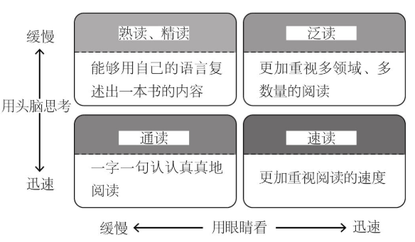
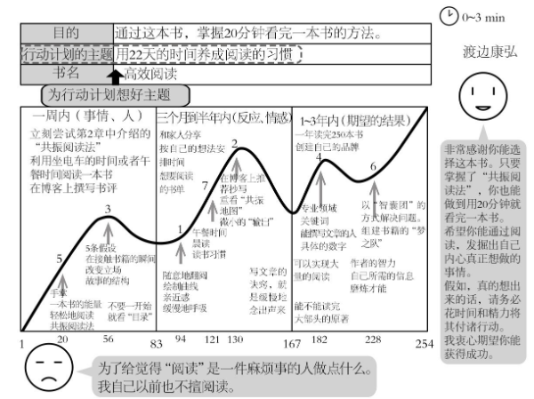

# 读《高效阅读》

利用5W1H法阅读《高效阅读》

## WHO, WHEN,WHERE

本书作者：（日） 渡边康弘（Yasuhiro Watanabe），日本Read For Action读书会创始人。一般社团法人“商业模式革新协会”理事。

毕业于青山学院大学经济学系。每年阅读超过500本以上的经营管理类英文书籍，还通过举办英文商业杂志的发行、国外作者的交流会等活动，推广阅读文化。

一直处于失学的状态的他，正处在人生的最低谷。除了不擅阅读外，英语也很糟糕，所以虽然参加了两次大学入学考试，但结果都以失败告终。就在**参加大学入学考试后回家的路上**，他看到了两本封面分别为粉色和白色的书，书名叫作《金钱与英语的非常识关系》，一共有上下两册。打破了他一直以来对于“阅读”的固有思维。

**大学一年级**，他一直以“阅读然后行动、阅读然后实践”为根本。从一个月阅读10本书，逐渐变成30本、50本。（产生了他的共振阅读法）

也就是说，他是在针对自身问题，偶然发现方法，实践之后产生自身方法，优化之后，向外推广的。

## WHY

思想的变化，导致行动的改变。

行动的变化，导致习惯的改变。

习惯的变化，导致性格的改变。

性格的变化，导致人生的改变。

书中还零零总总说了很多，总结起来我觉得上面4句话言简意赅。

## WHAT

主要阐述了4种阅读的形式。

“熟读、精读”：准确地阅读，并将书本中的内容消化成为自己的东西。不但要准确地理解作者的观点，还要能找到新的切入口，用自己的语言复述出这本书的内容。即将获得的“信息”转变成自己掌握的“知识”。只有你自己独立的“想法”或“知识”才具有价值。如果这个“知识”还能契合市场的需求，那么将更具价值。

“通读”：这是我们在学校里所学的阅读方法。它要求我们念出声来或者在心里记住内容，是一种要求“眼睛看文字”和“头脑思考”同时进行的阅读方法。

“速读”：将重点放在“用眼睛看”上，是一种很注重时间与效率的阅读方法。为了提高阅读的速度，而去大致“浏览”或者只看必要的内容。

“泛读”：一种以量取胜的阅读方法。首先要阅读大量的书籍，然后再在几本书中进行对比，从而发现不同之处。

## HOW

作者的共振阅读法，核心也就5步：

步骤0：接触书本，明确自己的目的。

步骤1：通过随意翻阅，让大脑“下载”信息。

步骤2：在三栏表格中绘制曲线。

步骤3：从曲线中感兴趣的那一页上摘出单词。

步骤4：凭着感兴趣的单词，带着问题去阅读。

步骤5：基于从这本书中所获得的想法，制订出行动计划。

阅读后将感悟分享出去增强理解

步骤1：说一说自己看完后感动的内容。

步骤2：如果与对方相识的话，还可以向对方转述他能从中“学到”或者“获得解决烦恼的启示”等内容。

步骤3：基于对方所遇到的烦恼和问题，具体思考“这本书能帮助他解决问题吗？”或者“能为他提供解决问题的启示吗？”然后与其分享。

## 其他

本书开篇还讲了很多为什么阅读（考试，升职等），阅读障碍的场景（犯困等），阅读前做的一些准备（平稳呼吸，进入思维状态等），后半部分又举了很多阅读的意义（阅读多的人年薪比阅读少的高，举例比尔盖茨、巴菲特的阅读量等）。

从作者想要20分钟快速阅读一本书（其实是目的阅读），本书确实应该20分钟内阅读完（很多论证性的普适观点，价值不高）。