[TOC]


# 第一章 绪论

## 1.1 引言

​		机器学习是这样一门学科，它致力于研究如何通过计算的手段，利用经验来改善系统自身的性能,在计算机系统中，“经验”通常以“数据”形式存在，因此，机器学习所研究的主要内容，是关于在计算机上从数据中产生“模型” (model)的算法，即“学习算法” (learning algorithm)。有了学习算法，我们把经验数据提供给它，它就能基于这些数据产生模型；在面对新的情况时(例如看到一个没剖开的西瓜)，模型会给我们提供相应的判断(例如好瓜)。如果说计算机科学是研究关于“算法”的学问，那么类似的，可以说机器学习是研究关于“学习算法”的学问。

​		Mitchell 在1997给出了一个更形式化的定义：假设用 P 来评估计算机程序在某任务类 T 上的性能，若一个程序通过利用经验 E 在 T 中任务上获得了性能改善，则我们就说关于 T 和 P，该程序对 E 进行了学习。


## 1.2 基本术语

### 1.2.1 数据相关

* 示例/样本（instance / sample）

  例：（色泽=青绿；根蒂=蜷缩；敲声=浊响）

  一般以 $D={x_1,x_2, \dots , x_m}$ 表示包含 $m$ 个示例的数据集

* 数据集（data set）

  例：（色泽=青绿；根蒂=蜷缩；敲声=浊响），（色泽=乌黑；根蒂=稍蜷；敲声=沉闷），（色泽=浅白；根蒂=硬挺；敲声=清脆），……

* 属性/特征（attribute / feature）
  例：色泽、根蒂、敲声

  一个示例由 $d$ 个特征描述，如示例 $x_i=(x_{i1}；x_{i2}；\dots； x_{id})$ 
  
* 属性值（attribute value）
  例：青绿、乌黑、浅白

  如示例 $x_i=(x_{i1}；x_{i2}；\dots； x_{id})$ ，其中 $x_{id}$ 表示第 $i$ 个示例的第 $d$ 个特征的值
  
* 属性空间/样本空间/输入空间（attribute space / sample space）
  属性张成的空间称为“属性空间”（attribute space）、“样本空间”（sample space）或“输入空间”，例：我们把“色泽”、“根蒂”、“敲声”作为三个坐标轴，则它们张成一个用于描述西瓜的三维空间，每个西瓜都可在这个空间中找到自己的坐标位置。

* 特征向量（feature vector）
  在属性空间中的每个点对应一个坐标向量，因此我们也把一个示例 (instance/sample )称为一个“特征向量”（feature vector）


### 1.2.2 训练相关

* 学习/训练（learning / training）

  从数据中学得模型的过程称为“学习”（learning）或“训练”（training），这个过程通过执行某个学习算法来完成。

* 训练数据（training data）

  训练过程中使用的数据称为“训练数据”（training data）

* 训练样本（training sample）

  训练数据中每个样本称为一个“训练样本”（training sample）

* 训练集（training set）

  训练样本组成的集合称为“训练集”（training set）

* 假设与真相（hypothesis & ground-truth）

  + 假设：学得模型对应了关于数据的某种潜在的规律，因此亦称“假设”（hypothesis）

  + 真相：潜在规律自身，则称为“真相”或“真实”（ground-truth），学习过程就是为了找出或逼近真相
  + 两者区别：假设是我们认为的样本空间的真相，而样本空间的真相是客观存在的，我们认为的真相是否与真相本身相一致，需要后期的验证。

* 标记（label）

  训练样本的“结果”信息，例如“（色泽=青绿；根蒂=螺缩；敲声=浊响)，好瓜）”，这里关于示例结果的信息，例如“好瓜”，称为“标记”（label）

* 样例（example）

  拥有了标记信息的示例，称为“样例”（example）

* 标记空间/输出空间（label space）

  所有标记的集合，称为“标记空间”（label space）或“输出空间”

  

### 1.2.3 测试相关

* 分类（classification）

  若我们欲预测的是离散值，例如“好瓜”、“坏瓜”，此类学习任务称为“分类”（classification）

* 回归（regression）

  若欲预测的是连续值，例如西瓜成熟度0.95、0.37，此类学习任务称为“回归”（regression）

* 测试与测试样本（testing & testing sample）
  * 测试：学得模型后，使用其进行预测的过程称为“测试”（testing）
  * 测试样本：被预测的样本称为“测试样本”（testing sample）

* 簇&聚类（cluster & clustering）

  我们还可以对西瓜做“聚类”（clustering）：将训练集中的西瓜分成若干组，每组称为一个“簇”（cluster）；这些自动形成的簇可能对应一些潜在的概念划分，例如“浅色瓜”、“深色瓜”，甚至“本地瓜”、“外地瓜”。

  

  在聚类学习中，“浅色瓜”、“本地瓜”这样的概念我们事先是不知道的，而且学习过程中使用的训练样本通常不拥有标记信息。

* 监督学习与无监督学习的区别/分类
  + 监督学习（supervised learning）：训练数据有标记信息。如：分类、回归

  + 无监督学习（unsupervised learning）：训练数据无标记信息。如：聚类

    

### 1.2.4  泛化相关

* 泛化能力（generalization）

   学得模型适用于新样本的能力，称为“泛化”（generalization）能力

* 独立同分布（ i.i.d.）

  通常假设样本空间中全体样本服从一个未知“分布”（distribution）D，我们获得的每个样本都是独立地从这个分布上采样获得的，即“独立同分布”（independent and identically distributed，简称 i.i.d.），一般而言，训练样本越多，我们得到的关于 D 的信息越多，这样就越有可能通过学习获得具有强泛化能力的模型。

  > 中心极限定理：若样本的数据量足够大，样本均值近似服从正态分布。
  
  

## 1.3 假设空间

* 假设空间（hypothesis space）

  我们可以把学习过程看作一个在所有假设（hypothesis）组成的空间中进行搜索的过程，搜索目标是找到与训练集“匹配”（fit）的假设，即能够将训练集中的瓜判断正确的假设。

  

  假设的表示一旦确定，假设空间及其规模大小就确定了。

  

  附图
  
  

* 版本空间（version space）

  现实问题中我们常面临很大的假设空间，但学习过程是基于有限样本训练集进行的。因此，可能有多个假设与训练集一致，即存在着一个与训练集一致的“假设集合”，我们称之为“版本空间”（version space）。例如在西瓜问题中，与表1.1训练集所对应的版本空间如图1.2所示。

  
  
  附图
  
  

## 1.4 归纳偏好

* 归纳偏好（inductive bias）

   通过学习得到的模型对应了假设空间中的一个假设。机器学习算法在学习过程中对某种类型假设的偏好，称为“归纳偏好”（inductive bias），或简称为“偏好”。

  任何一个有效的机器学习算法必有其归纳偏好，否则它将被假设空间中看似在训练集上“等效”的假设所迷惑，而无法产生确定的学习结果。

  

* “奥卡姆剃刀”（Occam's razor）原则

  + 归纳偏好可看作学习算法自身在一个可能很庞大的假设空间中对假设进行选择的启发式或“价值观”，“奥卡姆剃刀”可以用来引导算法确立“正确的”偏好。
  + “奥卡姆剃刀”（Occam's razor）原则：若有多个假设与观察一致，则选最简单的那个

* 什么学习算法更好

  归纳偏好对应了学习算法本身所做出的关于“什么样的模型更好”的假设，在具体的现实问题中，这个假设是否成立，即算法的归纳偏好是否与问题本身匹配，大多数时候直接决定了算法能否取得好的性能。
  对于一个学习算法A，若它在某些问题上比学习算法B好，则必然存在另一些问题，在那里B比A好。**这个结论对任何算法均成立**

  + “没有免费的午餐”定理（NFL定理）

    无论学习算法A多聪明，学习算法B多笨拙，它们的期望性能相同。这就是“没有免费的午餐”定理（No Free Lunch Theorem，简称NFL定理）

    NFL定理有一个重要前提：所有“问题”出现的机会相同、或所有问题同等重要，但实际情形并不是这样。例如：“(根蒂=蝶缩;敲声=浊响)”的好瓜很常见，而“(根落二硬摄:敲声二清晚)”的好瓜罕见，甚至不存在。

    NFL定理最重要的寓意：脱离具体问题，空泛地谈论“什么学习算法更好”毫无意义。**要谈论算法的相对优劣，必须要针对具体的学习问题。**学习算法自身的归纳偏好与问题是否相配，往往会起到决定性的作用。

    

## 1.5 发展历程

​	略

##  1.6 应用现状

​	略

## 1.7 阅读材料

​	可以参考 [Roadmap](../Roadmap.md)中的相关资源

## 1.8 第1章习题

​	略

## 小故事：“机器学习”名称的由来

​    1952年，阿瑟·萨缪尔(Arthur Samuel， 1901-1990) 在IBM公司研制了一个西洋跳棋程序，这个程序具有自学习能力，可通过对大量棋局的分析逐渐辨识出当前局面下的“好棋”和“坏棋”，从而不断提高弈棋水平，并很快就赢了萨缪尔自己。 1956年，萨缪尔应约翰·麦卡锡(John McCarthy， “人工智能之父” ， 1971年图灵奖得主)之邀，在标志着人工智能学科诞生的达特茅斯会议上介绍这项工作，萨缪尔发明了“机器学习”这个词，将其定义为“不显式编程地赋予计算机能力的研究领域” 。他的文章"Some studies in machine learning using the game of checkers" 1959年在IBM Journal正式发表后，爱德华·费根鲍姆(Edward Feigenbaum，“知识工程之父” ，1994年图灵奖得主)为编写其巨著Computers and Thought，在1961年邀请萨缪尔提供一个该程序最好的对弈实例，于是，萨缪尔借机向康涅狄格州的跳棋冠军、当时全美排名第四的棋手发起了挑战，结果萨缪尔程序获胜，在当时引起表动。
​    事实上，萨缪尔跳棋程序不仅在人工智能领域产生了重大影响，还影响到整个计算机科学的发展，早期计算机科学研究认为，计算机不可能完成事先没有显式编程好的任务，而萨缪尔跳棋程序否证了这个假设，另外，这个程序是最早在计算机上执行非数值计算任务的程序之一，其逻辑指令设计思想极大地影响了IBM计算机的指令集，并很快被其他计算机的设计者采用。


# 第二章 模型评估与选择

## 2.1 经验误差与过拟合

### 2.1.1 概念解析

(1)  误差：学习器的实际预测输出与样本的真实输出之间的差异；其中学习器在训练集上的误差称为”**训练误差**“（training error）或“**经验误差**” （empirical error），在新样本上的误差称为”**泛化误差**“（generalization error）。值得一提的是，学习器就是在训练集上训练出来的，但实际上在回到训练集上对样本预测结果时，仍有误差。（即结果值与标记值不同）

(2)     错误率：分类错误的样本数占样本总数的比例，$E=\frac{a}{m}$（ $a$ 个样本错误，$m$ 个样本总数）

(3)     精度：与错误率的概念相反，$P=(1-E)\ast 100\%$ 

(4)     过拟合(overfitting)：学习器学习的”太好了“，把训练样本自身的特点当作了所有潜在样本都会有的一般性质。（注意：过拟合会造成泛化性能下降）

(5)     欠拟合(underfitting)：对训练样本的性质尚未学好


### 2.1.2 注意事项

（1）泛化误差

我们一直希望得到泛化误差最小的学习器。但是我们实际能做的就是努力使经验误差最小化。注意：努力使经验误差最小化≠让经验误差达到最小值，即训练集的分类错误率为 0%。因为在训练集上表现很好的学习器，泛化能力却并不强。

（2）欠拟合与过拟合

欠拟合比较容易克服，往往因为学习器学习能力过强造成的过拟合较难处理，但是实际上过拟合是机器学习过程中必须面对的障碍。我们必须认识到过拟合我们无法彻底避免，我们只能尽可能”缓解“。从理论上讲，机器面临的问题通常是 NP 难或者更难，而有效的学习算法是在多项式时间内完成的，若可以彻底避免过拟合，则通过经验误差最小化就获得最优解，那么我们构造性的证明了 P=NP，但实际上 P≠NP，也就是说这是不可能完成的。

## 2.2 评估方法（数据集划分方法）

在现实任务中，我们往往有多种学习算法可供选择，甚至对同一个学习算法，当使用不同的参数配置时，也会产生不同的模型，那么，我们该选用哪一个学习算法、使用哪一种参数配置呢? 这就是机器学习中的“模型选择” (model selection)问题，理想的解决方案当然是对候选模型的泛化误差进行评估，然后选择泛化误差最小的那个模型，然而如上面所讨论的，我们无法直接获得泛化误差而训练误差又由于过拟合现象的存在而不适合作为标准。

因此，通常，我们需要通过实验测试来对学习器的泛化误差进行评估从而做出选择。此时，我们需要一个“测试集”来测试学习器对新样本的判别能力，然后以测试集上的“测试误差”作为泛化误差的近似。（假设测试样本独立同分布）我们知道一个 $m$ 个样例的数据集 $D={(x_1,y_1),(x_2,y_2),\dots,(x_m,y_m)}$ ,我们要对这个数据集既要训练又要测试，那么如何产生训练集 $S$ 和测试集 $T$ 是我们要面对的问题。


### 2.2.1 留出法 LOO
留出法 Leave-one-out：直接将数据集 $D$ 划分为两个互斥的集合，其中一个集合作为训练集 $S$ ，另一个作为测试集 $T$，即 $D=S\cup T$，$S\cap T= \emptyset$。

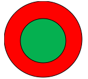

如上图所示，两个同心圆。其中内圆红色部分为训练集，外环绿色部分为测试集，两部分是两个互斥的集合。

除此之外，留出法还要尽可能的保持数据分布的一致性，要保持样本类别比例相似，从采样的角度看待数据采集的划分过程，保留类别比例的采样方式通常称为“分层采样”。

就好比它真是一个西瓜，按甜度将其分为七块，采样时每一块都要按照相同的所占比例去采。这七类数据集的测试集与训练集的比值应是相等的。

.png)

注意：单次使用留出法所得到的估计结果往往不稳定可靠，在使用留出法时，一般采用若干次随机划分、重复实验取平均值。

留出法的特点：
1. 直接划分训练集与测试集；
2. 训练集和测试集采取分层采样；
3. 随机划分若干次，重复试验取平均值

### 2.2.2 交叉验证 CV
交叉验证法 cross-validation：先将数据集 $D$ 分为 $k$ 个大小相似的互斥子集，即 $D=D_1\cup D_2\cup \dots \cup D_k ；D_i \cap D_j = \emptyset（i \neq j）$。每个子集 $D_i$ 都尽可能保持数据分布的一致性，即每个子集仍然要进行分层采样。每次用 $k-1$ 个子集作为训练集，余下作测试集，这样可以获得 $k$ 组“训练/测试集”，最终返回的是 $k$ 个结果的均值。

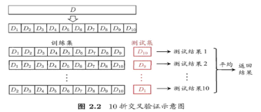

与留出法类似，将数据集 $D$ 划分为 $K$ 个子集同样存在多种划分方式。为减少因样本划分不同而引入的差别，$k$ 折交叉验证通常也要重复 $p$ 次实验，最后取均值。

**交叉验证的特例：**

留一法（LOO）：$m$ 个样本划分成 $m$ 个子集，每个子集包含一个样本。留一法中被实际评估的模型与期望评估的用 $D$ 训练出来的模型很相似，因此，留一法的评估结果往往被认为比较准确。

留一法缺陷：当数据集过大时，计算开销、时间开销、空间开销都是难以忍受的（还未考虑算法调参）。

### 2.2.3 自助法 bootstrapping	
留出法与交叉验证法都会使训练集比 $D$ 小，这必然会引入一些因样本规模不同而导致的估计偏差。那么如何做到较少训练样本规模不同造成的影响，同时还高效地进行实验估计呢？

自助法 bootstrapping：对有 $m$ 个样本的数据集 $D$，按如下方式采样产生数据集 $D^\prime$：每次随机取一个样本拷贝进$D^\prime$，取 $m$ 次（有放回取 $m$ 次）。

按此方法，保证了 $D^\prime$ 和 $D$ 的规模一致。但 $D^\prime$ 虽然也有 $m$ 个样本，其中会出现重复的样本，$D$中会存在  $D^\prime$ 没有采到的样本，这些样本就留作测试集。

计算某样本在 $m$ 次采样中均不会被采到的概率是： $(1-\frac{1}{m})^m$ ，取极限可得
$$
\lim_{m\to \infty}(1-\frac{1}{m})^m \to \frac{1}{e} \approx 0.368
$$
由此可知，理论上有36.8%的样本没有出现在在$D^\prime$ 之中，我们把 $D \setminus D^\prime$ 作为测试集。

优点：训练集与数据集规模一致；数据集小、难以有效划分训练/测试集时效果显著；能产生多个不同的训练集；

缺点：改变了训练集的样本分布，引入估计偏差。

### 2.2.4 调参与最终模型

大多数学习算法都有些参数 (parameter) 需要设定，参数配置不同，学得模型的性能往往有显著差别，因此，在进行模型评估与选择时，除了要对适用学习算法进行选择，还需对算法参数进行设定，这就是通常所说的“参数调节”或简称“调参” (parameter tuning)。

因为学习算法的参数可能是在实数域，因此对每种参数配置都训练相应的模型成为了不可行方案，通常我们对每个参数选定一个**范围**和**变化步长**，显然，这样选定的参数值往往不是“最佳”值，但这是在计算开销和性能估计之间进行折中的结果，通过这个折中，学习过程才变得可行，

给定包含 $m$ 个样本的数据集 $D$，在模型评估与选择过程中由于需要留出一部分数据进行评估测试，事实上我们只使用了一部分数据训练模型，因此，在模型选择完成后，学习算法和参数配置已选定，此时应该用数据集 $D$ **重新训练模型**，这个模型在训练过程中使用了所有 $m$ 个样本，这才是我们最终提交给用户的模型。	

另外，需注意的是，我们通常把学得模型在实际使用中遇到的数据称为测试数据，为了加以区分，模型评估与选择中用于评估测试的数据集常称为“验证集” (validation set)。例如，在研究对比不同算法的泛化性能时，我们用测试集上的判别效果来估计模型在实际使用时的泛化能力，而把训练数据另外划分为训练集和验证集，基于验证集上的性能来进行模型选择和调参。

（1）概念详解
+ 调参 parameter tunning：对模型进行评估和选择时，对算法参数 parameter 进行标定。
+ 验证集 validation set：模型评估与选择中用于评估测试的数据集。

（2）参数的分类
- 算法的参数：亦称超参数，数目在十以内
- 模型的参数：数目众多。


## 2.3 性能度量

对学习器的泛化性能进行评估，不仅需要有效可行的实验估计方法，还需要**衡量模型泛化能力的评价标准**，即性能度量 performance measure。不同的性能度量，模型的好坏也不同，故模型的好坏是相对的。它取决于三个方面：

- 算法（算法类型+ 参数）
- 数据情况
- 任务需求
  - 原型设计阶段：离线评估 Offline evaluation
  - 应用阶段：在线评估 Online evaluation , 一般使用商业评价指标


>通常机器学习过程包括两个阶段,原型设计阶段和应用阶段

>原型设计阶段是使用历史数据训练一个适合解决目标任务的一个或多个机器学习模型，并对模型进行验证( Validation )与离线评估( Offline evaluation )，然后通过评估指标选择一个较好的模型。比如准确率( accuracy )、精确率-召回率( precision-recall)等

>应用阶段是当模型达到设定的指标值时便将模型上线,投入生产,使用新生成的数据来对该模型进行在线评估( Online evaluation ),以及使用新数据更新模型。在线评估中，一般使用一些商业评价指标,如用户生命周期价值( Customer Lifetime Value, CLV )、广告点击率(ClickThrough Rate, CTR)、用户流失率( Customer Churn Rate, CCR)等,这些指标才是模型使用者最终关心的一些指标。


预测任务中，给定样例数据集 $D={(x_1,y_1),(x_2,y_2),\dots,(x_m,y_m)}$ ，其中  $y_i$ 是示例 $x_i$ 的真实标记。 评估学习器 $f$ 的性能，需要将学习器的预测结果 $f(x)$ 同真实标记 $y$  进行比较。


本节内容，原书都以分类任务的常用性能度量为例。


### 2.3.1 错误率与精度

错误率 error rate：
$$
E(f ; D)=\frac{1}{m} \sum_{i=1}^{m} \mathbb{I}\left(f\left(\boldsymbol{x}_{i}\right) \neq y_{i}\right)
$$
其中 $\mathbb{I}(f(x_i)\neq y_i)$ 为指示函数 indicator function ，若表达式为真则取值为1，否则取值0

精度 accuracy：
$$
\begin{aligned} \operatorname{acc}(f ; D) &=\frac{1}{m} \sum_{i=1}^{m} \mathbb{I}\left(f\left(\boldsymbol{x}_{i}\right)=y_{i}\right) \\ &=1-E(f ; D) \end{aligned}
$$


更一般的，对于数据分布 $\mathcal{D}$ 和概率密度函数 $\mathcal{p}(\cdot)$ ，错误率和精度可分别描述为

[comment]: 后续需要补充说明

$$
E(f ; \mathcal{D})=\int_{\boldsymbol{x} \sim \mathcal{D}} \mathbb{I}(f(\boldsymbol{x}) \neq y) p(\boldsymbol{x}) \mathrm{d} \boldsymbol{x} \tag{2.6}
$$

$$
\begin{aligned} \operatorname{acc}(f ; \mathcal{D}) &=\int_{\boldsymbol{x} \sim \mathcal{D}} \mathbb{I}(f(\boldsymbol{x})=y) p(\boldsymbol{x}) \mathrm{d} \boldsymbol{x} \\ &=1-E(f ; \mathcal{D}) \end{aligned} \tag{2.7}
$$


### 2.3.2 查准率、查全率与F1（混淆矩阵）

当需要反映的不是判断正确与否的能力，而是正例、反例查出的准确率时，就不能用错误率和精度作为判断分类任务模型的性能度量了，查准率（准确率） precision 和查全率（召回率） recall 应运而生。（因为各个翻译版本的不同，下文都以英文表示）

为了说明 precision 和 recall，我们引入混淆矩阵 confusion matrix。可以说，confusion matrix 很直观地表示了各个指标的定义、来源以及作用意义。

以 [维基百科](https://en.wikipedia.org/wiki/Confusion_matrix) 给出的表格释义最为直观与全面

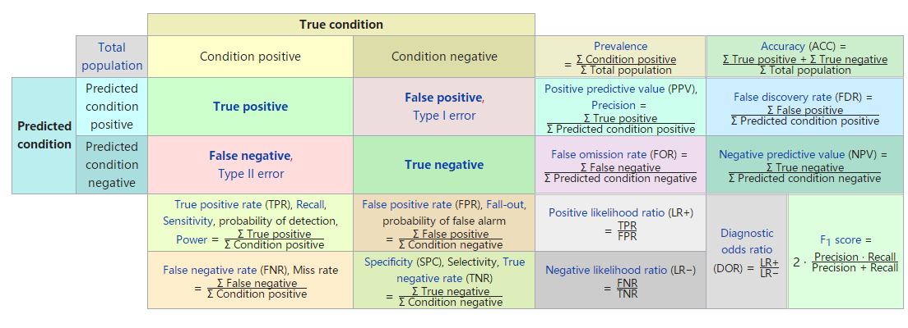

其中，True condition 表示数据集中各数据样本的真实标记值，一般即为 $y$ ，Predicted condition 表示学习算法给出的预测值。

> True positive (TP)：真正例，即真实值为1，预测为1

> False positive (FP)：假正例，即真实值为0，预测为1

> False negtive (FN)：假反例，即真实值为1，预测为0

> True negtive (TN):  真反例，即真实值为0，预测为0

有了confusion matrix ，我们就可以很直观地知道其他指标的定义了

> precision(Positive predictive value,PPV) ：预测为正例的样本中真正例的比例
> $$
> \text{Precision} = \frac{\sum \text { True positive }}{\sum \text { Predicted condition positive }}=\frac{\text{真正例=TP}}{\text{预测为正例=TP+FP}}
> $$

> Recall(True positive rate, TPR, Sensitivity) ：真实值为正例中被预测为正例的比例
> $$
> \text{Recall}=\frac{\sum \text { True positive }}{\sum \text { Condition positive }} = \frac{\text {真正例=TP}}{\text {真实值为正例=TP+FN}}
> $$
> 


可以发现，**precision 反映准确性，recall 反映全面性，**他们是一对矛盾的存在。为了找到 P、R之间的平衡点，我们将以 precision 为纵轴，recall 为横轴，建立直角坐标系，就得到”P-R“图

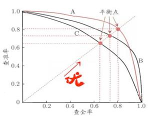

根据 P-R 曲线，我们就可以去评价学习器性能的优劣

* 当曲线没有交叉的时候：外侧曲线的学习器性能优于内侧；
* 当曲线有交叉的时候（此时无法根据 P-R 图得到哪个学习器更优，需要在具体情境下比较）：
  * 比较曲线下面积（值不容易计算）
  * 比较两条曲线的平衡点 Break-Even Point (BEP)，平衡点是“precision=recall”时的取值，在上图中表示为曲线和对角线的交点，平衡点在外侧的曲线的学习器性能优于内侧
  * $F1$ 度量和 $F_{\beta}$度量。$F1$ 是基于查准率与查全率的调和平均 harmonic mean ，$F_{\beta}$ 则是加权调和平均


> $$
> \frac{1}{F 1}=\frac{1}{2} \cdot\left(\frac{1}{P}+\frac{1}{R}\right) \Rightarrow F1=\frac{2\times P \times R}{P+R} = \frac{2\times TP}{\text{样例总数}+TP-TN}
> $$

> $$
> \frac{1}{F_{\beta}}=\frac{1}{1+\beta^{2}} \cdot\left(\frac{1}{P}+\frac{\beta^{2}}{R}\right) \Rightarrow F_{\beta} = \frac{(1+\beta ^{2})\times P \times R}{(\beta ^{2}\times P)+ R}
> $$

其中， $\beta \gt 0$ 度量了recall 对 precision 的相对重要性，$\beta = 1$ 时 $F_{\beta}$ 退化为标准 $F1$ ， $\beta \gt 1$ 时 recall 有更大影响，反之，precision 有更大影响。


对于我们有多个二分类混淆矩阵的情况，例如进行多次训练/测试，每次得到一个混淆矩阵；或是在多个数据集上进行训练/测试，希望估计学习算法的“全局”性能；甚或是执行多分类任务，每两两类别的组合都对应一个混淆矩阵……总之，我们希望在n个二分类混淆矩阵上综合考察查准率 precision 和查全率recall，于是就有了宏查准率 （macro-P）、 宏查全率（macro-R）、宏F1（macro-F1）以及微查准率 （micro-P）、 微查全率（micro-R）、微F1（micro-F1）


宏 macro ：在 n 个混淆矩阵中分别计算出 precision、recall，再计算均值，就得到“宏查准率, macro-P”、“宏查全率, macro-R ”和“宏F1, macro-F1”

> $$
> macro\mathbb{-}P=\frac{1}{n} \sum_{i=1}^{n} P_{i} \quad macro\mathbb{-}R=\frac{1}{n} \sum_{i=1}^{n} R_{i} \quad macro\mathbb{-}F1=\frac{2\times macro\mathbb{-}P \times macro\mathbb{-}R}{macro\mathbb{-} P + macro\mathbb{-} R}
> $$


微 micro ：先将n个混淆矩阵的对应元素 $TP,  FP, TN, FN$ 进行平均得到 $\overline{TP}, \overline{FP}, \overline{TN}, \overline{FN}$，再计算precision, recall 和 F1，就得到“微查准率，micro-P”、“微查全率，micro-R”和 “微F1，micro-F1”。
$$
micro\mathbb{-}P=\frac{\overline{TP}}{\overline{TP}+\overline{FP}} \quad micro\mathbb{-}R=\frac{\overline{TP}}{\overline{TP}+\overline{FN}} \quad micro\mathbb{-}F1=\frac{2\times micro\mathbb{-}P \times micro\mathbb{-}R}{micro\mathbb{-} P + micro\mathbb{-} R}
$$


__macro-F1 和 micro-F1应用场景的区别？__

micro-F1 从全局上去体现 precision 和 recall，将分类类别的界限去除了，所得值会偏向于模型对样本数多的分类类别的表现。直观上可以认为，micro-F1 将所有样本基于一个分类类别去考虑。

macro-F1 更关注各个分类类别下的 precision 和recall，所得值同样偏向于模型对样本数多的分类的表现，但是对模型在其他分类类别下的表现比 micro-F1 更敏感。


### 2.3.3 ROC与AUC

很多学习器是为测试样本产生一个实值或概率预测，然后将这个预测值与一个分类阈值(threshold)进行比较，若大于阔值则分为正类，否则为反类。例如，神经网络在一般情形下是对每个测试样本预测出一个[0.0，1.0]之间的实值，然后将这个值与 0.5 进行比较，大于 0.5 则判为正例，否则为反例，这个实值或概率预测结果的好坏，直接决定了学习器的泛化能力，实际上，根据这个实值或概率预测结果，我们可将测试样本进行排序， “最可能”是正例的排在最前面，“最不可能”是正例的排在最后面，这样，分类过程就相当于在这个排序中以某个“截断点” (cut point)将样本分为两部分，前一部分判作正例，后一部分则判作反例

在不同的应用任务中，我们可根据任务需求来采用不同的截断点，例如若我们更重视precision，则可选择排序中靠前的位置进行截断；若更重视 recall，则可选择靠后的位置进行截断，因此，**排序本身的质量好坏**，体现了综合考虑学习器在不同任务下的**期望泛化性能**的好坏，或者说， “一般情况下”泛化性能的好坏。 ROC曲线（Receiver Operating Characteristic curve）则是从这个角度出发来研究学习器泛化性能的有力工具。

ROC 名为”受试者工作特征“曲线，源于二战中用于敌机检测的雷达信号分析技术。与之前的P-R曲线相似，需要对样例进行排序，然后按顺序逐个将样本作为正例进行预测。ROC曲线以真正例率（TPR，即Recall）为纵轴，假正例率（FPR）为横轴，ROC曲线下的面积为AUC（Area Under ROC Curve）

> $$
> TPR = Recall = \frac{\sum \text{True positive}}{\sum \text{Condition positive}}=\frac{TP}{TP+FN}
> $$

真正例率（TPR）：【真正例样本数】与【真实情况是正例的样本数】的比值。反映预测正类中实际正类越多

> $$
> FPR = \frac{\sum \text{False positive}}{\sum \text{Condition negtive}}=\frac{FP}{FP+TN}
> $$

假正例率（FPR）：【假正例样本数】与【真实情况是反例的样本数】的比值。反映预测正类中实际负类越多


如图，理想模型是真正例率为100%，假正例率为 0% 的一点（左上角）。随机猜测模型则是真正例率与假正例率持平的直线。对角线对应于“随机猜测”模型,而点(0, 1)则对应于将所有正例排在所有反例之前的“理想模型”。


然而，现实任务中通常是利用**有限个**测试样例来绘制 ROC 图，此时仅能获得有限个(真正例率，假正例率)坐标对，ROC曲线绘图过程很简单：给定m+ (即 Condition positive)个正例和 m- (即Condition negtive)个反例，根据学习器预测结果对样例进行排序，然后把分类阈值设为最大，即把所有样例均预测为反例，此时真正例率和假正例率均为0，在坐标 (0,0) 处标记一个点，然后，将分类阈值依次设为每个样例的预测值（从大到小）,即依次将每个样例划分为正例，设前一个标记点坐标为 $(x,y)$ 当前若为真正例，则对应标记点的坐标为 $(x, y+\frac{1}{m+} )$ 当前若为假正例，则对应标记点的坐标为$(x+\frac{1}{m-}, y)$ 然后用线段连接相邻点即得。


**利用ROC曲线比较学习器的性能优劣**

* 若一个学习器的ROC曲线被另一个学习器的曲线完全“包住” ，则可断言后者的性能优于前者
* 若两个学习器的ROC曲线发生交叉，则难以一般性地断言两者孰优孰劣，此时如果一定要进行比较，则较为合理的判据是比较ROC曲线下的面积，即AUC

从定义可知，AUC可通过对ROC曲线下各部分的面积求和而得，假定ROC曲线是由坐标为${(x_1,y_1), (x_2, y_2),\dots, (x_m,y_m)}$ 的点按序连接而形成 $(x_1=0, x_m=1)$ ，则AUC可估算为
$$
AUC=\frac{1}{2} \sum_{i=1}^{m-1}\left(x_{i+1}-x_{i}\right) \cdot\left(y_{i}+y_{i+1}\right)
$$
这里的估算方式实际上是使用了梯形公式（$(\text{上底+下底})\times \text{高} \times \frac{1}{2}$），其中 $x_{i+1}-x_i$ 为高，$y_i, y_{i+1}$ 分别为上底和下底，更详细的解析可以参考[南瓜书](https://datawhalechina.github.io/pumpkin-book/#/chapter2/chapter2)


AUC 指标用来评估分类器性能，可以兼顾**样本中类别不平衡**的情况（当测试集中的正负样本的分布变化的时候，ROC曲线能够保持不变），这一点上要比分类准确率更加具有参考价值。


**AUC的一般判断标准**
* 0.5 - 0.7：效果较低
* 0.7 - 0.85：效果一般
* 0.85 - 0.95：效果很好
* 0.95 - 1：效果非常好，但一般不太可能


整体而言，混淆矩阵给我们呈现了一个清晰可见的分类模型效果评估工具，而基于混淆矩阵的评估指标可以从不同侧面来评价分类器性性能，至于在实际操作中使用什么样的评估指标来进行评价，还要视具体的分析目标而定。


可参考的说明网站 [网站1](http://alexkong.net/2013/06/introduction-to-auc-and-roc/) , [网站2](https://www.cnblogs.com/dlml/p/4403482.html)

### 2.3.4 代价敏感错误率与代价曲线

从混淆矩阵中我们可以看到，存在两种错判的情况（FP 为 1型错误，FN为 2型错误），在前面介绍的性能度量标准下，它们都隐式地假设了均等代价（两种错判情况造成影响相等），然而，两种错误类型会造成的后果（错误代价）是不一致的。

例如在医疗诊断中，错误地把患者诊断为健康人与错误地把健康人诊断为患者，看起来都是犯了“一次错误” ，但后者的影响是增加了进一步检查的麻烦，前者的后果却可能是丧失了拯救生命的最佳时机；再如，门禁系统错误地把可通行人员拦在门外，将使得用户体验不佳，但错误地把陌生人放进门内，则会造成严重的安全事故。

为权衡不同类型错误所造成的不同损失，为错误赋予“非均等代价”（unequal cost）。在非均等代价下，目标不再是简单地最小化错误次数，而是最小化总体代价 total cost 。


实现方式是，可根据任务的领域知识设定代价矩阵 cost matrix

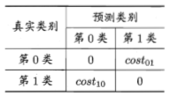

其中 $cost_{ij}$ 表示将第 $i$ 类样本预测为第 $j$ 类样本的代价。一般来说, $cost_{01}$ 就对应于第一类错误，$cost_{10}$ 就对应于第二类错误。如上图所示，第1类作为正类、第0类作为反类，令 $D+$ 与 $D-$ 分别代表样例集 $D$ 的正例子集和反例子集，则“代价敏感” (cost-sensitive)错误率为
$$
\begin{aligned} 
E(f ; D ; cost)=& \frac{1}{m}\left(\sum_{x_{i} \in D^{+}} \mathbb{I}\left(f\left(\boldsymbol{x}_{i}\right) \neq y_{i}\right) \times cos t_{01}\right.\\ &+\sum_{\boldsymbol{x}_{i} \in D^{-}} \mathbb{I}\left(f\left(\boldsymbol{x}_{i}\right) \neq y_{i}\right) \times cost_{10} ) \end{aligned}
$$


类似的，可给出基于分布定义的代价敏感错误率，以及其他一些性能度量如精度（precision）的代价敏感版本，若令 $cost_{ij}$ 中的 $i,  j$ 取值不限于0、1,则可定义出多分类任务的代价敏感性能度量。

在非均等代价下, ROC曲线不能直接反映出学习器的期望总体代价，而“代价曲线” (cost curve)则可达到该目的，代价曲线图的横轴是取值为 [0,1] 的正例概率代价， 纵轴是取值为 [0,1] 的归一化代价
$$
P(+)\text{cost}=\frac{p \times \text{cost}_{01}}{p \times \text{cost}_{01}+(1-p) \times \text{cost}_{10}}
$$

$$
\text{cost}_\text{norm}=\frac{FNR \times p \times \text{cost}_{01}+FPR \times(1-p) \times \text{cost}_{10}}{p \times \text{cost}_{01}+(1-p) \times \text{cost}_{10}}
$$

其中 FPR 是假正例率，FNR=1-TPR是假反例率，代价曲线的绘制很简单: ROC曲线上每一点对应了代价平面上的一条线段，设ROC曲线上点的坐标为(TPR, FPR)，则可相应计算出 FNR ，然后在代价平面上绘制一条从 (0, FPR) 到(1, FNR) 的线段，线段下的面积即表示了该条件下的期望总体代价；如此将ROC曲线上的每个点转化为代价平面上的一条线段，然后**取所有线段的下界**，围成的面积即为在所有条件下学习器的期望总体代价

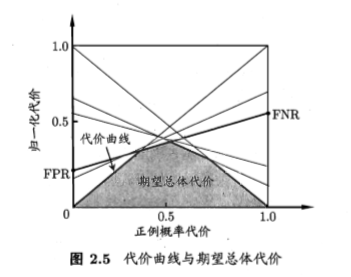


### 2.3.5 sklearn中的分类算法性能度量实现

[comment]:  <后续补充>


## 2.4 比较检验

有了实验评估方法和性能度量，看起来就能对学习器的性能进行评估比较了：先使用某种实验评估方法测得学习器的某个性能度量结果，然后对这些结果进行比较，但怎么来做这个“比较”呢？是直接取得性能度量的值然后“比大小”吗？

实际上，机器学习中性能比较这件事要复杂得多。这里面涉及几个重要因素：

- 我们希望比较的是泛化性能，然而通过实验评估方法我们获得的是测试集上的性能，两者的对比结果可能未必相同；
- 测试集上的性能与测试集本身的选择有很大关系，且不论使用不同大小的测试集会得到不同的结果，即便用相同大小的测试集，若包含的测试样例不同，测试结果也会有不同；
- 很多机器学习算法本身有一定的随机性，即便用相同的参数设置在同一个测试集上多次运行，其结果也会有不同

统计假设检验(hypothesis test)为我们进行学习器性能比较提供了重要依据，基于假设检验结果我们可推断出，若在测试集上观察到学习器 A 比 B 好，则A的泛化性能是否在统计意义上优于B，以及这个结论的把握有多大。


[comment]: 后续再补充


## 2.5 偏差与方差

[comment ]: <后续补充>


# **第三章 线性模型**

## 3.1 基本形式

给定由 $d$ 个属性描述的示例 $x=(x_1;x_2;x_3\dots ;x_d)$，其中 $x_i$ 是 $x$ 的第 $i$ 个属性上的取值，线性模型试图学得一个通过属性的线性组合来进行预测函数，即 
$$
f(x) = w_1x_1+w_2x_2+\dots w_dx_d + b \tag{3.1}
$$
一般用向量形式
$$
f(x)=w^{T}x+b \tag{3.2}
$$
其中 $w=(w_1;w_2;\dots ;w_d)$  。 $w$ 和 $b$ 学得之后，模型就得以确定。

线性模型形式简单、易于建模，但却蕴涵着机器学习中一些重要的基本思想，许多功能更为强大的非线性模型(nonlinear model)可在线性模型的基础上通过引入**层级结构**或**高维映射**而得，此外，由于 $w$ 直观表达了各属性在预测中的重要性，因此线性模型有很好的可解释性(comprehensibility) / 可理解性 (understandability) 。

例：西瓜问题中学的 $“f_{\text{好瓜}}（x）= 0.2*x{\text{色泽}}+0.5*x_{\text{根蒂}}+0.3*x_{\text{敲声}}+1”$，则意味着可通过综合考虑色泽、根蒂和敲声来判断瓜好不好，其中根蒂最要紧，而敲声比色泽更重要。


## 3.2 线性回归

​	给定数据集 $D=\{{(x_1,y_1),(x_2,y_2),\dots,(x_m,y_m)}\}$ ，其中 $x_i = (x_{i 1};x_{i 2};\dots x_{i d}), y \in \mathbb{R}$ 。“线性回归”(linear regression)试图学得一个线性模型以尽可能准确地预测实值输出标记。

例如：通过历年的人口数据预测2020年人口数量。在这类问题中，往往我们会先得到一系列的有标记数据，例如：2000--13亿...2018--15亿，这时输入的属性只有一个，即年份；也有输入多属性的情形，假设我们预测一个人的收入，这时输入的属性值就不止一个了，例如：（学历，年龄，性别，颜值，身高，体重）-- 15 k。

有时这些输入的属性值并不能直接被我们的学习模型所用，需要进行相应的处理，对于连续数值型的特征，一般都可以被学习器所用，有时会根据具体的情形作相应的预处理，例如：归一化等；对于离散型的特征，针对其属性值间的特点，有不同的处理方式：

- 若属性值之间存在“序关系” （order），则可以将其转化为连续值，例如：身高属性分为{高，中等，矮}，可转化为数值：{1, 0.5, 0}。
- 若属性值之间不存在“序关系”，则通常将其转化为向量的形式，例如：瓜类的取值{西瓜，南瓜，黄瓜}，可转化为向量：{(1, 0, 0)，(0, 1, 0)，(0, 0, 1)}。

### 3.2.1 一元（简单）线性回归

（1）当输入特征只有一个的时候，就是最简单的情形。

线性回归试图学得
$$
f\left(x_{i}\right)=w x_{i}+b \approx y_i \tag{3.3}
$$

> $f(x_i) + \epsilon = y_i$  ，其中 $\epsilon$ 是误差项的随机变量，反映了自变量之外的随机因素对因变量的影响，它是不同由自变量 $x$ 和 因变量 $y$ 的线性关系所解释的变异性。

如何确定 $w, b$ ？通过计算出每个样本预测值与真实值之间的误差平方并求和，通过最小化均方误差 (mean-square error，MSE) / 平方损失 (square loss) 即可。均方误差有非常好的几何意义，它对应了常用的欧几里得距离或简称“欧氏距离” (Euclidean distance)。基于均方误差最小化来进行模型求解的方法称为“最小二乘法” (least square method)。在线性回归中，最小二乘法就是试图找到一条直线，使所有样本到直线上的欧氏距离之和最小。
$$
\begin{aligned}\left(w^{*}, b^{*}\right) &=\underset{(w, b)}{\arg \min } \sum_{i=1}^{m}\left(f\left(x_{i}\right)-y_{i}\right)^{2} \\ &=\underset{(w, b)}{\arg \min } \sum_{i=1}^{m}\left(y_{i}-w x_{i}-b\right)^{2} \end{aligned} \tag{3.4}
$$
其中，$\omega ^{*}, b^{*}$ 表示  $\omega, b$ 的解 ； $\arg$ 是变元(即自变量argument) ，$\arg \min$ 就是使函数值达到最小值时的变量的取值 $\arg \max$ 就是使函数值达到最大值时的变量的取值。 

求解 $\omega$ 和 $b$ 使  $E_{(w, b)}=\sum_{i=1}^{m}\left(y_{i}-w x_{i}-b\right)^{2}$ 最小化的过程，称为线性回归模型的最小二乘“参数估计” (parameter estimation)。这里 $E_{(w, b)}$ 是关于 $\omega$ 和 $b$ 的凸函数， 因此可以通过求导的方式得到最优解的闭式（closed-form）解

> 凸函数定义： 对区间 $[a,b]$ 上定义的函数 $f$ ，若它对区间中任意两点 $x_1,x_2$ 均有 $f\left(\frac{x_{1}+x_{2}}{2}\right) \leqslant \frac{f\left(x_{1}\right)+f\left(x_{2}\right)}{2}$ ，则称 $f$ 为区间 $[a,b]$ 上的凸函数。 $U$ 型曲线的函数如 $f(x)=x^2$ 通常是凸函数。

$$
\frac{\partial E_{(w, b)}}{\partial w}=2\left(w \sum_{i=1}^{m} x_{i}^{2}-\sum_{i=1}^{m}\left(y_{i}-b\right) x_{i}\right) \tag{3.5}
$$

$$
\frac{\partial E_{(w, b)}}{\partial b}=2\left(\sum_{i=1}^{m}b-\sum_{i=1}^{m}\left(y_{i}-w x_{i}\right)\right)=2\left(m b-\sum_{i=1}^{m}\left(y_{i}-w x_{i}\right)\right) \tag{3.6}
$$

令导数为 0 即可，这里先求解 3.6 式，因为其形式上更简单
$$
\frac{\partial E_{(w, b)}}{\partial b}=2\left(m b-\sum_{i=1}^{m}\left(y_{i}-w x_{i}\right)\right)=0 \Rightarrow b=\frac{1}{m}\sum_{i=1}^{m}\left(y_{i}-w x_{i}\right)\tag{3.8}
$$
继续化简 3.8 式，$ \cfrac{1}{m}\sum_{i=1}^{m}y_i=\bar{y} $，$ \cfrac{1}{m}\sum_{i=1}^{m}x_i=\bar{x} $，实际上就是均值，则 
$$
b=\bar{y}-w\bar{x} \tag{3.8.1}
$$
继续求解 3.5 式，
$$
\begin{array}{cl}
\frac{\partial E_{(w, b)}}{\partial w}=2\left(w \sum_{i=1}^{m} x_{i}^{2}-\sum_{i=1}^{m}\left(y_{i}-b\right) x_{i}\right)=0 
&\Rightarrow \omega \sum_{i=1}^{m} x_{i}^{2} = \sum_{i=1}^{m}\left(y_{i}-b\right) x_i
\\
& \Downarrow
\\
\omega \sum_{i=1}^{m} x_{i}^{2} = \sum_{i=1}^{m}\left(y_{i}-(\bar{y}-w\bar{x})\right) x_i &= \sum_{i=1}^{m}(y_{i}x_i) - \sum_{i=1}^{m}(\bar{y}x_i)+\sum_{i=1}^{m}w\bar{x}x_i
\\
& \Downarrow
\\
\omega (\sum_{i=1}^{m} x_{i}^{2} -\bar{x}\sum_{i=1}^{m}x_i) 
&= \sum_{i=1}^{m}(y_{i}x_i) - \sum_{i=1}^{m}(\bar{y}x_i)
\end{array}
$$
因为 $\sum_{i=1}^{m}(\bar{y}x_i) = \frac{1}{m}\sum_{i=1}^{m}(y_i x_i)=\sum_{i=1}^{m}(\bar{x}y_i)$ ,  $\bar{x} \sum_{i=1}^{m} x_{i}=\frac{1}{m} \sum_{i=1}^{m} x_{i} \sum_{i=1}^{m} x_{i}=\frac{1}{m}\left(\sum_{i=1}^{m} x_{i}\right)^{2}$

由此即可得到
$$
\begin{array}{cl}
\omega (\sum_{i=1}^{m} x_{i}^{2} -\bar{x}\sum_{i=1}^{m}x_i) 
= \sum_{i=1}^{m}(y_{i}x_i) - \sum_{i=1}^{m}(\bar{y}x_i)
\\
\Downarrow
\\
\omega =\frac{\sum_{i=1}^{m} y_{i}\left(x_{i}-\bar{x}\right)}
{\sum_{i=1}^{m} x_{i}^{2}-\frac{1}{m}\left(\sum_{i=1}^{m} x_{i}\right)^{2}}
\end{array}  \tag{3.7}
$$

### 3.2.2 多元线性回归

multivariate linear regression

（2）当输入特征有多个的时候，例如对于一个样本有 $d$ 个属性 $\{(x_{i1}；x_{i2}；\dots； x_{id}),y\}$，则可写成：
$$
f(\vec{x}_i) = w_1 x_{i 1}+w_2 x_{i 2}+ \dots +w_d x_{i d}+b = \vec{w}^{T}\vec{x}_i+b\approx y_i
$$
和一元的情况类似，依然使用最小二乘法来对 $\omega$ 和 $b$ 进行估计，但是对于多元问题，我们使用矩阵的形式来表示数据。为便于讨论，我们把  $\omega$ 和 $b$  吸收入向量形式  $\hat{\omega}=(\omega;b)$ ，相应的，把数据集 $D$ 表示为一个 $m\times (d+1)$ 大小的矩阵 $\mathbf{X}$ ，其中每行对应于一个示例，该行前 $d$ 个元素对应于示例的 $d$ 个属性值，最后一个元素置为1，即
$$
\hat{\omega}_{(d+1)\times 1} =(\omega;b) = \left(\begin{array}{c}{\omega_{1}} \\ {\omega_{2}} \\ {\vdots} \\ {\omega_{d}} \\ {b}\end{array}\right)
$$

$$
\mathbf{X}=\left(\begin{array}{ccccc}{x_{11}} & {x_{12}} & {\dots} & {x_{1 d}} & {1} \\ {x_{21}} & {x_{22}} & {\dots} & {x_{2 d}} & {1} \\ {\vdots} & {\vdots} & {\ddots} & {\vdots} & {\vdots} \\ {x_{m 1}} & {x_{m 2}} & {\dots} & {x_{m d}} & {1}\end{array}\right)=\left(\begin{array}{cc}{x_{1}^{T}} & {1} \\ {x_{2}^{T}} & {1} \\ {\vdots} & {\vdots} \\ {x_{m}^{T}} & {1}\end{array}\right)
$$

于是，矩阵形式的线性回归可以表示为
$$
X * \hat{\omega}
=\left(\begin{array}{ccccc}
{x_{11}} & {x_{12}} & {\dots} & {x_{1 d}} & {1} 
\\ 
{x_{21}} & {x_{22}} & {\dots} & {x_{2 d}} & {1} 
\\ 
{\vdots} & {\vdots} & {\ddots} & {\vdots} & {\vdots} 
\\ 
{x_{m 1}} & {x_{m 2}} & {\dots} & {x_{m d}} & {1}
\end{array}\right) 
*
\left(\begin{array}{c}{\omega_{1}} \\ {\omega_{2}} \\ {\vdots} \\ {\omega_{d}} \\ {b}\end{array}\right)
=
\left(\begin{array}{c}
{\omega_{1} x_{11}+\omega_{2} x_{12}+\ldots \omega_{d} x_{1 d}+b} \\ 
{\omega_{1} x_{21}+\omega_{2} x_{22}+\ldots \omega_{d} x_{2 d}+b} \\ 
{\vdots} \\
{\omega_{1} x_{m1}+\omega_{2} x_{m2}+\ldots \omega_{d} x_{m d}+b} \\ 
\end{array}\right)
=\left(\begin{array}{c}
{f\left(\mathrm{x}_{1}\right)} \\ 
{f\left(\mathrm{x}_{2}\right)} \\ 
{\vdots} \\ 
{f\left(\mathrm{x}_{m}\right)}
\end{array}\right)
$$
同时将因变量也写成向量形式 $\boldsymbol{y}=(y_1;y_2;\dots ;y_m)$ ，则可以将式 3.4 推广为
$$
\begin{array}{cl}
\hat{\omega}^{*} 
&= \underset{\hat{w}^{*}}{\arg \min } (f(x)-\boldsymbol{y})^2  \\
&= \underset{\hat{w}^{*}}{\arg \min } (\boldsymbol{y}-\mathbf{X}\hat{\omega})^{T}(\boldsymbol{y}-\mathbf{X}\hat{\omega})
\end{array} \tag{3.9}
$$
同样地进行求导求解，令 $E_{\hat{\boldsymbol{w}}}=(\boldsymbol{y}-\mathbf{X} \hat{\boldsymbol{w}})^{\mathrm{T}}(\boldsymbol{y}-\mathbf{X} \hat{\boldsymbol{w}})$ ，对 $\hat{\omega}$ 求导可得
$$
\frac{\partial E_{\hat{\boldsymbol{w}}}}{\partial \hat{\boldsymbol{w}}}
=2 \mathbf{X}^{\mathrm{T}}(\mathbf{X} \hat{\boldsymbol{w}}-\boldsymbol{y})
=2 \mathbf{X}^{\mathrm{T}}\mathbf{X} \hat{\boldsymbol{w}}-2 \mathbf{X}^{\mathrm{T}}\boldsymbol{y}
\tag{3.10}
$$
> 式3.10 涉及到矩阵求导，可以参考[维基百科矩阵运算](https://en.wikipedia.org/wiki/Matrix_calculus) ，[刘建平的解释](https://www.cnblogs.com/pinard/p/10750718.html)，在这里我们就知道一些基本的运算即可，
>
> 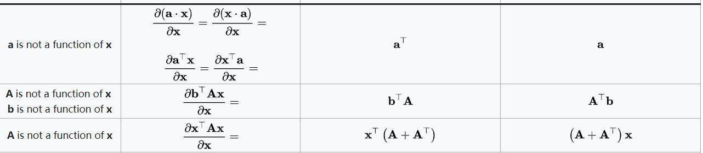
>
> 这里对矩阵的求导还分为分子布局(**Numerator layout** , 对应上图结果左)和分母布局(**Denominator layout**，对应上图结果右) ，一般准则是对于向量或者矩阵**对**标量求导，则使用分子布局，对于标量**对**向量或者矩阵，则使用分母布局。

由此我们可以对式3.10 展开并得到各部分的求导结果
$$
\begin{array}{cl}
\frac{\partial E_{\hat{\boldsymbol{w}}}}{\partial \hat{\boldsymbol{w}}} 
&=(\boldsymbol{y}-\mathbf{X} \hat{\boldsymbol{w}})^{\mathrm{T}}(\boldsymbol{y}-\mathbf{X} \hat{\boldsymbol{w}}) \\
&=\frac{\partial \boldsymbol{y}^{T} \boldsymbol{y}}{\partial \hat{\boldsymbol{w}}}-\frac{\partial \boldsymbol{y}^{T} \mathbf{X} \hat{\boldsymbol{w}}}{\partial \hat{\boldsymbol{w}}}-\frac{\partial \hat{\boldsymbol{w}}^{T} \mathbf{X}^{T} \boldsymbol{y}}{\partial \hat{\boldsymbol{w}}}+\frac{\partial \hat{\boldsymbol{w}}^{T} \mathbf{X}^{T} \mathbf{X} \hat{\boldsymbol{w}}}{\partial \hat{\boldsymbol{w}}}\\
& =0- \mathbf{X}^{T} \boldsymbol{y}- \mathbf{X}^{T} \boldsymbol{y} + (\mathbf{X}^{T}\mathbf{X}+ (\mathbf{X}^{T}\mathbf{X})^{T})\hat{\omega} \\
&=2 \mathbf{X}^{\mathrm{T}}(\mathbf{X} \hat{\boldsymbol{w}}-\boldsymbol{y}) 
\end{array}
\tag{3.10.1}
$$
令式 3.10 为 0 即可得到最优解的闭式解。
$$
\hat{\boldsymbol{w}}^{*}=(\mathbf{X}^{\mathrm{T}}\mathbf{X} )^{-1}\mathbf{X}^{\mathrm{T}}\boldsymbol{y}  \tag{3.11}
$$
可以发现以矩阵的形式我们得到的闭式解很简洁，然而我们却无法忽略一个问题， $(\mathbf{X}^{\mathrm{T}}\mathbf{X} )^{-1}$ 是否存在？

对于 $\mathbf{X}^{\mathrm{T}}\mathbf{X}$ ，它是一个方阵，这是一个很好的性质，但是它却不一定满秩（比如音频，基因等，都可能特征数量大于（甚至远大于）样例数量），只有当其为满秩矩阵( full-rank matrix) 或正定矩阵(positive definite matrix)时，我们才能得到式3.11 。

现我们假设该方阵是满秩的情况，令 $\boldsymbol{\hat{x_i}}=(\boldsymbol{x_i};1)$ 则多元线性回归模型可以表示为
$$
f\left(\hat{\boldsymbol{x}}_{i}\right)=\hat{\boldsymbol{x}}_{i}^{\mathrm{T}}\left(\mathbf{X}^{\mathrm{T}} \mathbf{X}\right)^{-1} \mathbf{X}^{\mathrm{T}} \boldsymbol{y}  \tag{3.12}
$$

对于现实任务中 $\mathbf{X}^{\mathrm{T}}\mathbf{X}$ 不是满秩矩阵的情况，此时可解出多个 $\hat{\omega}^{*}$，它们都能使均方误差最小化，选择哪一个解作为输出，将由学习算法的归纳偏好决定，常见的做法是引入正则化(regularization)项。


### 3.2.3 广义线性模型

generalized linear model 

线性模型虽然简单，但却有丰富的变化。对于样例 $(\mathbf{x},y), y\in \mathbb{R}$ ，当我们希望线性模型（3.2）的预测值逼近真实标记 $y$ 时，就得到了线性回归模型，我们将模型简写为
$$
y = \mathbf{\omega}^{T} \mathbf{x} + b \tag{3.13}
$$
有时像上面这种原始的线性回归可能并不能满足需求，例如：$y$ 值并不是线性变化，而是在指数尺度上变化。这时我们可以采用线性模型来逼近 $y$ 的衍生物，例如 $\ln y$，这时衍生的线性模型如下所示，实际上就是相当于将指数曲线投影在一条直线上，如下图所示：
$$
\ln y = \mathbb{\omega}^{T} \mathbb{x} +b \tag{3.14}
$$
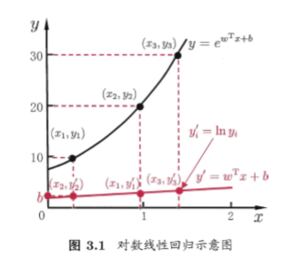

式3.14在形式上仍然式线性回归，但实质上已经式在求输入空间到输出空间的非线性函数映射。


一般地，考虑所有 $y$ 的衍生物的情形，就得到了“广义的线性模型”（generalized linear model）
$$
y = g^{-1}(\mathbb{\omega}^{T}\mathbb{x}+b) \tag{3.15}
$$
其中，$g(\cdot)$ 单调可微（即连续且充分光滑），称为联系函数（link function）。


## 3.3 对数几率回归

线性模型可以应用于回归学习问题，利用上述广义线性模型的特征，是否可以通过一个联系函数，将预测值转化为离散值从而进行分类任务的学习呢？

考虑二分类任务，其输出标记 $y\in \{0,1\}$ ，而线性回归模型产生的预测值 $z=\mathbf{\omega}^{T} \mathbf{x} + b$ 是实值，于是我们需要将其转化为 0/1，最理想的是"单位阶跃函数" (unit-step function)
$$
y=\left\{
\begin{array}{cl}
{0,} & {z<0} \\ 
{0.5,} & {z=0} \\ 
{1,} & {z>0}
\end{array}\right. \tag{3.16}
$$
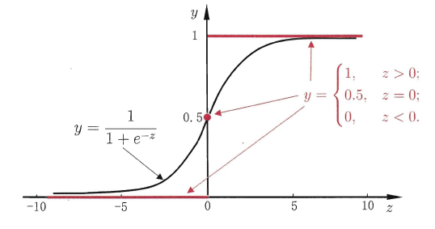

由上图可知单位阶跃函数不连续，因此不能作为广义线性模型中的联系函数，于是我们希望找到能在一定程度上近似单位阶跃函数的”替代函数“ (surrogate function)，并且它可以作为联系函数（单调可微），对数几率函数（logistic function）正是替代函数之一，可将预测值投影到 0-1之间，从而将线性回归问题转化为二分类问题。
$$
y=\frac{1}{1+e^{-z}} \tag{3.17}
$$
对数几率函数也是一种”Sigmoid 函数“ （即形似 S 的函数）。

将式 3.17 代入式 3.15 即可得到
$$
y=\frac{1}{1+e^{-\left(\boldsymbol{w}^{\mathrm{T}} \boldsymbol{x}+b\right)}} \tag{3.18}
$$
基于式 3.14的变换方式，可得到
$$
\ln \frac{y}{1-y}=\boldsymbol{w}^{\mathrm{T}} \boldsymbol{x}+b \tag{3.19}
$$
若将 $y$ 看做样本为正例的概率，$1-y$ 则为反例的概率，两者比值称为”几率“ (odds), 反映了样本作为正例的相对可能性。对几率取对数则得到”对数几率“ （log odds，亦称 logit）
$$
\frac{y}{1-y} \tag{3.20}
$$

$$
\ln \frac{y}{1-y} \tag{3.21}
$$


由此可看出，式3.18 实际上是在用线性回归模型的预测结果取逼近真实标记的对数几率，因此这个模型称为“对数几率回归”（logistic regression，或 logit regression），即“逻辑回归”。它的优点在于直接对分类可能性进行建模，无需事先假设数据分布，这样就避免了假设分布不准确所带来的问题；不仅可以预测类别，也可得到近似概率预测；对数几率函数是任意阶可导的凸函数，现有的许多数值优化算法都可直接用于求取最优解。

逻辑回归（对数几率回归）带有2个主要假设：

**（1）假设数据服从伯努利分布**

**（2）假设模型的输出值是样本为正例的概率**

若将式3.18中的 $y$ 视为类后验概率估计 $p(y=1|x)$ ，则式3.19可重写为
$$
\ln \frac{p(y=1 | \boldsymbol{x})}{p(y=0 | \boldsymbol{x})}=\boldsymbol{w}^{\mathrm{T}} \boldsymbol{x}+b  \tag{3.22}
$$
因为 $p(y=1|x)+p(y=0|x)=1$ ，于是我们可以得到
$$
p(y=1 | \boldsymbol{x})=\frac{e^{\boldsymbol{w}^{\top} \boldsymbol{x}+b}}{1+e^{\boldsymbol{w}^{\top} \boldsymbol{x}+b}} \tag{3.23}
$$

$$
p(y=0 | \boldsymbol{x})=\frac{1}{1+e^{\boldsymbol{w}^{\top} \boldsymbol{x}+b}} \tag{3.24}
$$


于是，可以使用极大似然估计的方法（maximum likelihood estimation, MLE）来计算出 $\omega $ 和 $b$ 两个参数

对于给定的训练数据集 $D=\{(x_i,y_i)\}_{i=1}^{m}$ ，该数据集出现的概率（即似然函数）为
$$
\ell(\boldsymbol{\omega},b) = P(D) = \prod p(y_i | \boldsymbol{x_i} ; \boldsymbol{\omega},b)
$$
对似然函数取对数得到“对数似然”(log-likelihood)
$$
LL(\boldsymbol{w}, b)=\ln \ell(\boldsymbol{w}, b)=\sum_{i=1}^{m} \ln p\left(y_{i} | \boldsymbol{x}_{i} ; \boldsymbol{w}, b\right) \tag{3.25}
$$
极大似然最简单的理解就是：样本所展现的状态便是所有可能状态中出现概率最大的状态。即令每个样本属于其真实标记的概率越大越好。为便于讨论，令 $\boldsymbol{\beta} = (\boldsymbol{\omega},b), \boldsymbol{\hat{x}}=(\boldsymbol{x};1)$ ，则 $\boldsymbol{w}^{\mathrm{T}} \boldsymbol{x}+b = \boldsymbol{\beta}^{T} \boldsymbol{\hat{x}}$ ,  令 $p_1(\boldsymbol{\hat{x}};\boldsymbol{\beta}) = p(y=1|\boldsymbol{\hat{x}};\boldsymbol{\beta})$ , $p_0(\boldsymbol{\hat{x}};\boldsymbol{\beta}) = p(y=0|\boldsymbol{\hat{x}};\boldsymbol{\beta})=1-p_1(\boldsymbol{\hat{x}};\boldsymbol{\beta}) $ ， 于是似然项可以重写为
$$
p\left(y_{i} | \boldsymbol{x}_{i} ; \boldsymbol{w}, b\right)=y_{i} p_{1}\left(\hat{\boldsymbol{x}}_{i} ; \boldsymbol{\beta}\right)+\left(1-y_{i}\right) p_{0}\left(\hat{\boldsymbol{x}}_{i} ; \boldsymbol{\beta}\right) \tag{3.26}
$$
将式3.26，3.23，3.24带入式3.25，则可以转化式3.25为
$$
\begin{array}{cl}LL(\boldsymbol{\beta})&=\sum_{i=1}^{m} \ln(y_{i} p_{1}\left(\hat{\boldsymbol{x}}_{i} ; \boldsymbol{\beta}\right)+\left(1-y_{i}\right) p_{0}\left(\hat{\boldsymbol{x}}_{i} ; \boldsymbol{\beta}\right)) \\&=\sum_{i=1}^{m} \ln (y_i\frac{e^{\boldsymbol{\beta}^{T} \boldsymbol{\hat{x_i}}}}{1+e^{\boldsymbol{\beta}^{T} \boldsymbol{\hat{x_i}}}} + (1-y_i)\frac{1}{1+e^{\boldsymbol{\beta}^{T} \boldsymbol{\hat{x_i}}}} ) \\&=\sum_{i=1}^{m} \left(\ln (y_i e^{\boldsymbol{\beta}^{T} \boldsymbol{\hat{x_i}}}+1-y_i) - \ln(1+e^{\boldsymbol{\beta}^{T} \boldsymbol{\hat{x_i}}}) \right)\end{array}  \tag{3.26.1}
$$
将 $y_i \in \{0,1\}$ 代入得到
$$
LL(\boldsymbol{\beta}) = \left\{\begin{array}{ll}{\sum_{i=1}^{m}\left(-\ln \left(1+e^{\beta^{T} \hat{x_i}}\right)\right),} & {y_{i}=0} \\ {\sum_{i=1}^{m}\left(\boldsymbol{\beta}^{T} \hat{\boldsymbol{x}}_{i}-\ln \left(1+e^{\boldsymbol{\beta}^{T} \hat{x_i}}\right)\right),} & {y_{i}=1}\end{array}\right.  \tag{3.26.2}
$$
综合上式即可得到
$$
LL(\boldsymbol{\beta})=\sum_{i=1}^{m}\left(y_{i} \boldsymbol{\beta}^{T} \hat{\boldsymbol{x_i}}-\ln \left(1+e^{\boldsymbol{\beta}^{T} \hat{x_i}}\right)\right) \tag{3.27}
$$
而损失函数即为对数似然函数的相反数，对于对数似然函数（高阶可导连续凸函数）求最大值，即是求其相反数的最小值，即损失函数的最小值。根据凸优化理论，经典的数值优化算法如梯度下降法(gradient descent method)、牛顿法(Newton method)等都可求得其最优解，于是就得到
$$
\boldsymbol{\beta}^{*} = \underset{\beta}{\arg \min} \left(-LL(\beta)\right) \tag{3.28}
$$

注: 逻辑回归的损失函数“对数似然函数(的相反数)”，在模型GBDT分类情况下也会用到，又叫作**“交叉熵”**（cross-entropy，描述两组不同概率数据分布的相似程度，越小越相似）。

用一句话来描述逻辑回归的过程：逻辑回归假设数据服从伯努利分布，通过极大化似然函数的方法，运用梯度下降来求解参数得出分类概率，通过阈值过滤来达到将数据二分类的目的。

## 3.4 线性判别分析

[comment ]: <后续补充>

## 3.5 多分类学习

[comment ]: <后续补充>


## 3.6 类别不平衡问题

前面介绍的分类学习方法都有一个共同的基本假设，即不同类别的训练样例数目相当，如果不同类别的训练样例数目稍有差别，通常影响不大，但若差别很大，则会对学习过程造成困扰，例如有998个反例，但正例只有2个，那么学习方法只需返回一个永远将新样本预测为反例的学习器，就能达到99.8%的精度，然而这样的学习器往往没有价值，因为它不能预测出任何正例。

类别不平衡（class-imbanlance）就是指分类问题中不同类别的训练样本相差悬殊的情况，常见的做法有三种：

1. 在训练样本较多的类别中进行“欠采样”（under-sampling / down-sampling），即去除一些样本，比如从反例中采出100个，常见的算法有：EasyEnsemble，其利用集成学习机制，将反例划分为若干个集合供不同学习器使用，这样对每个学习器来看都进行了欠采样，但在全局来看不会丢失重要信息。
2. 在训练样本较少的类别中进行“过采样”（oversampling / up-sampling），例如通过对正例中的数据进行插值，来产生额外的正例，常见的算法有SMOTE（Synthetic minority over-sampling technique）。
3. 直接基于原数据集进行学习，对预测值进行“再缩放”(rescaling / re-balance)处理。其中再缩放也是代价敏感学习的基础。

前两种方法都关注于对于数据样本进行均衡，而第三种方法则是关注于对预测结果进行均衡，称为“阈值移动” (threshold-moving)。

以逻辑回归应用在二分类问题为例，当我们在用 $y=\omega^{T}x +b $ 对新样本进行预测的时候，事实上是在用预测出的 $y$ 值与阈值进行比较，对于逻辑回归而言，因为联系函数的分段点在 $y=0.5$ 的位置，即在几率大于 1 时判定为正例，反之为反例。
$$
\frac{y}{1-y} > 1 \quad,  \text{预测为正例}  \tag{3.46}
$$
但是当训练集中正/反例的数目不同时，令 $m^{+}$ 表示正例数目，$m^{-}$ 表示反例数目，则观测几率是 $\frac{m^{+}}{m^{-}}$ ，由于我们通常假设训练集是真实样本总体的无偏采样，因此观测几率就代表了真实几率，于是，只要分类器的预测几率高于观测几率就应判定为正例，即
$$
\frac{y}{1-y} > \frac{m^{+}}{m^{-}} \quad, \text{预测为正例}  \tag{3.47}
$$
由于分类器是基于式3.46 进行决策，因此需要对其结果进行调整，使其执行式3.47，于是我们只需要令
$$
\frac{y^{\prime}}{1-y^{\prime}}=\frac{y}{1-y} \times \frac{m^{-}}{m^{+}} \tag{3.48}
$$
这就是在决策过程中进行了再缩放。


## 3.7 阅读材料

“稀疏表示” (sparse representation) 近年来很受关注（详细见第十一章），但即便对多元线性回归这样简单的模型，获得具有最优“稀疏性” (sparsity)的解也并不容易。稀疏性问题本质上对应了 $L_0$ 范数的优化，这在通常条件下是NP难问题。 LASSO通过 $L_1$ 范数来近似 $L_{0}$ 范数，是求取稀疏解的重要技术。

可以证明，OvO和 OvR 都是ECOC的特例[Allwein et al., 2000])，人们以往希望设计通用的编码法, [Crammer and Singer, 2002]提出要考虑问题本身的特点，设计“问题依赖”的编码法，并证明寻找最优的离散编码矩阵是一个NP完全问题，此后，有多种问题依赖的 ECOC编码法被提出，通常是通过找出具有代表性的二分类问题来进行编码，[Escalera et al., 2010]开发了一个开源ECOC库.

MvM除了ECOC还可有其他实现方式，例如DAG (Directed Acyclic Graph)拆分法将类别划分表达成树形结构，每个结点对应于一个二类分类器，还有一些工作是致力于直接求解多分类问题，例如多类支持向量机方面的一些研究[Crammer and Singer, 2001; Lee et al, 2004])

代价敏感学习中研究得最多的是基于类别的“误分类代价” (misclassification cost)， 代价矩阵如表2.2所示，在提及代价敏感学习时，默认指此类情形，已经证明，对二分类任务可通过“再缩放”获得理论最优解[Elkan,2001]，但对多分类任务，仅在某些特殊情形下存在闭式解[Zhouand Liu, 2006]。非均等代价和类别不平衡性虽然都可借助“再缩放”技术，但两者本质不同[Zhou and Liu, 2006b]。需注意的是，类别不平衡学习中通常是较小类的代价更高，否则无需进行特殊处理。

多分类学习中虽然有多个类别，但每个样本仅属于一个类别，如果希望为一个样本同时预测出多个类别标记，例如一幅图像可同时标注为“蓝天”、“白云”、“羊群”、“自然场景” ，这样的任务就不再是多分类学习，而是“多标记学习” (multi-label learning)，这是机器学习中近年来相当活跃的一个研究领域。


# 第四章 决策树

## 4.1 决策树基本流程

决策树(decision tree，亦称为判定树)是一类常见的机器学习方法。

以二分类任务为例，我们希望从给定训练数据集学得一个模型用以对新实例进行分类，这个把样本分类的任务，可看作对“当前样本属于正类吗?"这个问题的“决策”或“判定”过程，顾名思义，决策树是基于树结构来进行决策的，这恰是人类在面临决策问题时一种很自然的处理机制。

例如，我们要对“这是好瓜吗?"这样的问题进行决策时，通常会进行一系列的判断或“子决策"：我们先看“它是什么颜色?"，如果是“青绿色”，则我们再看“它的根蒂是什么形态?" ，如果是“蜷缩" ，我们再判断“它敲起来是什么声音?" ，最后，我们得出最终决策:这是个好瓜。决策过程如图4.1所示：


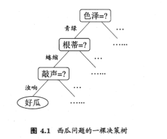

显然，决策过程的最终结论对应了我们所希望的判定结果，例如“是”或“不是”好瓜；决策过程中提出的每个判定问题都是对某个属性的“测试” ，例如“色泽=?" “根蒂=?" ；每个测试的结果或是导出最终结论，或是导出进一步的判定问题，其考虑范围是在上次决策结果的限定范围之内，例如若在“色泽=青绿”之后再判断“根蒂=?" ，则仅在考虑青绿色瓜的根蒂。

一般一颗决策树包含：一个根节点、若干个内部节点和若干个叶子节点，易知：

```
* 每个叶节点存放一个类别，对应于决策结果。
* 每个非叶节点表示一个特征/属性测试。
* 每个节点包含的样本集合通过属性测试被划分到子节点中，每个分支代表这个特征/属性在某个值域上的输出。
* 根节点包含样本全集。
* 从根节点到每个叶节点的路径对应了一个判定测试序列（决策序列）。
```


决策树学习的目的是为了产生一颗泛化能力强，即处理未见实例（样本）能力强的决策树（判定规则），其基本流程遵循简单且直观的“分而治之”（divide-and-conquer）策略，如图4.2所示

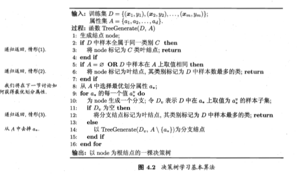

显然，决策树的生成是一个递归过程，在决策树基本算法中，有三种情形会导致递归返回:

- (1) 当前结点包含的样本全属于同一类别，无需划分； 
- (2) 当前属性集为空，或是所有样本在所有属性上取值相同，无法划分； 
- (3) 当前结点包含的样本集合为空，不能划分。

在第(2)种情形下，我们把当前结点标记为叶结点，并将其类别设定为该结点所含样本最多的类别；在第(3)种情形下，同样把当前结点标记为叶结点，但将其类别设定为其父结点所含样本最多的类别。

注意这两种情形的处理实质不同：情形(2)是在利用当前结点的**后验分布**，而情形(3)则是把父结点的样本分布作为当前结点的**先验分布**。

一句话总结，对于决策树这种树形结构，可以认为是 if-then（如果...那么...） 规则的集合，是以实例为基础的归纳学习。基本思想是自顶向下，以信息增益（或信息增益比，基尼系数等）为度量构建一颗度量标准下降最快的树，每个内部节点代表一个属性的测试，直到叶子节点处只剩下同一类别的样本。

决策树的学习包括三个重要的步骤，**特征选择**，**决策树的生成**以及**决策树的剪枝**：

- **特征选择：**特征选择方法有信息增益，信息增益比，基尼系数等。
- **生成过程：**通过计算信息增益或其它指标，选择最佳特征。从根结点开始，递归地产生决策树，不断的选取局部最优的特征，将训练集分割成能够基本正确分类的子集。（如图4.1所示）
- **剪枝过程：**有预剪枝和后剪枝两类方法。


## 4.2 划分选择

从 图4.2 的决策树算法过程可以看出：决策树学习的关键在于第8行，即如何选择**最优**划分属性，不同的划分属性得出不同的分支结构，从而影响整颗决策树的性能。一般而言，随着划分过程不断进行，我们希望决策树的分支结点所包含的样本尽可能属于同一类别，即结点的 “纯度”(purity) 越来越高。决策树最常用的量化纯度的指标有三种：信息熵，信息增益比，基尼系数，分别对应了ID3, C4.5, CART 三种决策树算法。


### 4.2.1 信息增益

ID3（Iterative Dichotomiser，迭代二分器）算法使用信息增益为准则来选择划分属性，“信息熵”(information entropy)是度量样本集合纯度（随机变量不确定度）的常用指标，假定当前样本集合 $D$ 中第 $k$ 类样本所占比例为 $p_k(k=1,2,\dots,|y|)$，则样本集合 $D$ 的信息熵定义为：
$$
\operatorname{Ent}(D)=-\sum_{k=1}^{|y|} p_{k} \log_2{p_k} \tag{4.1}
$$
$\operatorname{Ent}(D)$ 的值**越小**（最小值为0，最大值为 $\log_2{|y|}$ ），则样本集 $D$ 的**纯度越高**。其中 $|y|$ 表示样本类别数——最终分类数，如{好瓜，坏瓜}，则值为2。


> 信息论之父克劳德·香农，总结了信息熵的三条性质：
>
> - **单调性**，即发生概率越高的事件，其所携带的信息熵越低。极端案例就是“太阳从东方升起”，因为为确定事件，所以不携带任何信息量。从信息论的角度，认为这句话没有消除任何不确定性。
> - **非负性**，即信息熵不能为负。这个很好理解，因为负的信息，即你得知了某个信息后，却增加了不确定性是不合逻辑的。
> - **累加性**，即多随机事件同时发生存在的总不确定性的量度是可以表示为各事件不确定性的量度的和。写成公式就是事件 $X=A, Y=B$ 同时发生，两个事件相互独立，则 $p(X=A,Y=B)=p(X=A)\ast p(Y=B)$ ,那么信息熵为 $H(A,B)=H(A)+H(B)$ 
>
> 香农从数学上，严格证明了满足上述三个条件的随机变量不确定性度量函数具有唯一形式：
> $$
> H(X)=-C \sum\limits_{x\in \mathrm{X}} = p(x)\log p(x)
> $$
> 其中 $C$ 为常数，将其归一化之后即得到信息熵公式。
>
> 如果两个随机事件不独立，则满足 $H(A,B)=H(A)+H(B)-I(A,B)$ ，其中 $I(A,B)$ 为互信息（mutual information），代表一个随机变量包含另一个随机变量的度量。


假定离散属性 $a$ 有 $V$ 个可能的取值 $\{a^{1},a^{2},\dots,a^{V} \}$ ，通过 $a$ 属性划分样本集 $D$，则产生了 $V$ 个分支结点，用 $v$ 表示其中第 $v$ 个分支结点，则该分支结点包含了 $D$ 中所有在属性 $a$ 上取值为 $a^{v}$ 的样本，记为 $D^{v}$ 。由式4.1我们即可计算该划分下的信息熵，并且易知：分支结点包含的样本数越多，表示该分支结点的影响力越大，则对分支结点根据样本数比例赋予权重 $|D^{v}|/|D|$ ，即可计算出划分后相比原始数据集 $D$ 获得的“信息增益”（information gain）
$$
\operatorname{Gain}(D,a) = \operatorname{Ent}(D)- \sum_{v=1}^{V} \frac{|D^{v}|}{|D|} \operatorname{Ent}(D^{v})  \tag{4.2}
$$
信息增益越大，表示使用该属性划分样本集 $D$ 的效果越好，即使用该属性来进行划分所获得的纯度提升越大。因此 ID3 算法在递归过程中，每次选择最大信息增益的属性作为当前的划分属性，即在图4.2的算法流程的第8行中，选择属性 $a_* = \underset{a \in A}{\arg \max \operatorname{Gain}(D,a)}$ 。

表4.1 西瓜数据集2.0

| 编号 | 色泽 | 根蒂 | 敲声 | 纹理 | 脐部 | 触感 | 好瓜 |
| ---- | ---- | ---- | ---- | ---- | ---- | ---- | ---- |
| 1    | 青绿 | 蜷缩 | 浊响 | 清晰 | 凹陷 | 硬滑 | 是   |
| 2    | 乌黑 | 蜷缩 | 沉闷 | 清晰 | 凹陷 | 硬滑 | 是   |
| 3    | 乌黑 | 蜷缩 | 浊响 | 清晰 | 凹陷 | 硬滑 | 是   |
| 4    | 青绿 | 蜷缩 | 沉闷 | 清晰 | 凹陷 | 硬滑 | 是   |
| 5    | 浅白 | 蜷缩 | 浊响 | 清晰 | 凹陷 | 硬滑 | 是   |
| 6    | 青绿 | 稍蜷 | 浊响 | 清晰 | 稍凹 | 软粘 | 是   |
| 7    | 乌黑 | 稍蜷 | 浊响 | 稍糊 | 稍凹 | 软粘 | 是   |
| 8    | 乌黑 | 稍蜷 | 浊响 | 清晰 | 稍凹 | 硬滑 | 是   |
| 9    | 乌黑 | 稍蜷 | 沉闷 | 稍糊 | 稍凹 | 硬滑 | 否   |
| 10   | 青绿 | 硬挺 | 清脆 | 清晰 | 平坦 | 软粘 | 否   |
| 11   | 浅白 | 硬挺 | 清脆 | 模糊 | 平坦 | 硬滑 | 否   |
| 12   | 浅白 | 蜷缩 | 浊响 | 模糊 | 平坦 | 软粘 | 否   |
| 13   | 青绿 | 稍蜷 | 浊响 | 稍糊 | 凹陷 | 硬滑 | 否   |
| 14   | 浅白 | 稍蜷 | 沉闷 | 稍糊 | 凹陷 | 硬滑 | 否   |
| 15   | 乌黑 | 稍蜷 | 浊响 | 清晰 | 稍凹 | 软粘 | 否   |
| 16   | 浅白 | 蜷缩 | 浊响 | 模糊 | 平坦 | 硬滑 | 否   |
| 17   | 青绿 | 蜷缩 | 沉闷 | 稍糊 | 稍凹 | 硬滑 | 否   |

以表4.1中西瓜数据集2.0 为例，该数据集包含17个训练样例，显然, $|y|=2$，在决策树学习开始时，根结点包含 $D$ 中的所有样例，其中正例占 $p_1 = 8/17$，反例占 $p_2 = 9/17$。于是，根据式(4.1)可计算出根结点的信息煽为
$$
\begin{array}{cl}\operatorname{Ent}(D) &= -\sum\limits_{k=1}^{2} p_{k} \log_2{p_k}  \\&= -(8/17)* \log_2(8/17) -(9/17)\log_2(9/17) \\&= 0.9975 \approx 0.998\end{array}
$$
然后我们计算整个属性集 $A$ 中 {色泽，根蒂，敲声，纹理，脐部，触感} 每个属性的信息增益，以属性”色泽“为例，它有3个可能的取值，即 {青绿，乌黑，浅白} ，使用该属性（色泽）对数据集 $D$ 进行划分，即得到3个子集：$D^{1}$(色泽=青绿)，$D^{2}$(色泽=乌黑)，$D^{3}$(色泽=浅白) 。

子集 $D^1$ 包含编号为 {1， 4， 6， 10， 13， 17} 的6个样例，其中正例占 $p_1=3/6$，反例占 $p_2=3/6$; $D^2$ 包含编号为 {2， 3， 7， 8， 9， 15} 的6个样例，其中正、反例分别占 $p_1=4/6$， $p_2=2/6$ ;  $D^3$ 包含编号为 {5， 11， 12， 14， 16}的5个样例，其中正、反例分别占 $p_1=1/5$ ，$p_2=4/5$ 。根据 式(4.1) 可计算出用“色泽”划分之后所获得的3个分支结点的信息熵为
$$
\begin{array}{cl}\operatorname{Ent}(D^1) &= -(3/6)* \log_2(3/6) -(3/6)\log_2(3/6)=1.0  \\\operatorname{Ent}(D^2) &= -(4/6)* \log_2(4/6) -(2/6)\log_2(2/6)=0.918  \\\operatorname{Ent}(D^3) &= -(1/5)* \log_2(1/5) -(4/5)\log_2(4/5)=0.722  \\\end{array}
$$
再根据 式4.2 即可得到属性“色泽”的信息增益
$$
\begin{array}{cl}\operatorname{Gain}(D, \text{色泽})& = \operatorname{Ent}(D) - \sum\limits_{v=1}^{3} \frac{|D^{v}|}{|D|} \operatorname{Ent}(D^{v})  \\& = 0.998 - (\frac{6}{17} *1.0 + \frac{6}{17} *0.918 +\frac{5}{17} *0.722)  \\& = 0.109\end{array}
$$
类似地，我们可以计算得到其他5个属性的信息增益和它们各自属性值分支结点的信息熵
$$
\begin{array}{cl}\operatorname{Ent}(蜷缩，根蒂) &= -(5/8)* \log_2(5/8) -(3/8)\log_2(3/8) =0.954  \\\operatorname{Ent}(稍蜷，根蒂) &= -(3/7)* \log_2(3/7) -(4/7)\log_2(4/7)=0.985  \\\operatorname{Ent}(硬挺，根蒂) &= -(0/2)* \log_2(0/2) -(2/2)\log_2(2/2)=0  \\\operatorname{Ent}(浊响，敲声) &= -(6/10)* \log_2(6/10) -(4/10)\log_2(4/10)=0.971  \\\operatorname{Ent}(沉闷，敲声) &= -(2/5)* \log_2(2/5) -(3/5)\log_2(3/5)= 0.971  \\\operatorname{Ent}(清脆，敲声) &= -(0/2)* \log_2(0/2) -(2/2)\log_2(2/2)=0  \\\operatorname{Ent}(清晰，纹理) &= -(7/9)* \log_2(7/9) -(2/9)\log_2(2/9)=0.764  \\\operatorname{Ent}(模糊，纹理) &= -(0/3)* \log_2(0/3) -(3/3)\log_2(3/3)=0  \\\operatorname{Ent}(稍糊，纹理) &= -(1/5)* \log_2(1/5) -(4/5)\log_2(4/5)= 0.722  \\\operatorname{Ent}(凹陷，脐部) &= -(5/7)* \log_2(5/7) -(2/7)\log_2(2/7)=0.863  \\\operatorname{Ent}(稍凹，脐部) &= -(3/6)* \log_2(3/6) -(3/6)\log_2(3/6)=1.0  \\\operatorname{Ent}(平坦，脐部) &= -(0/4)* \log_2(0/4) -(4/4)\log_2(4/4)=0  \\\operatorname{Ent}(硬滑，触感) &= -(6/12)* \log_2(6/12) -(6/12)\log_2(6/12)=1.0  \\\operatorname{Ent}(软粘，触感) &= -(2/5)* \log_2(2/5) -(3/5)\log_2(3/5)= 0.971  \\\end{array}
$$

$$
\begin{array}{cl}\operatorname{Gain}(D, \text{根蒂}) &= 0.998 - (\frac{8}{17} *0.954 + \frac{7}{17} *0.985 +\frac{2}{17} *0) = 0.143  \\\operatorname{Gain}(D, \text{敲声}) &= 0.998 - (\frac{10}{17} *0.971 + \frac{5}{17} *0.971 +\frac{2}{17} *0) = 0.141 \\\operatorname{Gain}(D, \text{纹理}) &= 0.998 - (\frac{9}{17} *0.764 + \frac{3}{17} *0 +\frac{5}{17} *0.722) = 0.381 \\\operatorname{Gain}(D, \text{脐部}) &= 0.998 - (\frac{7}{17} *0863 + \frac{6}{17} *1.0 +\frac{4}{17} *0) = 0.289 \\\operatorname{Gain}(D, \text{触感}) &= 0.998 - (\frac{12}{17} *1.0 + \frac{5}{17} *0.971) = 0.006 \\\end{array}
$$

显然，属性“纹理”的信息增益最大，因此我们选择其作为划分属性。图4.3 给出了基于纹理对根结点进行划分的结果，各分支结点所包含的样例子集显示在结点中。


然后，决策树学习算法将对每个分支结点进一步划分，即对应于图4.2中第11行到第15行的步骤。

以图4.3中第一个分支结点（纹理=清晰）为例，样例集为 $D^{1}=\{1,2,3,4,5,6,8,10,15\}$ ，可用属性集 {色泽，根蒂，敲声，脐部，触感} 。

表4.1.1 纹理=清晰样本子集

| 编号 | 色泽 | 根蒂 | 敲声 | 纹理 | 脐部 | 触感 | 好瓜 |
| ---- | ---- | ---- | ---- | ---- | ---- | ---- | ---- |
| 1    | 青绿 | 蜷缩 | 浊响 | 清晰 | 凹陷 | 硬滑 | 是   |
| 2    | 乌黑 | 蜷缩 | 沉闷 | 清晰 | 凹陷 | 硬滑 | 是   |
| 3    | 乌黑 | 蜷缩 | 浊响 | 清晰 | 凹陷 | 硬滑 | 是   |
| 4    | 青绿 | 蜷缩 | 沉闷 | 清晰 | 凹陷 | 硬滑 | 是   |
| 5    | 浅白 | 蜷缩 | 浊响 | 清晰 | 凹陷 | 硬滑 | 是   |
| 6    | 青绿 | 稍蜷 | 浊响 | 清晰 | 稍凹 | 软粘 | 是   |
| 8    | 乌黑 | 稍蜷 | 浊响 | 清晰 | 稍凹 | 硬滑 | 是   |
| 10   | 青绿 | 硬挺 | 清脆 | 清晰 | 平坦 | 软粘 | 否   |
| 15   | 乌黑 | 稍蜷 | 浊响 | 清晰 | 稍凹 | 软粘 | 否   |

基于该样例集计算各属性的信息增益和它们各自属性值分支结点的信息熵
$$
\begin{array}{cl}\operatorname{Ent}(青绿，色泽) &= -(3/4)* \log_2(3/4) -(1/4)\log_2(1/4)=0.811  \\\operatorname{Ent}(乌黑，色泽) &= -(3/4)* \log_2(3/4) -(1/4)\log_2(1/4)=0.811  \\\operatorname{Ent}(浅白，色泽) &= -(1/1)* \log_2(1/1) -(0/1)\log_2(0/1)= 0  \\\operatorname{Ent}(蜷缩，根蒂) &= -(5/5)* \log_2(5/5) -(0/5)\log_2(0/5) =0  \\\operatorname{Ent}(稍蜷，根蒂) &= -(2/3)* \log_2(2/3) -(1/3)\log_2(1/3)=0.918  \\\operatorname{Ent}(硬挺，根蒂) &= -(0/1)* \log_2(0/1) -(1/1)\log_2(1/1)=0  \\\operatorname{Ent}(浊响，敲声) &= -(5/6)* \log_2(5/6) -(1/6)\log_2(1/6)=0.650  \\\operatorname{Ent}(沉闷，敲声) &= -(2/2)* \log_2(2/2) -(0/2)\log_2(0/2)= 0  \\\operatorname{Ent}(清脆，敲声) &= -(0/1)* \log_2(0/1) -(1/1)\log_2(1/1)=0  \\\operatorname{Ent}(凹陷，脐部) &= -(5/5)* \log_2(5/5) -(0/5)\log_2(0/5)=0  \\\operatorname{Ent}(稍凹，脐部) &= -(2/3)* \log_2(2/3) -(1/3)\log_2(1/3)=0.918  \\\operatorname{Ent}(平坦，脐部) &= -(0/1)* \log_2(0/1) -(1/1)\log_2(1/1)=0  \\\operatorname{Ent}(硬滑，触感) &= -(6/6)* \log_2(6/6) -(0/6)\log_2(0/6)=0  \\\operatorname{Ent}(软粘，触感) &= -(1/3)* \log_2(1/3) -(2/3)\log_2(2/3)= 0.918  \\\end{array}
$$
这里的样本集的信息熵我们在之前已经计算过，即 $Ent(D^{1})=Ent(清晰，纹理)=0.764$
$$
\begin{array}{cl}\operatorname{Gain}(D^{1}, \text{色泽}) &= 0.764 - (\frac{4}{9} *0.811 + \frac{4}{9} *0.811 +\frac{1}{9} *0) = 0.043 \\\operatorname{Gain}(D^{1}, \text{根蒂}) &= 0.764 - (\frac{5}{9} *0 + \frac{3}{9} *0.918 +\frac{1}{9} *0) = 0.458  \\\operatorname{Gain}(D^{1}, \text{敲声}) &= 0.764 - (\frac{6}{9} *0.650 + \frac{2}{9} *0 +\frac{1}{9} *0) = 0.331 \\\operatorname{Gain}(D^{1}, \text{脐部}) &= 0.764 - (\frac{5}{9} *0 + \frac{3}{9} *0.918 +\frac{1}{9} *0) = 0.458 \\\operatorname{Gain}(D^{1}, \text{触感}) &= 0.764 - (\frac{6}{9} *0 + \frac{3}{9} *0.918) = 0.458 \\\end{array}
$$
“根蒂”、“脐部”、“触感” 3个属性均取得了最大的信息增益，可任选其中之一作为纹理=清晰结点下的划分属性，类似的，对其他每个分支结点继续进行上述操作，最终得到的决策树如图4.4所示

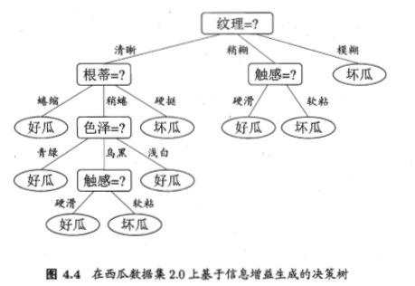


### 4.2.2 信息增益率

信息增益指标存在一个问题，就是偏向于取值数目较多的属性，即 V 值较大的属性，例如：对于表4.1 的西瓜数据集2.0的编号列，样本集 $D$ 将会被划分为 $|D|$ 个分支，每个分支只有一个样本，这样划分后每一个分支的信息熵为零，十分纯净，但是对分类毫无用处。

C4.5(Classifier 4.5) 算法使用“增益率”（gain ratio）来选择最优划分属性，来避免信息增益准则对可取值数目较多的属性的偏好导致的不利影响。

因为信息增益率对于可取值数目较少的属性有所偏好（与信息增益相反），因此 C4.5 算法首先计算出所有属性的信息增益，然后取其中高于平均水平的多个候选属性，计算这些候选属性的信息增益率，最后选择信息增益率最高的属性作为最优划分属性，增益率定义为：
$$
{\text { Gain ratio }(D, a)=\frac{\operatorname{Gain}(D, a)}{\operatorname{IV}(a)}}  \tag{4.3}
$$

$$
\operatorname{IV}(a)=-\sum_{v=1}^{V} \frac{\left|D^{v}\right|}{|D|} \log _{2} \frac{\left|D^{v}\right|}{|D|} \tag{4.4}
$$

其中， $\operatorname{IV}(a)$ 称为属性 $a$ 的固有值（intrinsic value），属性 $a$ 的可能取值数目越多（V越大），则通常 $\operatorname{IV}(a)$ 的值越大。

**可以发现固有值的定义与信息熵的定义是一样的！**实际上，属性的固有值就是将该属性作为目标列计算的信息熵，但是因为我们的目标列不是该属性，因此我们称为特征熵。

对于西瓜数据集2.0 我们可以得到各个属性的固有值
$$
\begin{array}{cl}\operatorname{IV}(编号) &= -17*(1/17)* \log_2(1/17)= 4.087  \\\operatorname{IV}(色泽) &= -(6/17)* \log_2(6/17) -(6/17)*\log_2(6/17)-(5/17)*\log_2(5/17) =1.580\\\operatorname{IV}(根蒂) &= -(8/17)* \log_2(8/17) -(7/17)*\log_2(7/17)-(2/17)*\log_2(2/17)=1.402 \\\operatorname{IV}(敲声) &= -(10/17)* \log_2(10/17) -(5/17)*\log_2(5/17)-(2/17)*\log_2(2/17)=1.333 \\\operatorname{IV}(纹理) &= -(9/17)* \log_2(9/17) -(3/17)*\log_2(3/17)-(5/17)*\log_2(5/17) =1.447 \\\operatorname{IV}(脐部) &= -(7/17)* \log_2(7/17) -(6/17)*\log_2(6/17)-(4/17)*\log_2(4/17) =1.549\\\operatorname{IV}(触感) &= -(12/17)* \log_2(12/17) -(5/17)*\log_2(5/17)=0.874 \\\end{array}
$$


### 4.2.3 基尼指数

CART（Classification and Regression Tree）决策树使用“基尼指数”（Gini index）来选择划分属性，基尼指数反映的是从样本集 $D$ 中随机抽取两个样本，其类别标记不一致的概率，因此 $\operatorname{Gini}(D)$ 越小越好，即数据集的纯度越高。数据集 $D$ 的基尼指数：
$$
\operatorname{Gini}(D) =\sum_{k=1}^{|y|} \sum_{k^{\prime} \neq k} p_{k} p_{k^{\prime}} =\sum_{k=1}^{|y|} p_{k}(1-p_{k})=1-\sum_{k=1}^{|y|} p_{k}^{2}  \tag{4.5}
$$
进而，使用属性 $a$ 划分后的基尼指数为：
$$
\operatorname{Gini\_index}(D, a)=\sum_{v=1}^{V} \frac{\left|D^{v}\right|}{|D|} \operatorname{Gini}\left(D^{v}\right)  \tag{4.6}
$$
于是，我们在候选属性集合 A 中，选择使得划分后基尼指数最小的属性作为最优划分属性即可，即
$$
a_* = \underset{a\in A}{\operatorname{arg min\;}} \operatorname{Gini\_index}(D,a)
$$

## 4.3 剪枝处理

从决策树的构造流程中我们可以直观地看出：不管怎么样的训练集，决策树总是能很好地将各个类别分离开来，这时就会遇到之前提到过的问题：过拟合，即太依赖于训练样本，以致于把训练集自身的一些特点当作所有数据都具有的一般性质。剪枝（pruning）则是决策树算法对付过拟合的主要手段，剪枝的策略有两种如下：


	* 预剪枝（prepruning）：在构造的过程中先评估，再考虑是否分支。
	* 后剪枝（postpruning）：在构造好一颗完整的决策树后，自底向上，评估非叶结点分支的必要性。

评估指的是性能评估（2.2节），即评估决策树的泛化性能。预剪枝表示在构造数的过程中，对一个结点考虑是否分支时，首先计算决策树不分支时在测试集上的性能，再计算分支之后的性能，若分支对性能没有提升，则选择不分支（即剪枝）。后剪枝则表示在构造好一颗完整的决策树后，从最下面的结点开始，考虑该结点分支对模型的泛化性能是否有提升，若无提升则剪枝，即将该结点标记为叶子结点，类别标记为其包含样本最多的类别。

本节假定采用留出法，即预留一部分数据为验证集以进行性能评估。对于表4.1的西瓜数据集2.0，随机划分为2部分，编号为{1,2,3,6,7,10,14,15,16,17}的样例组成训练集，编号为{4,5,8,9,11,12,13}的样例组成验证集。采用4.2.1节的信息增益准则进行划分属性选择，则可将训练集训练生成 如图4.5 所示的决策树。

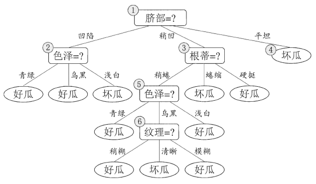


### 4.3.1 预剪枝

基于信息增益准则，在计算了训练集（编号为{1,2,3,6,7,10,14,15,16,17}的样例）各特征的信息增益后，选择脐部作为划分属性。

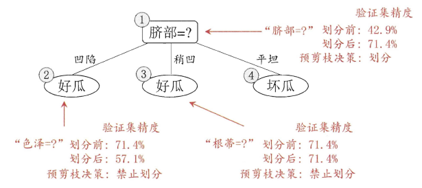

在划分之前，所有样例集中在根结点，若不进行划分，则根据算法4.2 第6行，该结点将被标记为叶结点，其类别标记为训练样例数最多的类别，假设我们将这个叶结点标记为“好瓜”，用验证集{4, 5, 8, 9, 11, 12, 13} 对这个单结点决策树进行评估，则编号为{4, 5, 8}的样例被分类正确，另外4个样例分类错误，于是，验证集精度为 (3/7)*100% =42.9%。（因为训练集正负样本数相等，因此将划分前的根节点标记为“坏瓜”，也是可以的，相对应的验证集精度为57.1%）

在用属性“脐部”划分之后，图4.6中的结点②、③、④分别包含编号为{1, 2, 3, 14}、{6, 7, 15, 17} 、{10, 16}的训练样例，因此这3个结点分别被标记为叶结点“好瓜”、“好瓜”、“坏瓜”。此时，验证集中编号为{4, 5, 8, 11, 12}的样例被分类正确，验证集精度为 (5/7)*100% = 71.4% > 42.9%于是，用“脐部”进行划分得以确定。

然后，决策树算法应该对结点②进行划分，基于信息增益准则，将挑选出划分属性“色泽” ，然而，在使用“色泽”划分后，编号为{5}的验证集样本分类结果会由正确转为错误，使得验证集精度下降为57.1%，于是，预剪枝策略将禁止结点②被划分。
对结点③，最优划分属性为“根蒂”，划分后验证集精度仍为71.4%。这个划分不能提升验证集精度，于是，预剪枝策略禁止结点3被划分。
对结点④，其所含训练样例已属于同一类，不再进行划分。

于是，基于预剪枝策略所生成的决策树如图4.6所示，其验证集精度为71.4%，这是一棵仅有一层划分的决策树，亦称“决策树桩” (decision stump)。
对比图4.6和图4.5可看出，预剪枝使得决策树的很多分支都没有“展开”，这不仅降低了过拟合的风险，还**显著减少了训练时间开销和测试时间开销**，但另一方面，有些分支的当前划分虽不能提升泛化性能、甚至可能导致泛化性能暂时下降，但在其基础上进行的后续划分却有可能导致性能显著提高；预剪枝基于“贪心”本质禁止这些分支展开，给预剪枝决策树带来了**欠拟合的风险**。


### 4.3.2 后剪枝

后剪枝先从训练集生成一颗完整的决策树（如图4.5所示）。

后剪枝首先考察图4.5中的结点⑥。若将其领衔的分支剪除，则相当于把⑥替换为叶结点，替换后的叶结点包含编号为{7, 15}的训练样本，于是，该叶结点的类别标记为“好瓜”，此时决策树的验证集精度提高至57.1%。于是，后剪枝策略决定剪枝。
然后考察结点⑥，若将其领衔的子树替换为叶结点，则替换后的叶结点包含编号为{6, 7, 15}的训练样例，叶结点类别标记为“好瓜” ，此时决策树验证集精度仍为57.1%，于是，可以不进行剪枝。(实际上，根据奥卡姆剃刀准则，通常会进行剪枝)
对结点②，若将其领衔的子树替换为叶结点，则替换后的叶结点包含编号为{1, 2, 3, 14}的训练样例，叶结点标记为“好瓜”.此时决策树的验证集精度提高至71.4%，于是，后剪枝策略决定剪枝。
对结点③和①，若将其领衔的子树替换为叶结点，则所得决策树的验证集精度分别为71.4%与42.9%，均未得到提高。于是它们被保留。
最终，基于后剪枝策略所生成的决策树如图4.7所示，其验证集精度为71.4%。

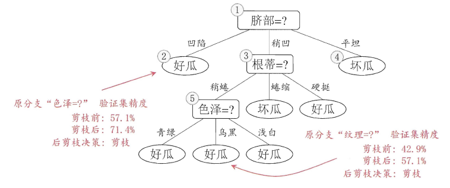

对比图4.7和图4.6可看出，后剪枝决策树通常比预剪枝决策树保留了更多的分支。一般情形下，后剪枝决策树的欠拟合风险很小，泛化性能往往优于预剪枝决策树，但后剪枝过程是在生成完全决策树之后进行的，并且要自底向上地对树中的所有非叶结点进行逐一考察，因此其训练时间开销比未剪枝决策树和预剪枝决策树都要大得多。


## 4.4 连续值与缺失值处理

下述方法为 C4.5决策树算法中采用。

### 4.4.1 连续值二值划分

对于连续值的属性，若每个取值作为一个分支则显得不可行，因此需要进行离散化处理，常用的方法为二分法（bi-partition），基本思想为：给定样本集 $D$ 与连续属性 $\alpha$，二分法试图找到一个划分点 t 将样本集 $D$ 在属性  $\alpha$ 上分为 ≤t 与＞t ，样本集即可分为子集 $D^{-}_{t}$ 和 $D^{+}_{t}$ ，其中 $D^{-}_{t}$ 包含在属性 $\alpha$ 上取值不大于 t 的样本，而$D^{+}_{t}$ 则包含大于 t 的样本 。显然，当取值为 $[\alpha^{t},\alpha^{t+1})$ 中任意值所产生的划分结果是相同的。

	* 首先将α的所有取值按升序排列，所有相邻属性的均值作为候选划分点（n-1个，n为α所有的取值数目）。
	* 计算每一个划分点划分集合D（即划分为两个分支）后的信息增益。
	* 选择最大信息增益的划分点作为最优划分点。

可知 n-1 个候选划分点集合为
$$
T_{\alpha} = \{\frac{a^{i}+a^{i+1}}{2} |1 \leq i \leq n-1 \}  \tag{4.7}
$$
于是，我们可以像离散属性值一样来考虑这些划分点，选取最优的划分点进行样本集合的划分。对式4.2 进行稍加改造即可得到可应用于连续值属性的信息增益
$$
\begin{aligned} \operatorname{Gain}(D, a) 
&=\max _{t \in T_{a}} \operatorname{Gain}(D, a, t) \\ 
&=\max _{t \in T_{a}} \operatorname{Ent}(D)-\sum_{\lambda \in[-,+)} \frac{\left|D_{t}^{\lambda}\right|}{|D|} \operatorname{Ent}\left(D_{t}^{\lambda}\right) \end{aligned} \tag{4.8}
$$
其中， $\operatorname{Gain}(D,a,t)$ 是样本集 $D$ 基于划分点 t 二分后的信息增益。于是，我们可选择使得 $\operatorname{Gain}(D,a,t)$ 最大化的划分点。

现在西瓜数据集2.0上增加两个连续属性"密度"和"含糖率"，得到表4.3所示的西瓜数据集3.0。

表4.3 西瓜数据集3.0

| 编号 | 色泽 | 根蒂 | 敲声 | 纹理 | 脐部 | 触感 | 密度  | 含糖率 | 好瓜 |
| ---- | ---- | ---- | ---- | ---- | ---- | ---- | ----- | ------ | ---- |
| 1    | 青绿 | 蜷缩 | 浊响 | 清晰 | 凹陷 | 硬滑 | 0.697 | 0.46   | 是   |
| 2    | 乌黑 | 蜷缩 | 沉闷 | 清晰 | 凹陷 | 硬滑 | 0.774 | 0.376  | 是   |
| 3    | 乌黑 | 蜷缩 | 浊响 | 清晰 | 凹陷 | 硬滑 | 0.634 | 0.264  | 是   |
| 4    | 青绿 | 蜷缩 | 沉闷 | 清晰 | 凹陷 | 硬滑 | 0.608 | 0.318  | 是   |
| 5    | 浅白 | 蜷缩 | 浊响 | 清晰 | 凹陷 | 硬滑 | 0.556 | 0.215  | 是   |
| 6    | 青绿 | 稍蜷 | 浊响 | 清晰 | 稍凹 | 软粘 | 0.403 | 0.237  | 是   |
| 7    | 乌黑 | 稍蜷 | 浊响 | 稍糊 | 稍凹 | 软粘 | 0.481 | 0.149  | 是   |
| 8    | 乌黑 | 稍蜷 | 浊响 | 清晰 | 稍凹 | 硬滑 | 0.437 | 0.211  | 是   |
| 9    | 乌黑 | 稍蜷 | 沉闷 | 稍糊 | 稍凹 | 硬滑 | 0.666 | 0.091  | 否   |
| 10   | 青绿 | 硬挺 | 清脆 | 清晰 | 平坦 | 软粘 | 0.243 | 0.267  | 否   |
| 11   | 浅白 | 硬挺 | 清脆 | 模糊 | 平坦 | 硬滑 | 0.245 | 0.057  | 否   |
| 12   | 浅白 | 蜷缩 | 浊响 | 模糊 | 平坦 | 软粘 | 0.343 | 0.099  | 否   |
| 13   | 青绿 | 稍蜷 | 浊响 | 稍糊 | 凹陷 | 硬滑 | 0.639 | 0.161  | 否   |
| 14   | 浅白 | 稍蜷 | 沉闷 | 稍糊 | 凹陷 | 硬滑 | 0.657 | 0.198  | 否   |
| 15   | 乌黑 | 稍蜷 | 浊响 | 清晰 | 稍凹 | 软粘 | 0.36  | 0.37   | 否   |
| 16   | 浅白 | 蜷缩 | 浊响 | 模糊 | 平坦 | 硬滑 | 0.593 | 0.042  | 否   |
| 17   | 青绿 | 蜷缩 | 沉闷 | 稍糊 | 稍凹 | 硬滑 | 0.719 | 0.103  | 否   |

对属性“密度”，在决策树学习开始时，根结点包含的17个训练样本在该属性上取值均不同，根据式(4.7)，该属性的候选划分点集合包含 16 个候选值:  $T_{\text{密度}}= \{0.244, 0.294, 0.351, 0.81, 0.420, 0.459, 0.518,0.574, 0.600, 0.621,0.636, 0.648, 0.661, 0.681, 0.708, 0.746\}$ 由式(4.8)可算出属性“密度”的信息增益为0.262, 对应于划分点0.381。

对属性“含糖率” ，其候选划分点集合也包含 16 个候选值: $T_{\text{含糖率}}=\{0.049, 0.074, 0.095, 0.101, 0.126, 0.155, 0.179, 0.204, 0.213, 0.226, 0.250, 0.265,0.292, 0.344, 0.373, 0.418\}$ ，类似的，根据式(4.8)可计算出其信息增益为0.349，应于划分点0.126。

最终生成如图4.8 所示决策树

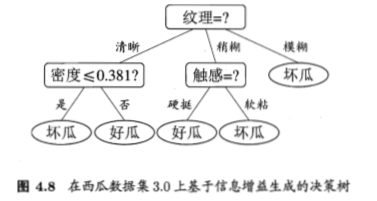

需要注意的是，与离散不同之处在于，若当前结点划分属性为连续属性，该属性还可以作为其后代的划分属性。比如在图4.8中决策树的左树分支，对于"密度≤0.381?"分支，不会禁止子结点使用"密度≤0.294?" 。

### 4.4.2 缺失值处理

现实中常会遇到不完整的样本，即某些属性值缺失。有时若简单采取剔除，则会造成大量的信息浪费。如表4.4所示的西瓜数据集2.0a 。因此有必要考虑利用有缺失属性值的训练样例来进行学习。

表4.4 西瓜数据集2.0a

| 编号 | 色泽 | 根蒂 | 敲声 | 纹理 | 脐部 | 触感 | 好瓜 |
| :--: | :--: | :--: | :--: | :--: | :--: | :--: | :--: |
|  1   |  -   | 蜷缩 | 浊响 | 清晰 | 凹陷 | 硬滑 |  是  |
|  2   | 乌黑 | 蜷缩 | 沉闷 | 清晰 | 凹陷 |  -   |  是  |
|  3   | 乌黑 | 蜷缩 |  -   | 清晰 | 凹陷 | 硬滑 |  是  |
|  4   | 青绿 | 蜷缩 | 沉闷 | 清晰 | 凹陷 | 硬滑 |  是  |
|  5   |  -   | 蜷缩 | 浊响 | 清晰 | 凹陷 | 硬滑 |  是  |
|  6   | 青绿 | 稍蜷 | 浊响 | 清晰 |  -   | 软粘 |  是  |
|  7   | 乌黑 | 稍蜷 | 浊响 | 稍糊 | 稍凹 | 软粘 |  是  |
|  8   | 乌黑 | 稍蜷 | 浊响 |  -   | 稍凹 | 硬滑 |  是  |
|  9   | 乌黑 |  -   | 沉闷 | 稍糊 | 稍凹 | 硬滑 |  否  |
|  10  | 青绿 | 硬挺 | 清脆 |  -   | 平坦 | 软粘 |  否  |
|  11  | 浅白 | 硬挺 | 清脆 | 模糊 | 平坦 |  -   |  否  |
|  12  | 浅白 | 蜷缩 |  -   | 模糊 | 平坦 | 软粘 |  否  |
|  13  |  -   | 稍蜷 | 浊响 | 稍糊 | 凹陷 | 硬滑 |  否  |
|  14  | 浅白 | 稍蜷 | 沉闷 | 稍糊 | 凹陷 | 硬滑 |  否  |
|  15  | 乌黑 | 稍蜷 | 浊响 | 清晰 |  -   | 软粘 |  否  |
|  16  | 浅白 | 蜷缩 | 浊响 | 模糊 | 平坦 | 硬滑 |  否  |
|  17  | 青绿 |  -   | 沉闷 | 稍糊 | 稍凹 | 硬滑 |  否  |

**而在属性值缺失的情况下需要解决两个问题**：（1）如何选择划分属性；（2）给定划分属性，若某样本在该属性上的值缺失，如何划分到具体的分支上。


给定训练集 $D$ 和属性 $\alpha$ ，令 $\tilde{D}$ 表示 $D$ 在属性 $\alpha$ 上没有缺失值的样本子集。对于问题（1），显然可以根据 $\tilde{D}$ 来判断属性 $\alpha$ 的优劣。假定属性有 V 个值 $\{\alpha^{1},\alpha^{2},\dots,\alpha^{V},\}$ ，令 $\tilde{D}^{v}$ 表示在属性 $\alpha$ 上取值为 $\alpha ^{v}$ 的样本子集，$\tilde{D}_{k}$ 表示 $\tilde{D}$ 中属于第 $k$ 类 $(k=1,2,\dots ,|\mathcal{Y}|)$ 的样本子集，则显然有 $\tilde{D}=\bigcup _{k=1}^{|\mathcal{Y}|} \tilde{D}_{k}, \tilde{D}=\bigcup _{v=1}^{V}\tilde{D}^{v}$  假定为样本集中的每一个样本 $x$ 都赋予一个权重 $w_x$，根结点中的权重初始化为 1 ，并定义：
$$
\rho =\frac{\sum_{x \in \tilde{D}} w_{x}}{\sum_{x \in D} w_{x}} \tag{4.9}
$$

可知， $\rho$ 表示无缺失样本所占的比例。

$$
\tilde{p}_{k} =\frac{\sum_{x \in \tilde{D}_{k}} w_{x}}{\sum_{x \in \tilde{D}} w_{x}} \quad(1 \leqslant k \leqslant|\mathcal{Y}|)  \tag{4.10}
$$

可知，$\tilde{p}_{k}$ 表示无缺失样本中 $k$ 类所占的比例。

$$
\tilde{r}_{v} =\frac{\sum_{x \in \tilde{D}^{v}} w_{x}}{\sum_{x \in \tilde{D}} w_{x}} \quad(1 \leqslant v \leqslant V)  \tag{4.11}
$$
可知，$\tilde{r}_{v}$ 表示无缺失样本中在属性 $\alpha$ 上取值为 $\alpha ^{v}$ 的样本所占的比例。

显然可以得到，$\sum _{k=1}^{|\mathcal{Y}|} \tilde{p}_{k}=1,\quad \sum_ {v=1}^{V} \tilde{r}_{v}=1$

对于问题（1）：通过在样本集 $D$ 中选取在属性α 上没有缺失值的样本子集 $\tilde{D}$，计算在该样本子集上的信息增益，最终的信息增益等于该样本子集划分后信息增益乘以样本子集占样本集的比重 $\rho$。即：
$$
\begin{aligned} 
\operatorname{Gain}(D, a) &=\rho \times \operatorname{Gain}(\tilde{D}, a) \\ 
&=\rho \times\left(\operatorname{Ent}(\tilde{D})-\sum_{v=1}^{V} \tilde{r}_{v} \operatorname{Ent}\left(\tilde{D}^{v}\right)\right) 
\end{aligned}  \tag{4.12}
$$


其中，$\operatorname{Ent}(\tilde{D})=-\sum_{k=1}^{| \mathcal{Y |}} \tilde{p}_{k} \log _{2} \tilde{p}_{k}$ 。 

一句话总结就是，以属性非缺失的样本子集作为训练样本集，计算其信息增益，最后将信息增益以样本子集非缺失样本数对总样本数按比例进行折价。

对于问题（2）：若该样本 $x$ 在属性α 上的值已知，则将 $x$ 划入与其取值对应的子结点，且权值保持为  $\omega _{x}$；则将若该样本在属性α 上的值缺失，则将该样本以不同的权重（按每个分支所含样本比例）划入到所有分支结点中。该样本在分支结点中的权重变为：$\omega _x = \omega _x * \tilde{r}_{v}$ 

一句话总结就是，未缺失则权重不变，缺失则按比例（权重）划分到所有分支。


以西瓜数据集2.0a 为例，演示缺失数据集下的信息增益的计算方法。

在学习开始时，根结点包含样本集 $D$ 中全部17个样例，各样例的权值均为1，以属性“色泽”为例，该属性上无缺失值的样本子集 $\tilde{D}$ 包含编号为 {2,3,4,6,7,8,9,10,11,12,14,15,16,17} 的14个样例，即 $\rho=14/17$

基于式4.12 可以得到样本子集的信息熵
$$
\begin{array}{cl}
\operatorname{Ent}(\tilde{D}) 
& = -\sum_{k=1}^{| \mathcal{Y |}} \tilde{p}_{k} \log _{2} \tilde{p}_{k} \\
& = -\frac{6}{14}* \log _{2}(\frac{6}{14}) -\frac{8}{14}* \log _{2}(\frac{8}{14}) \\
& = 0.9852
\end{array}
$$
对于色泽，有三个不同的属性值，因此 V = {"乌黑","青绿","浅白"}, 于是可得按属性值划分后的信息熵
$$
\begin{array}{cl}
\sum_{v=1}^{V} \tilde{r}_{v} \operatorname{Ent}\left(\tilde{D}^{v}\right)
&=\frac{6}{14}(-\frac{4}{6}* \log _{2}(\frac{4}{6}) -\frac{2}{6}* \log _{2}(\frac{2}{6})) \\  
&- \frac{4}{14}(-\frac{2}{4}* \log _{2}(\frac{2}{4}) -\frac{2}{4}* \log _{2}(\frac{2}{4}))\\
&- \frac{4}{14}(-\frac{4}{4}* \log _{2}(\frac{4}{4}) -\frac{0}{4}* \log _{2}(\frac{0}{4}))\\
&=0.679  \\
\end{array}
$$
于是我们可以得到信息增益为
$$
\operatorname{Gain}(D, a) =\rho \times \left(\operatorname{Ent}(\tilde{D})-\sum_{v=1}^{V} \tilde{r}_{v} \operatorname{Ent}(\tilde{D}^{v})\right)=\frac{14}{17}*(0.985-0.679)=0.252
$$
最后基于上述计算方式，继续计算其他特征以及属性划分下的信息增益，得到如图4.9所示的决策树。

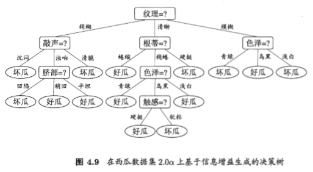


## 4.5 多变量决策树

若我们把每个属性视为坐标空间中的一个坐标轴，则 $d$ 个属性描述的样本就对应了 $d$ 维空间中的一个数据点，对样本分类则意味着在这个坐标空间中寻找不同类样本之间的分类边界，决策树所形成的分类边界有一个明显的特点：轴平行(axis-paralle)，即它的分类边界由若干个与坐标轴平行的分段组成。

以西瓜数据集3.0为基础，仅使用密度和含糖率二个特征，可以得到西瓜数据集3.0a，可构建得到如图4.10的决策树

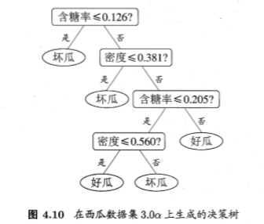


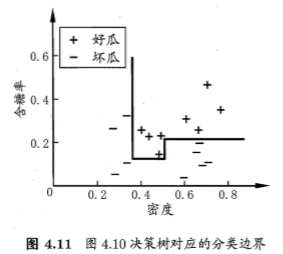

显然，分类边界的每一段都是与坐标轴平行的，这样的分类边界使得学习结果有较好的可解释性，因为每一段划分都直接对应了某个属性取值，但在学习任务的真实分类边界比较复杂时，必须使用**很多段划分**才能获得较好的近似。


若能使用斜的划分边界，如图4.12中红色线段所示，则决策树模型将大为简化。 “多变量决策树” (multivariate decision tree/ oblique decision tree)就是能实现这样的“斜划分”甚至更复杂划分的决策树，以实现斜划分的多变量决策树为例，在此类决策树中，非叶结点不再是仅对某个属性，而是**对属性的线性组合进行测试**；换言之，每个非叶结点是一个形如 $\sum _{i=1}^{d}\omega_{i}a_{i}=t$ 的线性分类器，其中 $\omega _{i}$ 是属性 $a_{i}$ 的权重, $\omega _{i}$ 和 t 可在该结点所含的样本集和属性集上学得，于是，与传统的“单变量决策树” (univariate decision tree)不同，在多变量决策树的学习过程中，不是为每个非叶结点寻找一个最优划分属性，而是试图建立一个合适的线性分类器。

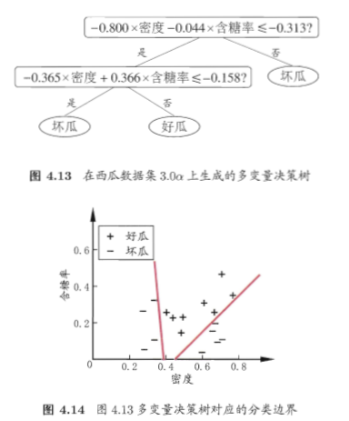


## 4.6 阅读材料

决策树学习算法最著名的代表是ID3 [Quinlan, 1979, 1986],C4.5 [Quinlan, 1993]和CART [Breiman et al, 1984]. [Murthy, 1998]提供了一个关于决策树文献的阅读指南. C4.5Rule是一个将C4.5决策树转化为符号规则的算法[Quinlan, 1993],决策树的每个分支可以容易地重写为一条规则,但C4.5Rule算法在转化过程中会进行规则前件合并、删减等操作,因此最终规则集的泛化性能甚至可能优于原决策树.

在信息增益、增益率、基尼指数之外,人们还设计了许多其他的准则用于决策树划分选择（本质上,各种特征选择方法均可用于决策树的划分属性选择,特征选择详见第11章）,然而有实验研究表明[Mingers, 1989b],这些准则虽然对决策树的尺寸有较大影响,但对泛化性能的影响很有限. [Raileanu and Stoffel,2004]对信息增益和基尼指数进行的理论分析也显示出,它们仅在2%的情况下会有所不同. 4.3节介绍了决策树剪枝的基本策略;剪枝方法和程度对决策树泛化性能的影响相当显著,有实验研究表明Mingers, 1989al,在数据带有噪声时通过剪枝甚至可将决策树的泛化性能提高25%.

多变量决策树算法主要有OC1 [Murthy et al, 1994] 和 [Brodley and Utgoff, 1995]提出的一系列算法. OC1先贪心地寻找每个属性的最优权值,在局部优化的基础上再对分类边界进行随机扰动以试图找到更好的边界; [Brodleyand Utgoff, 1995]则直接引入了线性分类器学习的最小二乘法,还有一些算法试图在决策树的叶结点上嵌入神经网络,以结合这两种学习机制的优势,例如“感知机树” (Perceptron tree) [Utgoff, 1989b]在决策树的每个叶结点上训练一个感知机,而[Guo and Gelfand, 1992]则直接在叶结点上嵌入多层神经网络.

有一些决策树学习算法可进行“增量学习" (incremental learning),即在接收到新样本后可对已学得的模型进行调整,而不用完全重新学习.主要机制是通过调整分支路径上的划分属性次序来对树进行部分重构,代表性算法有ID4 [Schlimmer and Fisher, 1986], ID5R [Utgof, 1989a], ITI [Utgoff et al,1997]等,增量学习可有效地降低每次接收到新样本后的训练时间开销,但多步增量学习后的模型会与基于全部数据训练而得的模型有较大差别.

## 4.7 决策树算法对比

|算法 | 思想 | 划分标准 | 剪枝策略   |使用场景|树形状|样本数据量| 优点| 缺点|
|-- | -- | -- | -- |-- | -- | -- | -- |--|
|ID3| 信息熵，信息增益 | 信息增益越大，则提升样本纯度越高 | 无 |分类 |多叉树|小样本|1.简单易懂；2.假设空间包含所有的决策树，搜索空间是完整的假设空间；| 1.过拟合；2.对属性取值多的特征有偏好（编号）；3.只能处理离散分布的特征；4.未考虑缺失值；5. 搜索时不回溯，易收敛于局部最优；6.无法增量学习；7.单变量决策树，未考虑属性间相互关系，易导致子树或者属性重复 |
|C4.5 | 信息增益率，改进ID3 | 信息增益率 | 悲观剪枝策略（从底向上） | 分类|多叉树|小样本 |相比ID3的改进：1.引入后剪枝；2.信息增益率进行划分克服信息增益的缺点；3.连续特征二元离散化；4.增加缺失值处理 | 1.剪枝策略可再优化；2.使用多叉树，可用二叉树提高效率；3.只用于分类问题；4.只适用于可驻留于内存的数据量，存在大量耗时对数运算和连续值排序；5.若属性集中存在无关特征，将降低测试的信息增益的平均值，导致划分选择高信息增益率、低信息增益的属性 |
|CART | 分裂、剪枝、树选择 | 基尼指数 | 代价复杂度 | 分类（及回归） |二叉树|大样本 |1.基尼指数运算相比熵的对数运算，运算量更少；2.二叉树计算耗时更少；3.可用于分类和回归；4.代理测试估计缺失值；5.基于代价复杂度进行后剪枝；6. 自动平衡样本不均衡。 简化了决策树规模，提升了生成决策树效率。 |基尼指数偏向于多值属性 |


## 4.8 参考内容

 [1]王黎明.决策树学习及其剪枝算法研究[D]. 武汉理工大学，2007. 


# 第五章 神经网络

在机器学习中，神经网络一般指的是“神经网络学习”，是机器学习与神经网络两个学科的交叉部分。所谓神经网络，目前用的最广泛的一个定义是“神经网络是由具有适应性的简单单元组成的广泛并行互连的网络，它的组织能够模拟生物神经系统对真实世界物体所做出的交互反应”。

## 5.1 神经元模型

神经网络中最基本的单元是神经元模型（neuron / unit）。在生物神经网络的原始机制中，每个神经元通常都有多个树突（dendrite），一个轴突（axon）和一个细胞体（cell body），树突短而多分支，轴突长而只有一个；在功能上，树突用于传入其它神经元传递的神经冲动，而轴突用于将神经冲动传出到其它神经元，当树突或细胞体传入的神经冲动使得神经元兴奋时，该神经元就会通过轴突向其它神经元传递兴奋。神经元的生物学结构如下图所示

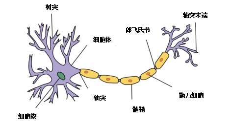

一直沿用至今的“M-P神经元模型”正是对这一结构进行了抽象，也称“阈值逻辑单元“，其中树突对应于输入部分，每个神经元收到n个其他神经元传递过来的输入信号，这些信号通过带权重的连接传递给细胞体，这些权重又称为连接权（connection weight）。细胞体分为两部分，前一部分计算总输入值（即输入信号的加权和，或者说累积电平），后一部分先计算总输入值与该神经元阈值的差值，然后通过激活函数（activation function，响应函数）的处理，产生输出从轴突传送给其它神经元。M-P神经元模型如下图5-1所示：

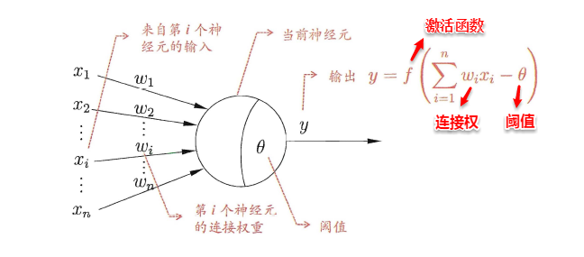

与线性分类十分相似，神经元模型最理想的激活函数也是阶跃函数，即将神经元输入值与阈值的差值映射为输出值1或0，若差值大于零输出1，对应兴奋；若差值小于零则输出0，对应抑制。但阶跃函数不连续，不光滑，故在M-P神经元模型中，也采用Sigmoid函数来近似， Sigmoid函数将较大范围内变化的输入值挤压到 (0,1) 输出值范围内，所以也称为挤压函数（squashing function）。

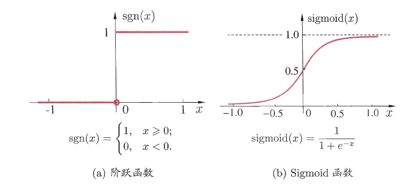

将多个神经元按一定的层次结构连接起来，就得到了神经网络。它是一种包含多个参数的模型，比方说10个神经元两两连接，则有100个参数需要学习（每个神经元有9个连接权以及1个阈值），若将每个神经元都看作一个函数，则整个神经网络就是由这些函数相互嵌套而成。

> M-P神经元模型使用最为广泛，还有一些神经元模型也受到关注，如考虑了电位脉冲发放时间而不仅是累积电位的脉冲神经元(spiking neuron)模型


**常用的激活函数**

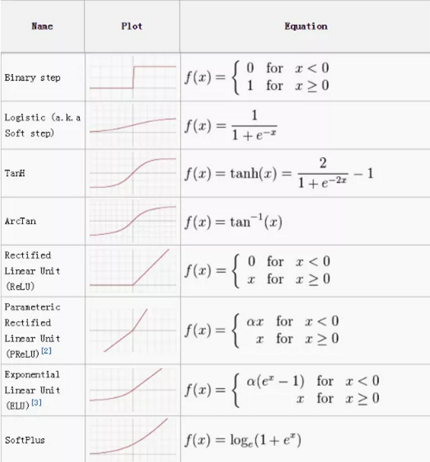


## 5.2 感知机与多层网络

感知机（Perceptron）是由两层神经元组成的一个简单模型，但只有输出层是M-P神经元（阈值逻辑单元，threshold logic unit），即只有输出层神经元进行激活函数处理，也称为功能神经元（functional neuron）；输入层只是接受外界信号（样本属性）并传递给输出层（输入层的神经元个数等于样本的属性数目），而没有激活函数。这样一来，感知机与之前线性模型中的对数几率回归的思想基本是一样的，都是通过对属性加权与另一个常数求和，再使用sigmoid函数将这个输出值压缩到0-1之间，从而解决分类问题。不同的是感知机的输出层应该可以有多个神经元，从而可以实现多分类问题，同时两个模型所用的参数估计方法十分不同。

给定训练集，则感知机的n+1个参数（n个权重+1个阈值）都可以通过学习得到。阈值$\theta$可以看作一个输入值固定为-1的哑结点的权重 $\omega_{n+1}$，即假设有一个固定输入$x_{n+1}=-1$ 的输入层神经元，其对应的权重为$\omega_{n+1}$，这样就把权重和阈值统一为权重的学习了。简单感知机的结构如下图所示：


感知机权重的学习规则如下：对于训练样本（x，y），当该样本进入感知机学习后，会产生一个输出值，若该输出值与样本的真实标记不一致，则感知机会对权重进行调整，若激活函数为阶跃函数，则调整的方法为（基于梯度下降法）：

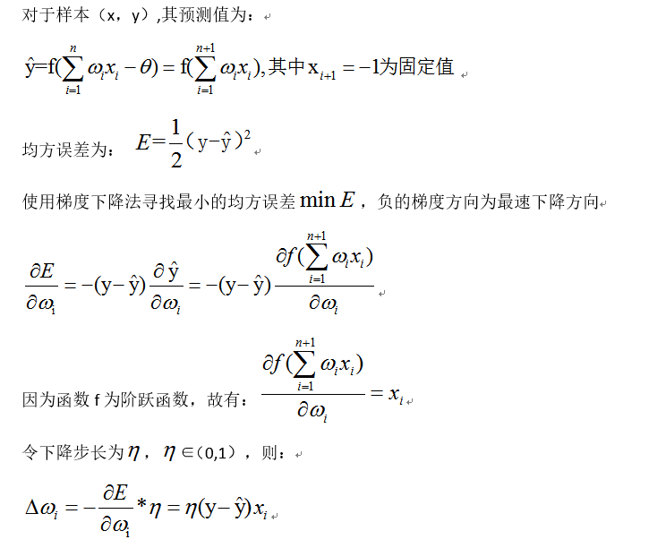

其中 η∈（0，1）称为学习率，可以看出感知机是通过逐个样本输入来更新权重，首先设定好初始权重（一般为随机），逐个地输入样本数据，若输出值与真实标记相同则继续输入下一个样本，若不一致则更新权重，然后再重新逐个检验，直到每个样本数据的输出值都与真实标记相同。容易看出：感知机模型总是能将训练数据的每一个样本都预测正确，和决策树模型总是能将所有训练数据都分开一样，**感知机模型很容易产生过拟合问题**。

由于感知机模型只有一层功能神经元，因此其功能十分有限，**只能处理线性可分的问题**（与、或、非问题），对于这类问题，感知机的学习过程一定会收敛（converge），因此总是可以求出适当的权值。但是对于异或问题，感知机学习过程将会发生振荡（fluctuation），权重无法确定，无法求得合适解。因此要解决非线性可分问题，需要考虑使用多层功能神经元，即神经网络。多层神经网络的拓扑结构如下图所示：


在神经网络中，输入层与输出层之间的层称为隐含层或隐层（hidden layer），隐层和输出层的神经元都是具有激活函数的功能神经元。只需包含一个隐层便可以称为多层神经网络，常用的神经网络称为“多层前馈神经网络”（multi-layer feed-forward neural network），该结构满足以下几个特点：

	* 每层神经元与下一层神经元之间完全互连
	* 神经元之间不存在同层连接
	* 神经元之间不存在跨层连接

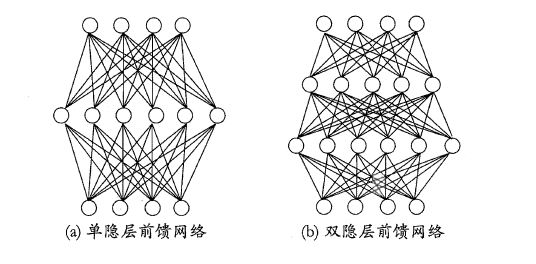

根据上面的特点可以得知：这里的 “前馈” 指的是网络拓扑结构中不存在环或回路，而不是指该网络只能向前传播而不能向后传播（下节中的BP神经网络正是基于前馈神经网络而增加了反馈调节机制）。

神经网络的学习过程就是根据训练数据来调整神经元之间的“连接权”以及每个神经元的阈值，换句话说：神经网络所学习到的东西都蕴含在网络的连接权（connection weight）与阈值（bias/threshold）中。

## 5.3 BP神经网络算法

BP神经网络算法即误差逆传播算法（error Back-Propagation, BP, 反向传播算法）正是为学习多层前馈神经网络而设计，BP神经网络算法是迄今为止最成功的的神经网络学习算法。现实任务中使用神经网络时，大多是在使用BP算法进行训练。BP算法不仅可用于多层前馈神经网络，也可用于其他类型的神经网络，例如训练递归神经网络。

一般而言，只需包含一个足够多神经元的隐层，就能以任意精度逼近任意复杂度的连续函数[Hornik et al.,1989]，但是对于如何设置隐层神经元个数的问题，至今仍然没有好的解决方案，常使用“试错法”（trial-by-error）进行调整。下面以训练单隐层(两层网络)的前馈神经网络为例，介绍BP神经网络的算法思想。

给定训练集 $D=\{(x_1,y_1),(x_2,y_2),\dots ,(x_m,y_m), x_i \in \mathbb{R}^{d}, y_i \in \mathbb{R}^{l}\}$ ，即输入示例由 $d$ 个属性描述，输出 $l$ 维实值 向量。图5.7 给出了一个拥有 $d$ 个输入神经元， $l$ 个输出神经元，$q$ 个隐层神经元的多层前馈网络结构，其中输出层第 $j$ 个神经元的阈值用 $\theta _{j}$ 表示，隐层第 $h$ 个神经元的阈值用 $\gamma _h$ 表示。 输入层第 $i$ 个神经元与隐层第 $h$ 个神经元之间的连接权为 $v_{i h}$ ，隐层第 $h$ 个神经元与输出层第 $j$  个神经元之间的连接权为 $\omega _{h j}$ 。记隐层第 $h$ 个神经元接收到的输入为 $a_h =\sum _{i=1}^{d} v_{i h} x_{i}$ ，输出层第 $j$ 个神经元接收到的输入为 $\beta _j = \sum _{h=1}^{q} \omega _{h j} b_h$ ，其中 $b_h$ 为隐层第 $h$ 个神经元的输出。

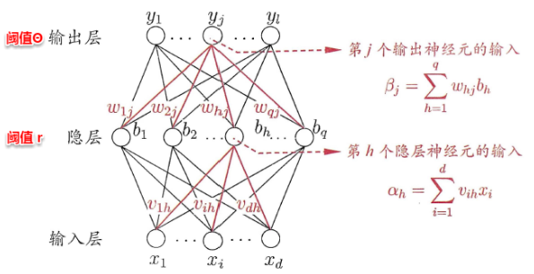

BP神经网络算法也使用梯度下降法（gradient descent），以单个样本的均方误差的负梯度方向对权重进行调节。可以看出：BP算法首先将误差反向传播给隐层神经元，调节隐层到输出层的连接权重与输出层神经元的阈值；接着根据隐含层神经元的均方误差，来调节输入层到隐含层的连接权值与隐含层神经元的阈值。BP算法基本的推导过程与感知机的推导过程原理是相同的，下面给出调整隐含层到输出层的权重调整规则的推导过程：

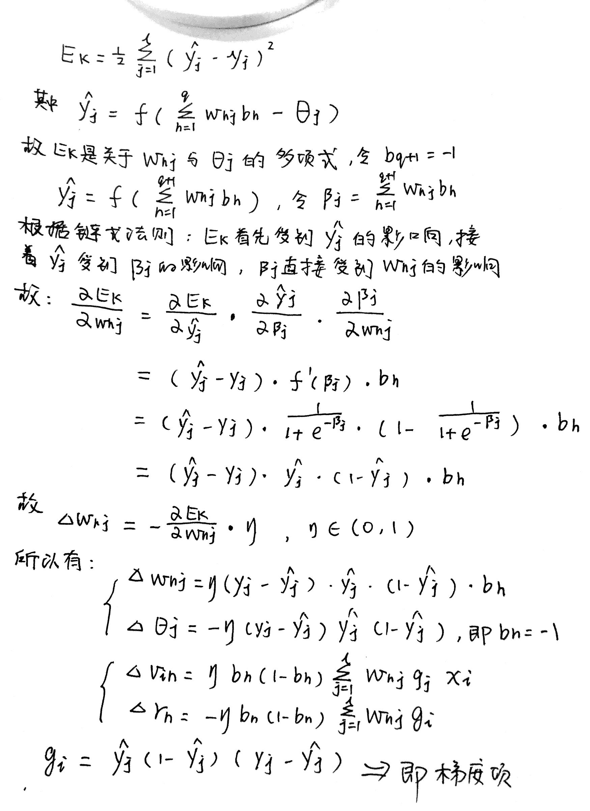

学习率η∈（0，1）控制着沿反梯度方向下降的步长，若步长太大则下降太快容易产生震荡，若步长太小则收敛速度太慢，一般地常把η设置为0.1，有时更新权重时会将输出层与隐含层设置为不同的学习率。BP算法的基本流程如下所示：

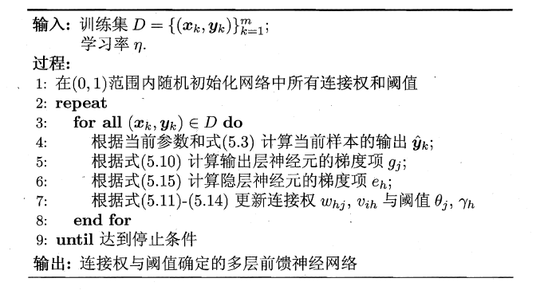

BP算法的更新规则是基于每个样本的预测值与真实类标的均方误差来进行权值调节，即BP算法每次更新只针对于单个样例。需要注意的是：BP算法的最终目标是要最小化整个训练集D上的累积误差，即：

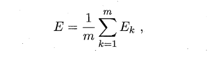

如果基于累积误差最小化的更新规则，则得到了累积误差逆传播算法（accumulated error back-propagation），即每次读取全部的数据集一遍（one round / one epoch），进行一轮学习，从而基于当前的累积误差进行权值调整，因此参数更新的频率相比标准BP算法低了很多，但在很多任务中，尤其是在数据量很大的时候，往往标准BP算法会获得较好的结果。

前面提到，BP神经网络强大的学习能力常常容易造成过拟合问题，有以下两种策略来缓解BP网络的过拟合问题：

- 早停（early stopping）：将数据分为训练集与测试集，训练集用于学习，测试集用于评估性能（估计误差），若在训练过程中，训练集的累积误差降低，而测试集的累积误差升高，则停止训练。
- 引入正则化（regularization）：基本思想是在累积误差函数中增加一个用于描述网络复杂度的部分，例如所有权值与阈值的平方和，其中λ∈（0,1）用于对累积经验误差与网络复杂度这两项进行折中，常通过交叉验证法来估计。(正则化项的引入，训练过程将会偏好比较小的连接权重和阈值，使得网络输出更加“光滑”，从而缓解过拟合；引入后，与SVM相似)

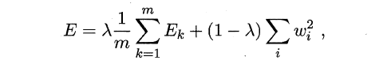

## 5.4 全局最小与局部最小

模型学习的过程实质上就是一个寻找最优参数的过程，例如BP算法试图通过最速下降来寻找使得累积经验误差最小的权值与阈值，在谈到最优时，一般会提到局部极小（local minimum）和全局最小（global minimum）。

对 $\omega^{*}$ 和 $\theta^{*}$ ，若存在 $\epsilon > 0$ 使得
$$
\forall (\omega;\theta) \in \{(\omega;\theta) | \lVert(\omega ^{*};\theta ^{*}) \rVert \leqslant \epsilon \},
$$
都有 $E(\omega;\theta) \geqslant E(\omega ^{*};\theta ^{*})$ ，则 $(\omega ^{*};\theta ^{*})$ 为局部极小值；若对参数空间中任意 $(\omega;\theta)$ 都有 $E(\omega;\theta) \geqslant E(\omega ^{*};\theta ^{*})$，则 $(\omega ^{*};\theta ^{*})$ 为全局最小解。

	* 局部极小解：参数空间中的某个点，其邻域点的误差函数值均不小于该点的误差函数值。
	* 全局最小解：参数空间中的某个点，所有其他点的误差函数值均不小于该点的误差函数值。

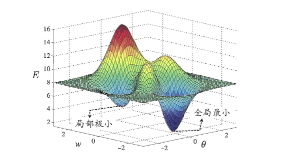

要成为局部极小点，只要满足该点在参数空间中的梯度为零。局部极小可以有多个，而全局最小只有一个。全局最小一定是局部极小，但局部最小却不一定是全局最小。

显然在很多机器学习算法中，都试图找到目标函数的全局最小。梯度下降法的主要思想就是沿着负梯度方向去搜索最优解，负梯度方向是函数值下降最快的方向，若迭代到某处的梯度为0，则表示达到一个局部最小，参数更新停止。

因为无法判断误差函数是否具有多个局部最小值，为了避免参数寻优陷入局部最小，而不到达全局最小，在现实任务中，通常使用以下策略尽可能地去接近全局最小。

	* 以多组不同参数值初始化多个神经网络，按标准方法训练，迭代停止后，取其中误差最小的解作为最终参数。（相当于从多个不同的初始点开始搜索）
	* 使用“模拟退火”(simulated annealing)技术，在每一步以一定的概率接受比当前结局更差的结果。(有可能跳出局部极小，但是也可能造成跳出全局最小)
	* 使用随机梯度下降，即在计算梯度时加入了随机因素，使得在局部最小时，计算的梯度仍可能不为0，从而迭代可以继续进行。

**需要注意的是，这些跳出局部极小值的方法都是启发式的，理论上尚缺乏保障。**

## 5.5 常见神经网络

### 5.5.1 RBF(Radial Basis Function)

RBF (Radial Basis Function,径向基函数)网络是一种单隐层前馈神经网络，它使用径向基函数作为隐层神经元激活函数，而输出层则是对隐层神经元输出的线性组合。假定输入为 $d$ 维向量$\boldsymbol{x}$，输出为实值，则RBF网络可表示为
$$
\varphi(\boldsymbol{x})=\sum_{i=1}^{q} w_{i} \rho\left(\boldsymbol{x}, \boldsymbol{c}_{i}\right)  \tag{5.18}
$$

其中 $q$ 为隐层神经元个数，$c_i$ 和 $w_i$ 分别是第 $i$ 个隐层神经元所对应的中心和权重， $\rho (a,c)$是径向基函数，这是某种沿径向对称的标量函数，通常定义为样本 $\boldsymbol{x}$ 到数据中心 $c_i$ 之间欧氏距离的单调函数，常用的高斯径向基函数形如
$$
\rho\left(\boldsymbol{x}, \boldsymbol{c}_{i}\right)=e^{-\beta_{i}\left\|\boldsymbol{x}-\boldsymbol{c}_{i}\right\|^{2}} \tag{5.19}
$$
[Park and Sandberg, 1991]证明，具有足够多隐层神经元的RBF网络能以任意精度逼近任意连续函数。

通常采用两步过程来训练RBF网络：第一步，确定神经元中心 $c_i$，常用的方式包括随机采样、聚类等；第二步，利用BP算法等来确定参数 $\omega _i$ 和 $\beta _i$ 。


### 5.5.2 ART(Adaptive Resonance Theory)

竞争型学习(competitive learning)是神经网络中一种常用的**无监督**学习策略，在使用该策略时，网络的输出神经元相互竞争，每一时刻仅有一个竞争获胜的神经元被激活，其他神经元的状态被抑制，这种机制亦称“胜者通吃" (winner-take-all)原则。

ART(Adaptive Resonance Theory，自适应谐振理论)网络是**竞争型学习**的重要代表，该网络由**比较层、识别层、识别阈值和重置模块**构成。

其中，比较层负责接收输入样本，并将其传递给识别层神经元，识别层每个神经元对应一个模式类，神经元数目可在训练过程中动态增长以增加新的模式类。在接收到比较层的输入信号后，识别层神经元之间相互竞争以产生获胜神经元。

竞争的最简单方式是，计算输入向量与每个识别层神经元所对应的模式类的代表向量之间的距离，距离最小者胜。获胜神经元将向其他识别层神经元发送信号，抑制其激活，若输入向量与获胜神经元所对应的代表向量之间的相似度大于识别阈值，则当前输入样本将被归为该代表向量所属类别，同时，网络连接权将会更新，使得以后在接收到相似输入样本时该模式类会计算出更大的相似度，从而使该获胜神经元有更大可能获胜；若相似度不大于识别阈值，则重置模块将在识别层增设一个新的神经元，其代表向量就设置为当前输入向量。

显然，识别阈值对ART网络的性能有重要影响，当识别阈值较高时，输入样本将会被分成比较多、比较精细的模式类；而如果识别阈值较低，则会产生比较少、比较粗略的模式类。

​	ART比较好地缓解了竞争型学习中的“可塑性-稳定性窘境” (stability-plasticity dilemma)，可塑性是指神经网络要有学习新知识的能力，而稳定性则是指神经网络在学习新知识时要保持对旧知识的记忆。这就使得ART网络具有一个很重要的优点：可进行增量学习(incremental learning)或在线学习(online learning)。

> 增量学习：学得模型后，再接收到训练样本，仅根据新样本更新模型，无需重新训练整个模型；
>
> 在线学习：每获得一个新样本就更新一次模型。
>
> 两者关系：在线学习是增量学习的特例，增量学习是批模式（batch-mode）的在线学习。（在线学习每拿到一个新样本就更新模型，增量学习是针对新增的样本更新模型，新增的样本可多可少，因此在线学习是增量学习的特例）

​	早期的ART网络只能处理布尔型输入数据，此后ART发展成了一个算法族，包括能处理实值输入的ART2网络、结合模糊处理的FuzzyART网络，以及可进行监督学习的ARTMAP网络等。


### 5.5.3 SOM(Self-Organizing Map)

SOM(Self-Organizing Map,自组织映射)网络是一种**竞争学习型**的**无监督**神经网络，它能将高维输入数据映射到低维空间(通常为二维),同时保持输入数据在高维空间的拓扑结构,即将高维空间中相似的样本点映射到网络输出层中的邻近神经元.

​	如图5.11所示, SOM网络中的输出层神经元以矩阵方式排列在二维空间中,每个神经元都拥有一个权向量,网络在接收输入向量后,将会确定输出层获胜神经元,它决定了该输入向量在低维空间中的位置. SOM的训练目标就是为每个输出层神经元找到合适的权向量,以达到保持拓扑结构的目的.

​	SOM的训练过程很简单：在接收到一个训练样本后,每个输出层神经元会计算该样本与自身携带的权向量之间的距离,距离最近的神经元成为竞争获胜者,称为最佳匹配单元(best matching unit).然后,最佳匹配单元及其邻近神经元的权向量将被调整,以使得这些权向量与当前输入样本的距离缩小,这个过程不断迭代,直至收敛.

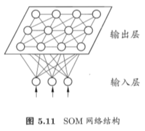

SOM网络在**聚类、高维数据可视化、图像分割**等方面有着广泛的应用。


### 5.5.4 级联相关网络

一般的神经网络模型通常假定网络结构是事先固定的,训练的目的是利用训练样本来确定合适的连接权、阈值等参数,与此不同，结构自适应网络（constructive，构造性神经网络）则将网络结构也当作学习的目标之一,并希望能在训练过程中找到最符合数据特点的网络结构,级联相关(Cascade-Correlation)网络是**结构自适应网络**的重要代表。

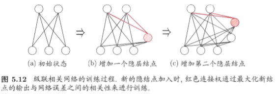

级联相关网络有两个主要成分: “级联”和“相关”。级联是指建立层次连接的层级结构,在开始训练时,网络只有输入层和输出层,处于最小拓扑结构;随着训练的进行,如图5.12所示,新的隐层神经元逐渐加入,从而创建起层级结构,当新的隐层神经元加入时,其输入端连接权值是冻结固定的,相关是指通过最大化新神经元的输出与网络误差之间的相关性(correlation)来训练相关的参数.

与一般的前馈神经网络相比，**级联相关网络无需设置网络层数、隐层神经元数目，且训练速度较快，但其在数据较小时易陷入过拟合**。


### 5.5.5 Elman网络

“递归神经网络” (recurrent neural networks, RNN)允许网络中出现环形结构,从而可让一些神经元的输出反馈回来作为输入信号,这样的结构与信息反馈过程,使得网络在 t 时刻的输出状态不仅与 t 时刻的输入有关,还与 t-1 时刻的网络状态有关,从而**能处理与时间有关的动态变化**。Elman网络是最常用的递归神经网络之一,其结构如图5.13所示,它的结构与多层前馈网络很相似,但隐层神经元的输出被反馈回来,与下一时刻输入层神经元提供的信号一起,作为隐层神经元在下一时刻的输入.隐层神经元通常采用Sigmoid激活函数,而网络的训练则常通过推广的BP算法。


### 5.5.6 Boltzmann机

神经网络中有一类模型是为网络状态定义一个“能量” (energy),能量最小化时网络达到理想状态,而网络的训练就是在最小化这个能量函数。

Boltzmann机就是一种“基于能量的模型” (energy-based model), 常见结构如图5.14(a)所示（可见玻尔兹曼机是一种递归神经网络）,其神经元分为两层：显层与隐层。显层用于表示数据的输入与输出，隐层则被理解为数据的内在表达。Boltzmann机中的神经元都是布尔型的,即只能取0、1两种状态,状态1表示激活,状态0表示抑制。令向量 $s \in \{0,1\}^{n}$表示n个神经元的状态,  $\omega _{i j}$ 表示神经元 $i$ 与 $j$ 之间的连接权, $\theta _{i}$ ,表示神经元 $i$ 的阈值,则状态向量 $s$ 所对应的Boltzmann机能量定义为
$$
E(\boldsymbol{s})=-\sum_{i=1}^{n-1} \sum_{j=i+1}^{n} w_{i j} s_{i} s_{j}-\sum_{i=1}^{n} \theta_{i} s_{i}  \tag{5.20}
$$


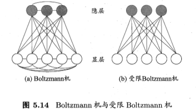

若网络中的神经元以任意不依赖于输入值的顺序进行更新，则网络最终将达到Boltzmann分布

> Boltzmann分布亦称"平衡态"(equilibrium) 或 ”平稳分布“(stationary distribution)

此时状态向量 $s$ 出现的概率将仅由其能量与所有可能状态向量的能量确定

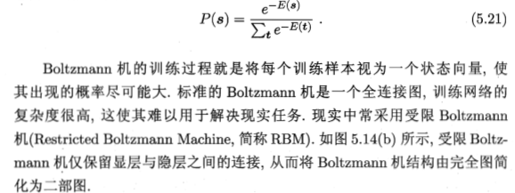

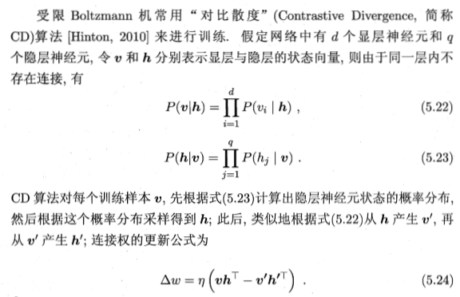


## 5.6 深度学习

理论上，参数越多，模型复杂度就越高，容量（capability）就越大，从而能完成更复杂的学习任务。深度学习（deep learning）正是一种极其复杂而强大的模型。

怎么增大模型复杂度呢？两个办法，一是增加隐层的数目，二是增加隐层神经元的数目。前者更有效一些，因为它不仅增加了功能神经元的数量，还增加了激活函数嵌套的层数。但是对于多隐层神经网络，经典算法如标准BP算法往往会在误差逆传播时发散（diverge），无法收敛达到稳定状态。

那要怎么有效地训练多隐层神经网络呢？一般来说有以下两种方法：

- 无监督逐层训练（unsupervised layer-wise training）：每次训练一层隐节点，把上一层隐节点的输出当作输入来训练，本层隐结点训练好后，输出再作为下一层的输入来训练，这称为预训练（pre-training）。全部预训练完成后，再对整个网络进行微调（fine-tuning）训练。一个典型例子就是深度信念网络（deep belief network，简称DBN），每层都是一个首先Boltzmann机，即整个网络由若干个RBM堆叠而成。这种做法（预训练+微调）其实可以视为把大量的参数进行分组，先找出每组较好的设置，再基于这些局部最优的结果来训练全局最优。

- 权共享（weight sharing）：令同一层神经元使用完全相同的连接权，典型的例子是卷积神经网络（Convolutional Neural Network，简称CNN）。这样做可以大大减少需要训练的参数数目。

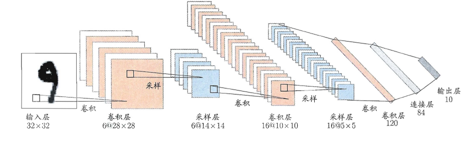


深度学习可以理解为一种特征学习（feature learning）或者表示学习（representation learning），无论是DBN还是CNN，都是通过多个隐层来把与输出目标联系不大的初始输入转化为与输出目标更加密切的表示，使原来只通过单层映射难以完成的任务变为可能。即通过多层处理，逐渐将初始的“低层”特征表示转化为“高层”特征表示，从而使得最后可以用简单的模型来完成复杂的学习任务。

传统任务中，样本的特征需要人类专家来设计，这称为特征工程（feature engineering）。特征好坏对泛化性能有至关重要的影响。而深度学习为全自动数据分析带来了可能，可以自动产生更好的特征。


## 5.7 参考内容

1. 塔里克·拉希德（Tariq Rashid）. python神经网络编程. 人民邮电出版社, 2018.
2. https://github.com/Vay-keen/Machine-learning-learning-notes 


# 第六章 支持向量机

支持向量机（Support Vector Machine，SVM）是一种经典的二分类模型，基本模型定义为特征空间中最大间隔的线性分类器，其学习的优化目标便是间隔最大化，因此支持向量机本身可以转化为一个凸二次规划求解的问题。


## 6.1 间隔和支持向量

对于二分类学习，假设现在的数据是线性可分的，这时分类学习最基本的想法就是找到一个合适的超平面，该超平面能够将不同类别的样本分开，类似二维平面使用 $ax+by+c=0$ 来表示，超平面实际上表示的就是高维的平面，通过如下线性方程来描述
$$
\mathbf{\omega}^{T} \mathbf{x} + b=0 \tag{6.1}
$$
其中 $\mathbf{\omega}=(\omega_1;\omega_2;\dots;\omega_d) $ 为法向量，决定了超平面的方向，$b$ 为位移项，决定了超平面与原点之间的距离。

图像则如下图所示：


对数据点进行划分时，易知：当超平面距离与它最近的数据点的间隔越大，分类的鲁棒性越好，即当新的数据点加入时，超平面对这些点的适应性最强，出错的可能性最小。因此需要让所选择的超平面能够最大化这个间隔Gap。


### 6.1.1 函数间隔

在超平面 $\mathbf{\omega}^{T}x+b=0$ 确定的情况下，$|\mathbf{\omega}^{T}x^{*}+b|$能够代表点 $x^{*}$ 距离超平面的远近，易知：当 $\mathbf{\omega}^{T}x^{*}+b>0$ 时，表示$x^{*}$在超平面的一侧（正类，类标为1），而当 $\mathbf{\omega}^{T}x^{*}+b<0$ 时，则表示 $x^{*}$ 在超平面的另外一侧（负类，类别为-1），因此$(\mathbf{\omega}^{T}x^{*}+b)y$ 的正负性恰能表示数据点$x^{*}$是否被分类正确。于是便引出了**函数间隔**的定义（functional margin）:


而超平面$（\omega,b）$关于所有样本点$（x_i，y_i）$的函数间隔最小值则为超平面在训练数据集 $T$上的函数间隔：


可以看出：这样定义的函数间隔在处理SVM上会有问题，当超平面的两个参数$\omega$和$b$同比例改变时，函数间隔也会跟着改变，但是实际上超平面还是原来的超平面，并没有变化。例如：$w_{1}x_{1}+w_{2}x_{2}+w_{3}x_{3}+b=0$其实等价于，但计$2*w_{1}x_{1}+2*w_{2}x_{2}+2*w_{3}x_{3}+b=0$算的函数间隔却翻了一倍。从而引出了能真正度量点到超平面距离的概念--几何间隔（geometrical margin）。

### 6.1.2 几何间隔

**几何间隔**代表的则是数据点到超平面的真实距离，对于超平面$\mathbf{\omega}^{T}x+b=0$，$\omega$代表的是该超平面的法向量，设$x^{*}$为超平面外一点$x$在法向量$\omega$方向上的投影点，$x$与超平面的距离为$r$，则有$x^{*}=x-r(w/||w||)$，又$x^{*}$在超平面上，即$\mathbf{\omega}^{T}x^{*}+b=0$，代入即可得：


为了得到$r$的绝对值，令$r$乘上其对应的类别y，即可得到几何间隔的定义：


从上述函数间隔与几何间隔的定义可以看出：实质上函数间隔就是$|\mathbf{\omega}^{T}x^{*}+b|$，而几何间隔就是点到超平面的距离。

### 6.1.3 最大间隔与支持向量

最大间隔（maximum margin）分类器的目标函数定义为：


一般地，我们令r^为1（这样做的目的是为了方便推导和目标函数的优化），从而上述目标函数转化为：


对于$y(\mathbf{\omega}^{T}x+b)=1$的数据点，即下图中位于$\mathbf{\omega}^{T}x+b=1$或$\mathbf{\omega}^{T}x+b=-1$上的数据点，我们称之为**支持向量**（support vector），易知：对于所有的支持向量，它们恰好满足$y^{*}(\mathbf{\omega}^{T}x^{*}+b)=1$，而所有不是支持向量的点，有$y^{*}(\mathbf{\omega}^{T}x^{*}+b)>1$


## 6.2 从原始优化问题到对偶问题

对于上述得到的目标函数，求1/||w||的最大值相当于求$||\omega||^{2}$的最小值，因此很容易将原来的目标函数转化为：


即变为了一个带约束的凸二次规划问题，可以使用现成的优化计算包（QP优化包）求解，但由于SVM的特殊性，一般我们将原问题变换为它的**对偶问题**，接着再对其对偶问题进行求解。为什么通过对偶问题进行求解，有下面两个原因：

	* 一是因为使用对偶问题更容易求解；
	* 二是因为通过对偶问题求解出现了向量内积的形式，从而能更加自然地引出核函数。

对偶问题，顾名思义，可以理解成优化等价的问题，更一般地，是将一个原始目标函数的最小化转化为它的对偶函数最大化的问题。对于当前的优化问题，首先我们写出它的朗格朗日函数：


上式很容易验证：当其中有一个约束条件不满足时，L的最大值为 ∞（只需令其对应的α为 ∞即可）；当所有约束条件都满足时，L的最大值为1/2||w||^2（此时令所有的α为0），因此实际上原问题等价于：


由于这个的求解问题不好做，因此一般我们将最小和最大的位置交换一下（需满足KKT条件） ，变成原问题的对偶问题：


这样就将原问题的求最小变成了对偶问题求最大（用对偶这个词还是很形象），接下来便可以先求L对w和b的极小，再求L对α的极大。

（1）首先求L对w和b的极小，分别求L关于w和b的偏导，可以得出：


将上述结果代入L得到：


（2）通过SMO（Sequential Minimal Optimization）算法，对L关于α极大求解α


（3）最后便可以根据求解出的α，计算出w和b，从而得到分类超平面函数。


在对新的点进行预测时，实际上就是将数据点x*代入分类函数f(x)=w'x+b中，若f(x)>0，则为正类，f(x)<0，则为负类，根据前面推导得出的w与b，分类函数如下所示，此时便出现了上面所提到的内积形式。


这里实际上只需计算新样本与支持向量的内积，因为对于非支持向量的数据点，其对应的拉格朗日乘子一定为0，根据最优化理论（K-T条件），对于不等式约束y(w'x+b)-1≥0，满足：

        


### 6.2.1 KKT条件

### 6.2.2 SMO优化

### 6.2.3 拉格朗日乘子


## 6.3 核函数（核方法）

由于上述的超平面只能解决线性可分的问题，对于线性不可分的问题，例如：异或问题，我们需要使用核函数将其进行推广。一般地，解决线性不可分问题时，常常采用**映射**的方式，将低维原始空间映射到高维特征空间，使得数据集在高维空间中变得线性可分，从而再使用线性学习器分类。如果原始空间为有限维，即属性数有限，那么总是存在一个高维特征空间使得样本线性可分。若∅代表一个映射，则在特征空间中的划分函数变为：


按照同样的方法，先写出新目标函数的拉格朗日函数，接着写出其对偶问题，求L关于w和b的极大，最后运用SMO求解α。可以得出：

（1）原对偶问题变为：


（2）原分类函数变为：


求解的过程中，只涉及到了高维特征空间中的内积运算，由于特征空间的维数可能会非常大，例如：若原始空间为二维，映射后的特征空间为5维，若原始空间为三维，映射后的特征空间将是19维，之后甚至可能出现无穷维，根本无法进行内积运算了，此时便引出了**核函数**（Kernel）的概念。


因此，核函数可以直接计算隐式映射到高维特征空间后的向量内积，而不需要显式地写出映射后的结果，它虽然完成了将特征从低维到高维的转换，但最终却是在低维空间中完成向量内积计算，与高维特征空间中的计算等效**（低维计算，高维表现）**，从而避免了直接在高维空间无法计算的问题。引入核函数后，原来的对偶问题与分类函数则变为：

（1）对偶问题：


（2）分类函数：


因此，在线性不可分问题中，核函数的选择成了支持向量机的最大变数，若选择了不合适的核函数，则意味着将样本映射到了一个不合适的特征空间，则极可能导致性能不佳。同时，核函数需要满足以下这个必要条件：


由于核函数的构造十分困难，通常我们都是从一些常用的核函数中选择，下面列出了几种常用的核函数：


对于给定训练样本 ${(x_1,y_1),(x_2,y_2),\dots,(x_m,y_m)}$ ，若不考虑便宜项 $b$ ，则无论SVM 还是SVR，学得的模型总能表示成核函数 $\kappa(x,x_i)$ 的线性组合。 

更一般的结论，我们成为"表示定理"(representer theorem):

令 $\mathbb{H}$ 为核函数 $\kappa$ 对应的再生核希尔伯特空间，$||h||_{\mathbb{H}}$ 表示 $\mathbb{H}$ 空间中关于 $h$ 的范数，对于任意单调递增函数 $\Omega:[0,\infty]\rightarrow\mathbb{R}$ 和任意非负损失函数 $\ell: \mathbb{R}^{m} \rightarrow [0,\infty]$，优化问题
$$
\min _{h \in \mathbb{H}} F(h)=\Omega\left(\|h\|_{\mathrm{H}}\right)+\ell\left(h\left(\boldsymbol{x}_{1}\right), h\left(\boldsymbol{x}_{2}\right), \ldots, h\left(\boldsymbol{x}_{m}\right)\right)
$$
的解总可以写成
$$
h^{*}(\boldsymbol{x})=\sum_{i=1}^{m} \alpha_{i} \kappa\left(\boldsymbol{x}, \boldsymbol{x}_{i}\right)
$$
表示定理**对损失函数没有限制**，对**正则化项 $\Omega$ 仅要求单调递增**，甚至不需要 $\Omega$ 为凸函数，意味着对于一般的损失函数和正则化项，优化问题的最优解 $h^{*}{(x)}$ 都可以表示为核函数 $\kappa(x_1,x_2)$ 的线性组合。

人们发展出一系列基于核函数的学习方法，统称为"核方法"(kernel methods)。最常见的，就是通过"核化"(即引入核函数)来将线性学习器拓展为非线性学习器。


## 6.4 软间隔与正则化

现在我们已经知道：当数据线性可分时，直接使用最大间隔的超平面划分；当数据线性不可分时，则通过核函数将数据映射到高维特征空间，使之线性可分。

然而在现实问题中，对于某些情形还是很难处理，例如数据中有**噪声**的情形，噪声数据（**outlier**）本身就偏离了正常位置，但是在前面的SVM模型中，我们要求所有的样本数据都必须满足约束，如果不要这些噪声数据还好，当加入这些outlier后导致划分超平面被挤歪了，对支持向量机的泛化性能造成很大的影响。


为了解决这一问题，我们需要允许某一些数据点不满足约束，即可以在一定程度上偏移超平面，同时使得不满足约束的数据点尽可能少，这便引出了**“软间隔”支持向量机**的概念

	* 允许某些数据点不满足约束y(w'x+b)≥1；
	* 同时又使得不满足约束的样本尽可能少。

这样优化目标变为：


如同阶跃函数，0/1损失函数虽然表示效果最好，但是数学性质不佳。因此常用其它函数作为“替代损失函数”。


支持向量机中的损失函数为**hinge损失**，引入**“松弛变量”**，目标函数与约束条件可以写为：


其中C为一个参数，控制着目标函数与新引入正则项之间的权重，这样显然每个样本数据都有一个对应的松弛变量，用以表示该样本不满足约束的程度，将新的目标函数转化为拉格朗日函数得到：


按照与之前相同的方法，先让L求关于w，b以及松弛变量的极小，再使用SMO求出α，有：


将w代入L化简，便得到其对偶问题：


将“软间隔”下产生的对偶问题与原对偶问题对比可以发现：新的对偶问题只是约束条件中的α多出了一个上限C，其它的完全相同，因此在引入核函数处理线性不可分问题时，便能使用与“硬间隔”支持向量机完全相同的方法。


## 6.5 支持向量回归

SVR回归（support vector regression）与SVM分类的区别在于，SVR的样本点最终只有一类，它所寻求的最优超平面不是SVM那样使两类或多类样本点分的“最开”，而是使所有的样本点离着超平面的总偏差最小。

统计上的理解就是：使得所有的数据的类内方差最小，把所有的类的数据看作是一个类。


传统的回归方法当且仅当回归$f(x)$完全等于$y$时才认为是预测正确，需计算其损失；而支持向量回归(SVR)则认为只要是$f(x)$与$y$偏离程度不要太大，既可认为预测正确，不用计算损失。具体的就是设置一个阈值$\epsilon$，只是计算 $|f(x) - y| > \epsilon $的数据点的loss。如图：支持向量回归表示只要在虚线内部的值都可认为是预测正确，只要计算虚线外部的值的损失即可。


# 第七章 贝叶斯分类器

贝叶斯分类器是一种概率框架下的统计学习分类器，对分类任务而言，假设在相关概率都已知的情况下，贝叶斯分类器考虑如何基于这些概率为样本判定最优的类标。

贝叶斯公式(定理)：设 $A_{1}, A_{2}, \ldots, A_{n}$ 为样本空间的一个划分, $B$ 为 S 中的任意事件, 且 $P(B)>0,$ 则恒有
$$
P\left(A_{i} \mid B\right)=P\left(A_{i}\right) P\left(B \mid A_{i}\right) / \sum_{j=1}^{n} P\left(A_{j}\right) P\left(B \mid A_{j}\right)
\\
i=1,2,\dots,n
$$
该公式的含义是在观察到事件B已发生的条件下，寻找导致B发生的每个原因($A_i$)的概率。


## 7.1 贝叶斯决策论

贝叶斯决策论(Bayesian decision theory)是概率框架下实施决策的基本方法。对分类任务来说, 在所有相关概率都已知的理想情形下，贝叶斯决策论考虑如何基于这些概率和误判损失来选择最优的类别标记。

假设有 $N$ 种可能的类别标记, 即 $\mathcal{Y}=\left\{c_{1}, c_{2}, \ldots, c_{N}\right\}, \lambda_{i j}$ 是将一个真实标记为 $c_{j}$ 的样本误分类为 $c_{i}$ 所产生的损失。基于后验概率 $P\left(c_{i} \mid \boldsymbol{x}\right)$ 可获得将样本 $x$ 分类为 $c_{i}$ 所产生的期望损失(expected loss)，即在样本 $x$ 上的“条件风险”(conditional risk)
$$
R\left(c_{i} \mid \boldsymbol{x}\right)=\sum_{j=1}^{N} \lambda_{i j} P\left(c_{j} \mid \boldsymbol{x}\right) \tag{7.1}
$$
我们的任务是寻找一个判定准则 $h: \mathcal{X} \mapsto \mathcal{Y}$ 以最小化总体风险


$$
R(h)=\mathbb{E}_{\boldsymbol{x}}[R(h(\boldsymbol{x}) \mid \boldsymbol{x})] \tag{7.2}
$$

即寻找一个判定准则最小化所有样本的条件风险总和，因此就有了**贝叶斯判定准则**（Bayes decision rule）:为最小化总体风险，只需在每个样本上选择那个使得条件风险最小的类标。
$$
h^{*}(\boldsymbol{x})=\underset{c \in \mathcal{Y}}{\arg \min } R(c \mid \boldsymbol{x})  \tag{7.3}
$$
此时，$h^{*}$ 称为贝叶斯最优分类器(Bayes optimal classifier)，与之对应的总体风险 $R\left(h^{*}\right)$ 称为贝叶斯风险(Bayes risk). $1-R\left(h^{*}\right)$ 反映了分奖器所能达到的最好性能，即通过机器学习所能产生的**模型精度的理论上限**。


具体来说，如若损失函数 $\lambda$ 取0-1损失，则有：
$$
\lambda_{i j}=\left\{\begin{array}{ll}
0, & \text { if } i=j \\
1, & \text { otherwise }
\end{array}\right.    \tag{7.4}
$$
此时条件风险
$$
R(c \mid \boldsymbol{x})=1-P(c \mid \boldsymbol{x})  \tag{7.5}
$$
于是，最小化分类错误率的贝叶斯最优分类器为
$$
h^{*}(\boldsymbol{x})=\underset{c \in \mathcal{Y}}{\arg \max } P(c \mid \boldsymbol{x})  \tag{7.6}
$$
即对于每个样本 $x$，选择其 后验概率 $P(c \mid \boldsymbol{x})$  最大所对应的类标，能使得总体风险函数最小，从而将原问题转化为估计后验概率$P(c \mid \boldsymbol{x})$。然而, 在现实任务中这通常难以直接获得。从这个（概率）角度来看, 机器学习（有些机器学习技术无需估计后验概率就能准确分类）所要实现的是基于有限的训练样本集尽可能准确地估计出后验概率 $P(c \mid \boldsymbol{x}) $ 。大体来说，主要有两种策略来对后验概率进行估计：

1. 给定 $\boldsymbol{x},$ 可通过直接建模 $P(c \mid \boldsymbol{x})$ 来 预测 $c$, 这样得到的是“判别式模型”(discriminative models); (决策树、BP 神经网络、支持向量机等, 都可归入判别式模型的范畴)
2. 可先对联合概率分布 $P(\boldsymbol{x}, c)$ 建模, 然后再由此获得 $P(c \mid \boldsymbol{x}),$ 这样得到的是“生成式模型”(generative models). （贝叶斯分类器）

对于生成模型来说，必然考虑贝叶斯定理：
$$
P(c \mid \boldsymbol{x})=\frac{P(\boldsymbol{x}, c)}{P(\boldsymbol{x})}=\frac{P(c) P(x \mid \boldsymbol{c})}{P(\boldsymbol{x})} \tag{7.7}
$$


其中, 

+ $P(c)$ 是类“先验”(prior)概率，表达了样本空间中各类样本所占的比例, 根据大数定律, 当训练集包含充足的独立同分布样本时, $P(c)$ 可通过各类样本出现的频率来进行估计; 
+ $P(\boldsymbol{x} \mid c)$ 是样本 $x$ 相对于类标记 $c$ 的类条件概率(class-conditional probability), 或称为“似然” (likelihood);
+ $P(\boldsymbol{x})$ 是 用于归一化的“证据”(evidence)因子。对给定样本 $x,$ 证据因子 $P(\boldsymbol{x})$ 与类标记无关(对所有类标记相同)。因此估计 $P(c \mid x)$ 的问题就转化为如何基于训练数据 $D$ 来估计先验 $P(c)$ 和似然 $P(\boldsymbol{x} \mid c)$ 。 

实际上先验概率就是在没有任何结果出来的情况下估计的概率，而后验概率则是在有一定依据后的重新估计，直观意义上后验概率就是条件概率。

对类条件概率 $P(\boldsymbol{x} \mid c)$  来说，由于涉及关于 $x$ 所有属性的联合概率，直接根据样本出现的频率来估计是非常困难的。例如, 假设样本的 d 个属性都是二值的, 则样本空间将有  $2^{d}$ 种可能的取值, 在现实应用中, 这个值往往远大于训练样本数 m, 也就是说, 很多样本取值在训练集中根本没有出现, 直接使用频率来估计 $P(\boldsymbol{x} \mid$ c) 显然不可行, 因为“未被观测到”与“出现概率为 ”零” 通常是不同的。一种常用的策略是先假定类条件概率具有某种确定的概率分布形式，再基于训练样本对概率分布的参数进行估计。

## 7.2 极大似然法

源自频率学派的极大似然估计（Maximum Likelihood Estimation，简称MLE），是一种根据数据采样来估计概率分布的经典方法。（频率主义学派(Frequentist)认为参数虽然未知, 但却是客观存在的固定值, 因此, 可通过优化似然函数等准则来确定参数值）

具体地, 记关于类别 c 的类条件概率为 $P(\boldsymbol{x} \mid c),$ 假设 $P(\boldsymbol{x} \mid c)$ 具有确定的形式并且被参数向量 $\boldsymbol{\theta}_{c}$ 唯一确定, 则我们的任务就是利用训练集 $D$ 估计参数 $\boldsymbol{\theta}_{c} .$ 为明确起见, 我们将 $P(\boldsymbol{x} \mid c)$ 记为 $P\left(\boldsymbol{x} \mid \boldsymbol{\theta}_{c}\right)$。

极大似然法的核心思想就是：在参数的所有可能取值当中，找到能使已知样本出现的概率（可能性）最大的值，即使得训练数据的似然最大的参数值。

令 $D_{c}$ 表示训练集 $D$ 中第 $c$ 类样本组成的集合, 假设这些样本是独立同分布的, 则参数 $\boldsymbol{\theta}_{c}$ 对于数据集 $D_{c}$ 的似然是
$$
P\left(D_{c} \mid \boldsymbol{\theta}_{c}\right)=\prod_{\boldsymbol{x} \in D_{c}} P\left(\boldsymbol{x} \mid \boldsymbol{\theta}_{c}\right)   \tag{7.9}
$$
对 $\theta_{c}$ 进行极大似然估计, 就是去寻找能最大化似然 $P\left(D_{c} \mid \boldsymbol{\theta}_{c}\right)$ 的参数值 $\hat{\boldsymbol{\theta}}_{c} .$ 
式(7.9)中的连乘操作易造成下溢, 通常使用对数似然(log-likelihood)
$$
\begin{aligned}
L L\left(\boldsymbol{\theta}_{c}\right) &=\log P\left(D_{c} \mid \boldsymbol{\theta}_{c}\right) \\
&=\sum_{\boldsymbol{x} \in D_{c}} \log P\left(\boldsymbol{x} \mid \boldsymbol{\theta}_{c}\right)
\end{aligned}   \tag{7.10}
$$

此时参数 $\theta_{c}$ 的极大似然估计 $\hat{\theta}_{c}$ 为
$$
\hat{\boldsymbol{\theta}}_{c}=\underset{\boldsymbol{\theta}_{c}}{\arg \max } L L\left(\boldsymbol{\theta}_{c}\right)   \tag{7.11}
$$
例如, 在连续属性情形下, 假设概率密度函数 $p(\boldsymbol{x} \mid c) \sim \mathcal{N}\left(\boldsymbol{\mu}_{c}, \boldsymbol{\sigma}_{c}^{2}\right),$ 则参数 $\mu_{c}$ 和 $\sigma_{c}^{2}$ 的极大似然估计为
$$
\hat{\boldsymbol{\mu}}_{c}=\frac{1}{\left|D_{c}\right|} \sum_{\boldsymbol{x} \in D_{c}} \boldsymbol{x} 
\tag{7.12}
$$

$$
\hat{\boldsymbol{\sigma}}_{c}^{2}=\frac{1}{\left|D_{c}\right|} \sum_{\boldsymbol{x} \in D_{c}}\left(\boldsymbol{x}-\hat{\boldsymbol{\mu}}_{c}\right)\left(\boldsymbol{x}-\hat{\boldsymbol{\mu}}_{c}\right)^{\mathrm{T}}  \tag{7.13}
$$

也就是说, 通过极大似然法得到的正态分布均值就是样本均值, 方差就是 $\left(\boldsymbol{x}-\hat{\boldsymbol{\mu}}_{c}\right)\left(\boldsymbol{x}-\hat{\boldsymbol{\mu}}_{c}\right)^{\mathrm{T}}$ 的均值, 这显然是一个符合直觉的结果。在离散属性情形下 , 也可通过类似的方式估计类条件概率。

所以，贝叶斯分类器的训练过程就是参数估计。总结最大似然法估计参数的过程，一般分为以下四个步骤：

	* 1.写出似然函数；
	* 2.对似然函数取对数，并整理；
	* 3.求导数，令偏导数为0，得到似然方程组；
	* 4.解似然方程组，得到所有参数即为所求。


需注意的是, 这种参数化的方法能使类条件概率估计变得相对简单, 但估计结果的准确性严重依赖于所假设的概率分布形式是否符合潜在的真实数据分布。在现实应用中, 欲做出能较好地接近潜在真实分布的假设, 往往需在一定程度上利用关于**应用任务本身的经验知识**, 否则若仅凭“猜测”来假设概率分布形式, 很可能产生误导性的结果.


## 7.3 朴素贝叶斯分类器

不难看出：原始的贝叶斯分类器（上述公式7.7）估计后验概率的困难点在于类条件概率是所有属性的联合概率，首先需要根据经验来假设联合概率分布；其次当属性很多时，训练样本往往覆盖不够，参数的估计会出现很大的偏差。为了避免这个问题，朴素贝叶斯分类器（naive Bayes classifier）采用了“属性条件独立性假设”(attribute conditional independence assumption)，即**样本数据的所有属性之间相互独立**。这样类条件概率 $P(\boldsymbol{x} \mid c)$ 可以改写为：
$$
P(\boldsymbol{x} \mid c)=\cdot \prod_{i=1}^{d} P\left(x_{i} \mid c\right)
$$
其中 d 为属性数目, $x_{i}$ 为 $x$ 在第 $i$ 个属性上的取值(实际上是属性-值 形式的键值对)


由于对所有类别来说 $P(\boldsymbol{x})$ 相同, 因此基于式(7.6)的贝叶斯判定准则有
$$
h_{n b}(\boldsymbol{x})=\underset{c \in \mathcal{Y}}{\arg \max } P(c) \prod_{i=1}^{d} P\left(x_{i} \mid c\right)   \tag{7.15}
$$
这就是朴素贝叶斯分类器的表达式。

显然, 朴素贝叶斯分类器的训练过程就是基于训练集 $D$ 来估计类先验概率$P(c),$ 并为每个属性估计条件概率 $P\left(x_{i} \mid c\right) .$ 令 $D_{c}$ 表示训练集 $D$ 中第 $c$ 类样本组成的集合, 若有充足的独立同分布样本, 则可容易地估计出类先验概率
$$
P(c)=\frac{\left|D_{c}\right|}{|D|} \tag{7.16}
$$


这样，为每个样本估计类条件概率变成为每个样本的每个属性估计类条件概率。$D_{c, x_{i}}$ 表示 $D_{c}$ 中在第 $i$ 个属性上取值为 $x_{i}$ 的样本组成的集合。


相比原始贝叶斯分类器，朴素贝叶斯分类器基于单个的属性计算类条件概率更加容易操作，需要注意的是：若某个属性值在训练集中和某个类别没有一起出现过，这样会抹掉其它的属性信息，因为该样本的类条件概率被计算为0。

例如，在使用西瓜数据集 3.0 训练朴素贝叶斯分类器时, 对一个“ 敲声=清脆”的测试例，有
$$
P_{\text {清脆|是 }}=P(\text { 敲声 }=\text { 清脆 } \mid \text { 好瓜 }=\text { 是 })=\frac{0}{8}=0
$$
由于式( $7.15)$ 的连乘式计算出的概率值为零, 因此, 无论该样本的其他属性是什么, 哪怕在其他属性上明显像好瓜, 分类的结果都将是“好瓜=否”, 这显然不太合理。

因此在估计概率值时，常常进行平滑（smoothing）处理，拉普拉斯修正（Laplacian correction）就是其中的一种经典方法，具体来说，令$N$表示训练集$D$中可能的类别数， $N_{i}$表示第$i$个属性可能的取值数：
$$
\hat{P}(c)=\frac{\left|D_{c}\right|+1}{|D|+N}  \tag{7.19}
$$

$$
\hat{P}\left(x_{i} \mid c\right)=\frac{\left|D_{c, x_{i}}\right|+1}{\left|D_{c}\right|+N_{i}} \tag{7.20}
$$

当训练集越大时，拉普拉斯修正引入的影响越来越小。拉普拉斯修正实质上假设了属性值与类别均匀分布, 这是在朴素贝叶斯学习过程中额外引入的关于数据的先验.

在现实任务中朴素贝叶斯分类器有多种使用方式。例如, 若任务对预测速度要求较高, 则对给定训练集, 可将朴素贝叶斯分类器涉及的所有概率估值事先计算好存储起来, 这样在进行预测时只需“查表”即可进行判别; 若任务数据更替频繁, 则可采用“懒惰学习” (lazy learning) 方式, 先不进行任何训练,待收到预测请求时再根据当前数据集进行概率估值; 若数据不断增加, 则可在现有估值基础上, 仅对新增样本的属性值所涉及的概率估值进行计数修正即可实现增量学习。

针对朴素贝叶斯，人们觉得它too sample，sometimes too naive！因此又提出了半朴素的贝叶斯分类器，具体有SPODE、TAN、贝叶斯网络等来刻画属性之间的依赖关系。

一个例子：

用西瓜数据集 3.0 训练一个朴素贝叶斯分奖器，
$$
\begin{array}{cccccccccc}\hline \text { 编号 } & \text { 色泽 } & \text { 根蒂 } & \text { 敲声 } & \text { 纹理 } & \text { 卑部 } & \text { 触感 } & \text { 密度 } & \text { 含糖率 } & \text { 好瓜 } \\ \hline \text { 测 } 1 & \text { 青绿 } & \text { 惠统 } & \text { 沖响 } & \text { 清晰 } & \text { 凹陷 } & \text { 硬滑 } & 0.697 & 0.460 & ? \\ \hline\end{array}
$$
可得类先验概率为
$$
P_{\text {好瓜|是 }}=\frac{8}{17}
\\
P_{\text {好瓜|否}}=\frac{9}{17}
$$
然后是每个属性的条件概率 $P(x_i \mid c)$
$$
\begin{array}{cl}
P_{\text {青绿|是 }}
&=P(\text { 色泽 }=\text { 青绿 } \mid \text { 好瓜 }=\text { 是 })=\frac{3}{8}
\\
P_{\text {青绿| 否 }}
&=P(\text { 色泽 }=\text { 青绿 } \mid \text { 好瓜 }=\text { 否 })=\frac{3}{9}
\\
P_{\text {蜷缩|是 }}
&=P(\text { 根蒂 }=\text { 蜷缩 } \mid \text { 好瓜 }=\text { 是 })=\frac{5}{8}
\\
P_{\text {蜷缩|否 }}
&=P(\text { 根蒂 }=\text { 蜷缩 } \mid \text { 好瓜 }=\text { 否 })=\frac{3}{9}
\\
P_{\text {浊响|是 }}
&=P(\text { 敲声 }=\text { 浊响 } \mid \text { 好瓜 }=\text { 是 })=\frac{6}{8}
\\
P_{\text {浊响|否 }}
&=P(\text { 敲声 }=\text { 浊响 } \mid \text { 好瓜 }=\text { 否 })=\frac{4}{9}
\\
P_{\text {清晰|是 }}
&=P(\text { 纹理 }=\text { 清晰 } \mid \text { 好瓜 }=\text { 是 })=\frac{7}{8}
\\
P_{\text {清晰|否 }}
&=P(\text { 纹理 }=\text { 清晰 } \mid \text { 好瓜 }=\text { 否 })=\frac{2}{9}
\\
P_{\text {凹陷|是 }}
&=P(\text { 脐部 }=\text { 凹陷 } \mid \text { 好瓜 }=\text { 是 })=\frac{6}{8}
\\
P_{\text {凹陷|否 }}
&=P(\text { 脐部 }=\text { 凹陷 } \mid \text { 好瓜 }=\text { 否 })=\frac{2}{9}
\\
P_{\text {触感|是 }}
&=P(\text { 触感 }=\text { 硬滑 } \mid \text { 好瓜 }=\text { 是 })=\frac{6}{8}
\\
P_{\text {触感|否 }}
&=P(\text { 触感 }=\text { 硬滑 } \mid \text { 好瓜 }=\text { 否 })=\frac{6}{9}
\\
p_{\text {密度：0.697|是 }}
&=p(\text { 密度 }=0.697 \mid \text { 好瓜 }=\text { 是 })=\frac{1}{\sqrt{2\pi}·0.129 }exp\left( -\frac{(0.697-0.574)^2}{2·0.129^2}\right) \approx 1.959
\\
p_{\text {密度：0.697|否 }}
&=p(\text { 密度 }=0.697 \mid \text { 好瓜 }=\text { 是 })=\frac{1}{\sqrt{2\pi}·0.195 }exp\left( -\frac{(0.697-0.496)^2}{2·0.195^2}\right) \approx 1.203
\\
p_{\text {含糖：0.460|是 }}
&=p(\text { 含糖率 }=0.460 \mid \text { 好瓜 }=\text { 是 })=\frac{1}{\sqrt{2\pi}·0.101 }exp\left( -\frac{(0.460-0.279)^2}{2·0.101^2}\right) \approx 0.788
\\
p_{\text {含糖：0.460|否 }}
&=p(\text { 含糖率 }=0.460 \mid \text { 好瓜 }=\text { 是 })=\frac{1}{\sqrt{2\pi}·0.108}exp\left( -\frac{(0.460-0.154)^2}{2·0.108^2}\right) \approx 0.066
\end{array}
$$
于是
$$
\begin{array}{cl}
&P_{\text {好瓜|是 }} \times P_{\text {青绿|是 }}\times P_{\text {蜷缩|是 }}\times P_{\text {浊响|是 }}\times P_{\text {清晰|是 }}\times P_{\text {凹陷|是 }}\times P_{\text {硬滑|是 }}\times p_{\text {密度:0.697|是 }}\times p_{\text {含糖:0.460|是 }}
\approx 0.038
\\
&P_{\text {好瓜|否}} \times P_{\text {青绿|否 }}\times P_{\text {蜷缩|否 }}\times P_{\text {浊响|否 }}\times P_{\text {清晰|否 }}\times P_{\text {凹陷|否 }}\times P_{\text {硬滑|否 }}\times p_{\text {密度:0.697|否 }}\times p_{\text {含糖:0.460|否 }}
\approx 6.80\times 10^{-5}
\end{array}
$$


## 7.4 半朴素贝叶斯分类器

为了降低贝叶斯公式(7.7)中估计后验概率 $P(c \mid x)$ 的困难, 朴素贝叶斯分类器采用了属性条件独立性假设, 但在现实任务中这个假设往往很难成立。于是, 人们尝试对属性条件独立性假设进行一定程度的放松, 由此产生了一类称为“半朴素贝叶斯分类器” (semi-naive Bayes classifiers)的学习方法。

半朴素贝叶斯分类器的基本想法是适当考虑一部分属性间的相互依赖信息, 从而既不需进行完全联合概率计算, 又不至于彻底忽略了比较强的属性依赖关系。“独依赖估计” (One-Dependeht Estimator, 简称 ODE)是半朴素贝叶斯分类器最常用的一种策略。 顾名思议, 所谓“独依赖”就是假设每个属性在类别之外最多仅依赖于一个其他属性, 即
$$
P(c \mid \boldsymbol{x}) \propto P(c) \prod_{i=1}^{d} P\left(x_{i} \mid c, p a_{i}\right)  \tag{7.21}
$$
其中 $p a_{i}$ 为属性 $x_{i}$ 所依赖的属性, 称为 $x_{i}$ 的父属性。此时, 对每个属性 $x_{i},$ 若其父属性 $p a_{i}$ 已知, 则可采用类似式 (7.20) 的办法来估计概率值 $P\left(x_{i} \mid c, p a_{i}\right)$ 。于是, 问题的关键就转化为如何确定每个属性的父属性, 不同的做法产生不同的独依赖分类器。


## 7.5 贝叶斯网络


## 7.6 EM算法


## 7.7 阅读材料


# 第八章 集成学习

集成学习（ensemble learning）指的是将多个学习器进行有效地结合，组建一个“学习器委员会”，其中每个学习器担任委员会成员并行使投票表决权，使得委员会最后的决定更加有效，即泛化性能要能优于其中任何一个学习器。

## 8.1 个体与集成

集成学习的基本结构为：先产生一组个体学习器，再使用某种策略将它们结合在一起。集成模型如下图所示：


在上图的集成模型中，若个体学习器都属于同一类别，例如都是决策树或都是神经网络，则称该集成为同质的（homogeneous）;若个体学习器包含多种类型的学习算法，例如既有决策树又有神经网络，则称该集成为异质的（heterogenous）。


> **同质集成**：个体学习器称为“基学习器”（base learner），对应的学习算法为“基学习算法”（base learning algorithm）。
> **异质集成**：个体学习器称为“组件学习器”（component learner）或直称为“个体学习器”。

上面我们已经提到要让集成起来的泛化性能比单个学习器都要好，虽说团结力量大但也有木桶短板理论调皮捣蛋，那如何做到呢？这就引出了集成学习的两个重要概念：**准确性**和**多样性**（diversity）。准确性指的是个体学习器不能太差，要有一定的准确度；多样性则是个体学习器之间的输出要具有差异性。

通过下面的这三个例子可以很容易看出这一点，准确度较高，差异度也较高，可以较好地提升集成性能。


现在考虑二分类的简单情形，假设基分类器之间相互独立（能提供较高的差异度），且错误率相等为 ε，则可以将集成器的预测看做一个伯努利实验，易知当所有基分类器中不足一半预测正确的情况下，集成器预测错误，所以集成器的错误率可以计算为：


此时，集成器错误率随着基分类器的个数的增加呈指数下降，但前提是基分类器之间相互独立，在实际情形中显然是不可能的，假设训练有A和B两个分类器，对于某个测试样本，显然满足：P（A=1 | B=1）> P（A=1），因为A和B为了解决相同的问题而训练，因此在预测新样本时存在着很大的联系。因此，**个体学习器的“准确性”和“差异性”本身就是一对矛盾的变量**，准确性高意味着牺牲多样性，所以产生“**好而不同**”的个体学习器正是集成学习研究的核心。

现阶段根据个体学习器生成方式，集成学习方法大致可分为两大类，即个体学习器间存在强依赖关系、必须串行生成的序列化方法，以及个体学习器间不存在强依赖关系、可同时生成的并行化方法。Boosting属于前者、Bagging以及随机森林（Random Forest）属于后者。

## 8.2 Boosting

Boosting是一种串行的工作机制，即个体学习器的训练存在依赖关系，必须一步一步序列化进行。其基本思想是：增加前一个基学习器在训练过程中预测错误样本的权重，使得后续基学习器更加关注这些打标错误的训练样本，尽可能纠正这些错误，一直向下串行直至产生需要的T个基学习器，Boosting最终对这T个学习器进行加权结合，产生学习器委员会。

Boosting族算法最著名、使用最为广泛的就是AdaBoost，因此下面主要是对AdaBoost算法进行介绍。AdaBoost使用的是**指数损失函数**，因此AdaBoost的权值与样本分布的更新都是围绕着最小化指数损失函数进行的。看到这里回想一下之前的机器学习算法，**不难发现机器学习的大部分带参模型只是改变了最优化目标中的损失函数**：如果是Square loss，那就是最小二乘了；如果是Hinge Loss，那就是著名的SVM了；如果是log-Loss，那就是Logistic Regression了。

定义基学习器的集成为加权结合，则有：


AdaBoost算法的指数损失函数定义为：


具体说来，整个Adaboost 迭代算法分为3步：

- 初始化训练数据的权值分布。如果有N个样本，则每一个训练样本最开始时都被赋予相同的权值：1/N。
- 训练弱分类器。具体训练过程中，如果某个样本点已经被准确地分类，那么在构造下一个训练集中，它的权值就被降低；相反，如果某个样本点没有被准确地分类，那么它的权值就得到提高。然后，权值更新过的样本集被用于训练下一个分类器，整个训练过程如此迭代地进行下去。
- 将各个训练得到的弱分类器组合成强分类器。各个弱分类器的训练过程结束后，加大分类误差率小的弱分类器的权重，使其在最终的分类函数中起着较大的决定作用，而降低分类误差率大的弱分类器的权重，使其在最终的分类函数中起着较小的决定作用。

整个AdaBoost的算法流程如下所示：


可以看出：**AdaBoost的核心步骤就是计算基学习器权重和样本权重分布**，那为何是上述的计算公式呢？这就涉及到了我们之前为什么说大部分带参机器学习算法只是改变了损失函数，就是因为**大部分模型的参数都是通过最优化损失函数（可能还加个规则项）而计算（梯度下降，坐标下降等）得到**，这里正是通过最优化指数损失函数从而得到这两个参数的计算公式。

Boosting算法要求基学习器能对特定分布的数据进行学习，即每次都更新样本分布权重，这里书上提到了两种方法：“重赋权法”（re-weighting）和“重采样法”（re-sampling）：


> **重赋权法** : 对每个样本附加一个权重，这时涉及到样本属性与标签的计算，都需要乘上一个权值。
> **重采样法** : 对于一些无法接受带权样本的及学习算法，适合用“重采样法”进行处理。方法大致过程是，根据各个样本的权重，对训练数据进行重采样，初始时样本权重一样，每个样本被采样到的概率一致，每次从N个原始的训练样本中按照权重有放回采样N个样本作为训练集，然后计算训练集错误率，然后调整权重，重复采样，集成多个基学习器。


从偏差-方差分解来看：Boosting算法主要关注于降低偏差，每轮的迭代都关注于训练过程中预测错误的样本，将弱学习器提升为强学习器。从AdaBoost的算法流程来看，标准的AdaBoost只适用于二分类问题。

## 8.3 Bagging与Random Forest

相比之下，Bagging与随机森林算法就简洁了许多，上面已经提到产生“好而不同”的个体学习器是集成学习研究的核心，即在保证基学习器准确性的同时增加基学习器之间的多样性。而这两种算法的基本思想都是通过“自助采样”的方法来增加多样性。

### 8.3.1 Bagging

Bagging是一种并行式的集成学习方法，即基学习器的训练之间没有前后顺序可以同时进行，Bagging使用“有放回”采样的方式选取训练集，对于包含m个样本的训练集，进行m次有放回的随机采样操作，从而得到m个样本的采样集，这样训练集中有接近36.8%的样本没有被采到，可用作验证集来对泛化性能进行“包外估计”(out-of-bag estimate)。按照相同的方式重复进行，我们就可以采集到T个包含m个样本的数据集，从而训练出T个基学习器，最终对这T个基学习器的输出进行结合。


Bagging算法的流程如下所示：


可以看出Bagging主要通过**样本的扰动**来增加基学习器之间的多样性，因此Bagging的基学习器应为那些对训练集十分敏感的不稳定学习算法，例如：神经网络与决策树等。从偏差-方差分解来看，Bagging算法主要关注于降低方差，即通过多次重复训练提高稳定性。不同于AdaBoost的是，Bagging可以十分简单地移植到多分类、回归等问题。总的说起来则是：**AdaBoost关注于降低偏差，而Bagging关注于降低方差。**

### 8.3.2 随机森林

随机森林（Random Forest）是Bagging的一个拓展体，它的基学习器固定为决策树，多棵树也就组成了森林，而“随机”则在于选择划分属性的随机，随机森林在训练基学习器时，也采用有放回采样的方式添加样本扰动，同时它还引入了一种**属性扰动**，即在基决策树的训练过程中，在选择划分属性时，RF先从候选属性集中随机挑选出一个包含K个属性的子集，再从这个子集中选择最优划分属性，一般推荐 $K=log_2(d)$。

这样随机森林中基学习器的多样性不仅来自样本扰动，还来自属性扰动，从而进一步提升了基学习器之间的差异度。相比决策树的Bagging集成，随机森林的起始性能较差（由于属性扰动，基决策树的准确度有所下降），但随着基学习器数目的增多，随机森林往往会收敛到更低的泛化误差。同时不同于Bagging中决策树从所有属性集中选择最优划分属性，随机森林只在属性集的一个子集中选择划分属性，因此训练效率更高。


## 8.4 结合策略

结合策略指的是在训练好基学习器后，如何将这些基学习器的输出结合起来产生集成模型的最终输出

### 8.4.1 平均法（回归问题）


易知简单平均法是加权平均法的一种特例，加权平均法可以认为是集成学习研究的基本出发点。由于各个基学习器的权值在训练中得出，**一般而言，在个体学习器性能相差较大时宜使用加权平均法，在个体学习器性能相差较小时宜使用简单平均法**。

### 8.4.2 投票法（分类问题）


绝对多数投票法（majority voting）提供了拒绝选项，这在可靠性要求很高的学习任务中是一个很好的机制。同时，对于分类任务，各个基学习器的输出值有两种类型，分别为类标记和类概率。


一些在产生类别标记的同时也生成置信度的学习器，置信度可转化为类概率使用，**一般基于类概率进行结合往往比基于类标记进行结合的效果更好**，需要注意的是对于异质集成，其类概率不能直接进行比较，此时需要将类概率转化为类标记输出，然后再投票。

### 8.4.3 学习法

学习法是一种更高级的结合策略，即学习出一种“投票”的学习器，Stacking是学习法的典型代表。Stacking的基本思想是：首先训练出T个基学习器，对于一个样本它们会产生T个输出，将这T个基学习器的输出与该样本的真实标记作为新的样本，m个样本就会产生一个m*T的样本集，来训练一个新的“投票”学习器。投票学习器的输入属性与学习算法对Stacking集成的泛化性能有很大的影响，书中已经提到：**投票学习器采用类概率作为输入属性，选用多响应线性回归（MLR）一般会产生较好的效果**。


## 8.5 多样性（diversity）

在集成学习中，基学习器之间的多样性是影响集成器泛化性能的重要因素。因此增加多样性对于集成学习研究十分重要，一般的思路是在学习过程中引入随机性，常见的做法主要是对**数据样本、输入属性、输出表示、算法参数**进行扰动。


> **数据样本扰动**，即利用具有差异的数据集来训练不同的基学习器。例如：有放回自助采样法，但此类做法只对那些不稳定学习算法十分有效，例如：决策树和神经网络等，训练集的稍微改变能导致学习器的显著变动。
> **输入属性扰动**，即随机选取原空间的一个子空间来训练基学习器。例如：随机森林，从初始属性集中抽取子集，再基于每个子集来训练基学习器。但若训练集只包含少量属性，则不宜使用属性扰动。
> **输出表示扰动**，此类做法可对训练样本的类标稍作变动，或对基学习器的输出进行转化。
> **算法参数扰动**，通过随机设置不同的参数，例如：神经网络中，随机初始化权重与随机设置隐含层节点数。


## 8.6 阅读材料

集成学习方面的主要推荐读物是[Zhou,2012]（Ensemble Methods: Foundations and Algorithms）。

除了基本的**结合方法**，常见的还有基于D-S证据理论的方法、动态分类器选择、混合专家(mixture of experts)等。
现有的多样性度量都存在显著缺陷，如何理解多样性，被认为是集成学习中的圣杯问题。

关于聚类、半监督学习、代价敏感学习等任务中集成学习的内容，可参阅[Zhou,2012]的第7~8章，事实上，**集成学习已被广泛用于几乎所有的学习任务**。

由于集成学习包含多个学习器，即便个体学习器有较好的可解释性，**集成仍是黑箱模型**。已有一些工作试图改善集成的可解释性，比如将集成转化为单模型、从集成中抽取符号规则等，衍生出了能产生性能超越集成的单学习器的“二次学习”(twice-learning)技术，例如NeC4.5算法。可视化技术也对于改善可解释性有一定帮助。


## 8.7  leo-breiman

> 我认为如果我现在要给年轻人提建议的话，学统计学，我持保留意见。但最后，我可能还是会说：“去学统计吧，但一定记住，统计的精髓之处是在收集和利用数据，来解决现实世界中有趣而又重要的问题。 

[leo-breiman的访谈](https://www.sohu.com/a/120433200_500658) 窥见大牛的传奇人生

[leo-breiman在berkeley的主页](https://www.stat.berkeley.edu/~breiman/)

[leo-breiman缅怀页面](https://statistics.berkeley.edu/memory/leo-breiman)

[leo-breiman维基页面](https://en.wanweibaike.com/wiki-Leo%20Breiman)


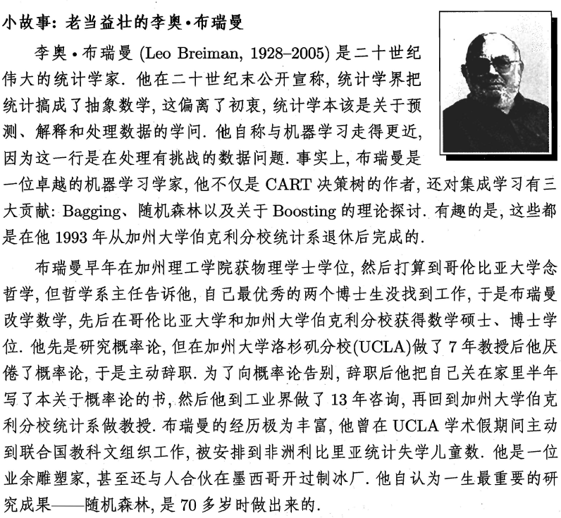


# 第九章 聚类算法

## 9.1 聚类任务

聚类是一种经典的**无监督学习**(unsupervised learning)方法，**无监督学习的目标是通过对无标记训练样本的学习，发掘和揭示数据集本身潜在的结构与规律**，即不依赖于训练数据集的类标记信息。

聚类试图将数据集中的样本划分为若干个通常是不相交的子集,每个子集称为一个“簇”( cluster)。通过这样的划分,每簇可能对应于一些潜在的概念(类别),如“浅色瓜”“深色瓜”,“有籽瓜”“无籽瓜”,甚至“本地瓜”“外地瓜”等;需说明的是,这些概念对聚类算法而言事先是未知的,聚类过程仅能自动形成簇结构, **簇所对应的概念语义需由使用者来把握和命名**。

聚类既能作为一个单独过程,用于找寻数据内在的分布结构,也可作为分类等其他学习任务的前驱过程。例如,在一些商业应用中需对新用户的类型进行判别,但定义“用户类型”对商家来说却可能不太容易,此时往往可先对用户数据进行聚类,根据聚类结果将每个簇定义为一个类,然后再基于这些类训练分类模型,用于判别新用户的类型。

直观上来说，聚类是将相似的样本聚在一起，从而形成一个**类簇（cluster）**。涉及两个问题

+ 如何**度量相似性**（similarity measure），这便是**距离度量**(distance measure)，在生活中我们说差别小则相似，对应到多维样本，每个样本可以对应于高维空间中的一个数据点，若它们的距离相近，我们便可以称它们相似。
+ 如何**评价聚类结果**，这便是**性能度量**(validity index)


## 9.2 性能度量

由于聚类算法不依赖于样本的真实类标，就不能像监督学习的分类那般，通过计算分对分错（即精确度或错误率）来评价学习器的好坏或作为学习过程中的优化目标。

直观上看,我们希望“物以类聚”,即同一簇的样本尽可能彼此相似,不同簇的样本尽可能不同换言之,聚类结果的“簇内相似度”( intra-cluster similarity)高且“簇间相似度” inter-cluster similarity)低

**聚类性能度量有两类**

+ “外部指标”(external index)：将聚类结果与某个“参考模型”(reference model)进行比较

+ “内部指标”( internal index)：直接考察聚类结果而不利用任何参考模型


### 9.2.1 外部指标

即将聚类结果与某个参考模型(比如**领域专家**给出的划分结果)的结果进行比较，**以参考模型的输出作为标准，来评价聚类好坏**。

对数据集 $D= \left \{x _{1},x_{2},...,x_{m}\right \}$ ，假设经过聚类后得到的簇划分为 $C=\left \{ C_{1},C_{2},...,C_{k}\right \}$ , ，参考模型给出的簇划分为 $C^{\ast }=\left \{ C_{1}^{\ast},C_{2}^{\ast},...,C_{s}^{\ast}\right \}$ ,(通常k≠s)， 相应的，令 $\lambda$ 和 $\lambda^{\ast}$ 分别表示 $C$ 和 $C^{\ast}$ 对应的簇标记向量(类结果)，我们将样本两两配对考虑，可定义

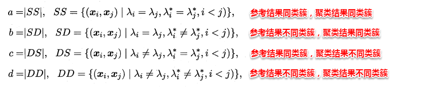

显然a和d代表着聚类结果好坏的正能量，b和c则表示参考结果和聚类结果相矛盾，由于每个样本对仅能出现在一个集合中，因此有 a+b+c+d = m(m-1)/2

基于a,b,c,d这四个值可以导出以下常用的外部评价指标：

+ Jaccard系数(Jaccard Coefficient，简称 JC)

$$
\mathrm{JC}=\frac{a}{a+b+c}
$$

+ FM系数(Fowlkes and Mallows Index，简称FMI)

$$
\mathrm{FMI}=\sqrt{\frac{a}{a+b}\cdot \frac{a}{a+c}}
$$

+ Rand指数(Rand Index，简称RI)

$$
\textrm{RI}=\frac{2(a+d))}{m(m-1)}
$$

JC, FMI, RI 的取值范围都在[0,1]，数值越大则聚类效果越好。


### 9.2.2 内部指标

内部指标不依赖任何外部模型，直接对聚类的结果进行评估：**簇内高内聚紧紧抱团，簇间低耦合易分离**。考虑聚类结果的簇划分$C=\{C_1,C_2,\dots,C_k\}$, 定义：

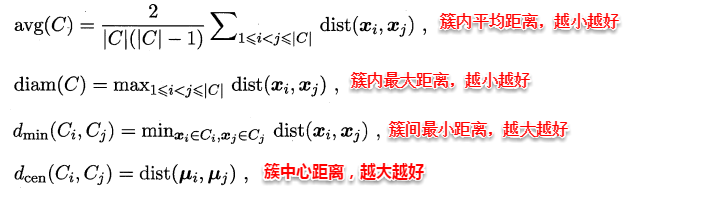

其中，$dist(\cdot , \cdot)$ 用于计算两个样本间的距离，$\mu$ 代表簇 C 中心点。基于上面的四个距离，可以导出下面这些常用的内部评价指标：

+ DB指数(Davies-Bouldin Index，简称DBI)(越小越好)

$$
\mathrm{DBI}=\frac{1}{k}\sum_{i=1}^{k}max_{j\neq i}\left ( \frac{avg\left ( C_{i} \right ) +avg\left ( C_{j} \right )}{d_{cen}\left (\mu _{i} ,\mu _{j}\right )}\right )
$$

它刻画的是: 给定两个簇,每个簇样本之间平均值之和比上两个簇的中心点之间的距离作为度量。然后考察该度量对所有簇的平均值。显然 DBI 越小越好。如果每个簇样本之间的平均值越小(即簇内样本距离都很近),则 DBI 越小;如果簇间中心点的距离越大(即簇间样本距离相互都很远),则 DBI 越小


+ Dunn指数(Dunn Index，简称DI)(越大越好)
  $$
  \mathrm{DI}=min_{1\leq i\leq k}\left \{ min_{j\neq i}\left ( \frac{d_{min}\left ( C_{i} ,C_{j}\right )}{max_{1\leq l\leq k}diam\left ( C_{l} \right )} \right ) \right \}
  $$

它刻画的是:任意两个簇之间最近的距离的最小值, 除以任意一个簇内距离最远的两个点的距离的最大值。DI 越大越好。如果任意两个簇之间最近的距离的最小值越大(即簇间样本距离相互都很远),则 DI 越大;如果任意一个簇内距离最远的两个点的距离的最大值越小(即簇内样本距离都很近),则 DI 越大。


+ 轮廓系数(Silhouette Coefficient)(越大越好)

https://scikit-learn.org/stable/modules/clustering.html#clustering-performance-evaluation

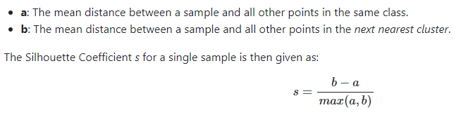

[轮廓系数( Silhouette coefficient)](https://scikit-learn.org/stable/modules/clustering.html#silhouette-coefficient)适用于实际类别信息未知的情况。对于单个样本, a是它与它同类别中其他样本的平均距离, b是与它距离最近不同类别中样本的平均距离。对于一个样本集合, 它的轮廓系数是所有样本轮廓系数的平均值。

轮廓系数取值范围是[-1,1]，同类别样本越距离相近且不同类别样本距离越远,分数越高。

> 簇内内聚度高意味着a越小，簇间耦合低意味着b越大，簇间越容易区分，则s越趋近于1；反之则簇间不容易区分。


轮廓系数的缺点在于对于突形簇其值会高于其他形状簇形，简单来说就是轮廓系数更适用于KMeans算法适用的场景。


## 9.3 距离度量

### 9.3.1 距离度量的基本性质

最熟悉的距离度量莫过于欧式距离：即对应属性之间相减的平方和再开根号。度量距离还有其它的很多经典方法，通常它们需要满足一些基本性质：

http://www.lunarnai.cn/2017/04/08/watermelon-chap-9/

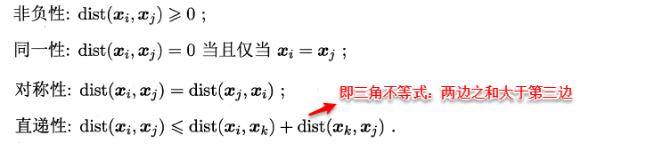

最常用的距离度量方法是**“闵可夫斯基距离”（Minkowski distance)**：
$$
dist_{mk}(x_i,x_j)=(\sum_{u=1}^n|x_{iu}-x_{ju}|^p)^{\frac{1}{p}}
$$
当p=1时，闵可夫斯基距离即**曼哈顿距离（Manhattan distance）**：

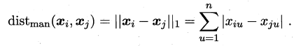

当p=2时，闵可夫斯基距离即**欧氏距离（Euclidean distance）**：

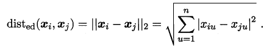

### 9.3.2 距离度量的选择

我们知道属性分为两种：**连续属性**(continuous attribute)和**离散属性**（catergorical attribute有限个取值）。对于连续值的属性，一般都可以被学习器所用，有时会根据具体的情形作相应的预处理，例如：归一化等；而对于离散值的属性，需要作下面进一步的处理：

> 若属性值之间**存在序关系**(ordinal attribute)，则可以将其转化为连续值，例如：身高属性“高”“中等”“矮”，可转化为{1, 0.5, 0}。
> 若属性值之间**不存在序关系**(non-ordinal attribute)，则通常将其转化为向量的形式，例如：性别属性“男”“女”，可转化为{（1,0）,（0,1）}。

**连续属性和存在序关系的离散属性都可以直接参与计算**，而不存在序关系的**无序属性，我们一般采用VDM（Value Difference Metric）进行距离的计算**，例如：令 $m_{u, a}$ 表示在属性 $u$ 上取值为 $a$ 的样本数, $m_{u, a, i}$ 表示在第 $i$ 个样本簇中在属性 u 上取值为 $a$  的样本数, k 为样本簇数, 则属性 $u$ 上两个离散值 $a$ 与 $b$ 之间的 VDM 距离为：

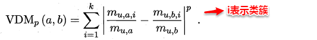

VDM距离刻画的是属性取值在各簇上的频率分布之间的差异。

在计算两个样本之间的距离时，假定有 n~c~ 个有序属性、n-n~c~个无序属性,不失一般性,令**有序属性**排列在**无序属性**之前, 则我们可以将闵可夫斯基距离和VDM混合在一起进行计算：

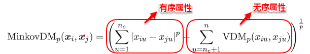


需注意的是,通常我们是基于某种形式的距离来定义“相似度度量”( similarity measure),距离越大,相似度越小。然而,用于相似度度量的距离未必一定要满足距离度量的所有基本性质,尤其是直递性。

例如在某些任务中我们可能希望有这样的相似度度量:“人”“马”分别与“人马”相似,但“人”与“马”很不相似;要达到这个目的,可以令“人”“马”与“人马”之间的距离都比较小,但“人”与“马”之间的距离很大,此时该距离不再满足直递性;这样的距离称为“非度量距离”(non- metric distance)。

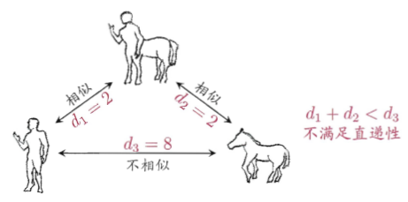


在现实任务中,有必要基于**数据样本**来确定合适的**距离计算**式, 这可通过“距离度量学习”( distance metric learning)来实现。


## 9.4 原型聚类

原型聚类即“**基于原型的聚类**”（prototype-based clustering），原型表示模板的意思，就是通过参考一个模板向量或模板分布的方式来完成聚类的过程，通常情形下算法先对原型进行初始化,然后对原型进行迭代更新求解。采用不同的原型表、不同的求解方式,将产生不同的算法。

常见的K-Means便是基于簇中心（原型向量）来实现聚类，混合高斯聚类则是基于簇分布（概率模型）来实现聚类。

### 9.4.1 K-Means

K-Means的思想十分简单，**首先随机指定类中心，根据样本与类中心的远近划分类簇，接着重新计算类中心，迭代直至收敛**。但是其中迭代的过程并不是主观地想象得出，事实上，若将样本的类别看做为“隐变量”（latent variable）,类中心看作样本的分布参数，这一过程正是通过**EM算法**的两步走策略而计算出，其根本的目的是为了最小化平方误差函数E：
$$
E=\sum_{i=1}^k\sum_{x\in C_i}||x-\mu_i||_2^2
$$


K-Means的算法流程如下所示：


### 9.4.2 学习向量量化（LVQ）

LVQ（Learning Vector Quantization）也是基于原型的聚类算法，与K-Means不同的是，**LVQ使用样本真实类标记辅助聚类**，首先 LVQ 根据样本的类标记，从各类中分别随机选出一个样本作为该类簇的原型，从而组成了一个**原型特征向量组**，接着从样本集中随机挑选一个样本，计算其与原型向量组中每个向量的距离，并选取距离最小的原型向量所在的类簇作为它的划分结果，再与真实类标比较。

> **若划分结果正确，则对应原型向量向这个样本靠近一些**
> **若划分结果不正确，则对应原型向量向这个样本远离一些**

LVQ算法的流程如下所示：

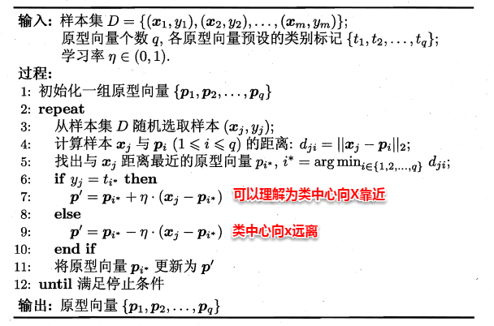

第5行是竞争学习的“胜者为王”策略。**SOM是基于无标记样本的聚类算法，而LVQ可看作SOM基于监督信息的扩展。**


### 9.4.3 高斯混合聚类

看出K-Means与LVQ都试图以类中心作为原型指导聚类，高斯混合（Mixture-of-Gaussian）聚类则采用高斯分布来描述原型。现假设**每个类簇中的样本都服从一个多维高斯分布，那么空间中的样本可以看作由k个多维高斯分布混合而成**。

对于多维高斯分布，其概率密度函数如下所示：

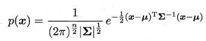

其中 $\mu$ 表示均值向量，∑~n×n~ 表示协方差矩阵，可以看出一个多维高斯分布完全由这两个参数所确定。接着定义高斯混合分布为：


α 称为混合系数（mixture coefficient），这样空间中样本的采集过程则可以抽象为：**（1）先选择一个类簇（高斯分布），（2）再根据对应高斯分布的密度函数进行采样**，这时候贝叶斯公式又能大展身手了：


此时只需要选择PM最大时的类簇并将该样本划分到其中，看到这里很容易发现：通过贝叶斯公式展开，然后计算类先验概率和类条件概率。但遗憾的是：**这里没有真实类标信息，对于类条件概率，并不能像贝叶斯分类那样通过最大似然法美好地计算出来**，因为这里的样本可能属于所有的类簇，这里的似然函数变为：


可以看出：简单的最大似然法根本无法求出所有的参数，这样PM也就没法计算。**这里采用EM算法迭代优化求解**，首先对高斯分布的参数及混合系数进行随机初始化，计算出各个PM（即γ~ji~，第i个样本属于j类），再最大化似然函数（即LL（D）分别对α、u和∑求偏导 ），对参数进行迭代更新。


高斯混合聚类的算法流程如下图所示：


## 9.5 密度聚类

密度聚类是基于密度的聚类（density-based clustering），它从**样本分布的角度**来考察样本之间的可连接性，并基于可连接性（密度可达）不断拓展疆域（类簇）。其中最著名的便是**DBSCAN**算法，首先定义以下概念：

对于给定数据集 $D= \left \{x _{1},x_{2},...,x_{m}\right \}$


简单来理解DBSCAN：**找出一个核心对象所有密度可达的样本集合形成簇**。首先从数据集中任选一个核心对象A，找出所有A密度可达的样本集合，将这些样本形成一个密度相连的类簇，直到所有的核心对象都遍历完。DBSCAN算法的流程如下图所示：


## 9.6 层次聚类

层次聚类(hierarchical clustering)是一种基于树形结构的聚类方法，常用的是**自底向上**的结合策略（**AGNES算法**, AGglomerative NESting），另外还有**自顶向下**的拆分策略（**Divisive Analysis**）。假设有N个待聚类的样本，其基本步骤是：

> 1.初始化-->把每个样本归为一类，计算每两个类之间的距离，也就是样本与样本之间的相似度；
> 2.寻找各个类之间最近的两个类，把他们归为一类（这样类的总数就少了一个）；
> 3.重新计算新生成的这个**类与各个旧类之间的相似度**；
> 4.重复2和3直到所有样本点都归为一类，结束。

可以看出其中最关键的一步就是**计算两个类簇的相似度**，这里有多种度量方法：

	* 单链接（single-linkage）:取类间最小距离。


	* 全链接（complete-linkage）:取类间最大距离


	* 均链接（average-linkage）:取类间两两的平均距离


很容易看出：**单链接的包容性极强，全链接则是坚持到底，只要存在缺点就坚决不合并，均连接则是从全局出发顾全大局**。

层次聚类法的算法流程如下所示：


## 9.7 阅读材料

聚类也许是机器学习中“新算法”出现最多、最快的领域。一个重要原因是**聚类不存在客观标准**；给定数据集, 总能从某个角度找到以往算法未覆盖的某种标准从而设计出新算法（例如同一堆水果,既能按大小,也能按颜色,甚至能接产地聚类）。

相对于机器学习其他分支来说, 聚类的知识还**不够系统化**, 因此著名教科书 [Mitchell,1997]（Machine Learning. McGraw Hill, New York, NY.） 中甚至没有关于聚类的章节。但聚类技术本身在现实任务中非常重要。

聚类性能度量常见的还有**F值、互信息( mutual information)、平均廓宽( average silhouette width)** 。 

Q: 对于一个聚类任务，如何选择性能度量？


距离计算是很多学习任务的核心技术。闵可夫斯基距离提供了距离计算的一般形式。除闵可夫斯基距离之外,**内积距离、余弦距离**等也很常用, 模式识别、图像检索等涉及复杂语义的应用中常会涉及非度量距离，距离度量学习可直接嵌入到聚类学习过程中。

聚类集成( clustering ensemble)通过对多个聚类学习器进行集成, 能有效降低聚类假设与真实聚类结构不符、聚类过程中的随机性等因素带来的不利影响。

异常检测( anomaly detection) 常借助聚类或距离计算进行, 如将远离所有簇中心的样本作为异常点, 或将密度极低处的样本作为异常点。


## 9.8 应用问题

传统的聚类算法已经比较成功的解决了低维数据的聚类问题。但是由于实际应用中数据的复杂性，在处理许多问题时，现有的算法经常失效，特别是对于高维数据和大型数据的情况：

①高维数据集中存在大量无关的属性使得在所有维中存在簇的可能性几乎为零；

②高维空间中数据较低维空间中数据分布要稀疏，其中数据间距离几乎相等是普遍现象，而传统聚类方法是基于距离进行聚类的，因此在高维空间中无法基于距离来构建簇。


# 第十章 降维与度量学习

样本的特征数也称为**维数**（dimensionality），当维数非常大时，也就是通常所说的“**维数灾难**”(curse of dimensionality)，具体表现在：在高维情形下，**数据样本变得十分稀疏**，因为此时要满足训练样本为“**密采样**”的总体样本数目是一个触不可及的天文数字。**训练样本的稀疏使得其代表总体分布的能力大大减弱，从而消减了学习器的泛化能力**；同时当维数很高时，**计算距离也变得十分复杂**，甚至连计算内积都不再容易，这也是为什么支持向量机（SVM）使用核函数 **“低维计算，高维表达”** 的原因。

缓解维数灾难的一个重要途径就是**降维（dimension reduction），即通过某种数学变换将原始高维空间转变到一个低维的子空间**（比如我们曾在线性代数中讲到过的奇异值分解SVD，上文讲到的聚类算法在高维数据情况下的应用问题）。在这个子空间中，样本的密度将大幅提高，同时距离计算也变得容易。这时也许会有疑问，降维之后不是会丢失原始数据的一部分信息吗？实际上，在很多实际问题中，虽然训练数据是高维的，但是与学习任务相关也许仅仅是其中的一个低维子空间，也称为一个**低维嵌入**，例如：数据属性中存在噪声属性、相似属性或冗余属性等，**对高维数据进行降维能在一定程度上达到提炼低维优质属性或降噪的效果**。


## 10.1 K近邻学习

k近邻算法简称**kNN（k-Nearest Neighbor）**，是一种经典的监督学习方法，是数据挖掘十大算法之一。其工作机制十分简单：给定某个测试样本，kNN基于某种**距离度量**在训练集中找出与其距离最近的k个带有真实标记的训练样本，然后基于这k个邻居的真实标记来进行预测，类似于集成学习中的基学习器结合策略：分类任务采用投票法，回归任务则采用平均法。


上图中有两种类型的样本，一类是蓝色正方形，另一类是红色三角形。而那个绿色圆形是我们待分类的样本。基于kNN算法的思路，我们很容易得到以下结论：

> 如果K=3，那么离绿色点最近的有2个红色三角形和1个蓝色的正方形，这3个点投票，于是绿色的这个待分类点属于红色的三角形。
> 如果K=5，那么离绿色点最近的有2个红色三角形和3个蓝色的正方形，这5个点投票，于是绿色的这个待分类点属于蓝色的正方形。

可以发现：**kNN虽然是一种监督学习方法，但是它没有显式的训练过程**，而是当有新样本需要预测时，才来计算出最近的k个邻居，因此**kNN是一种典型的懒惰学习方法（lazy learning）**，对比朴素贝叶斯的训练过程——参数估计，因此朴素贝叶斯也可以懒惰式学习，此类技术在**训练阶段开销为零**，待收到测试样本后再进行计算。相应地我们称那些一有训练数据立马开工的算法为“**急切学习**”，可见前面我们学习的大部分算法都归属于急切学习。

容易看出：**kNN算法的核心在于 k 值的选取以及 距离的度量**。k值选取太小，模型很容易受到噪声数据的干扰，例如：极端地取k=1，若待分类样本正好与一个噪声数据距离最近，就导致了分类错误；若k值太大， 则在更大的邻域内进行投票，此时模型的预测能力大大减弱，例如：极端取k=训练样本数，就相当于模型根本没有学习，所有测试样本的预测结果都是一样的。**一般通过交叉验证法来选取一个适当的k值**。


对于距离度量，**不同的度量方法得到的k个近邻不尽相同，从而对最终的投票结果产生了影响**，因此选择一个合适的距离度量方法也十分重要。

在上一篇聚类算法中，在度量样本相似性时介绍了常用的几种距离计算方法，包括**闵可夫斯基距离，曼哈顿距离，VDM**等。在实际应用中，**kNN的距离度量函数一般根据样本的特性来选择合适的距离度量，同时应对数据进行去量纲/归一化处理来消除大量纲属性的强权政治影响**。


kNN的重要假设: 任意测试样本 $x$ 附近任意小的 $\delta$ 距离范围内总能找到一个训练样本，即训练样本的采样密度足够大，或称为 **“密采样”( dense sample)** 。然而，这个假设在现实任务中通常很难满足，例如若 $\delta=0.001$ ，仅考虑单个属性， 则仅需1000个样本点平均分布在归一化后的属性取值范围内， 即可使得仼意测试样本在其附近0.001距离范围内总能找到一个训练样本，此时最近邻分类器的错误率不超过贝叶斯最优分类器的错误率的两倍。然而，这仅是属性维数为1的情形，若有更多的属性，则情况会发生显著变化。例如假定属性维数为20，若要 求样本满足密采样条件， 则至少需 $(10^3)^{20}=10^{60}$ 个样本。现实应用中属性维数经常成千上万，要满足密采样条件所需的样本数目是无法达到的天文数字（或许未来会变成可以达到，毕竟科技的发展总是如此）。


## 10.2 MDS算法

不管是使用核函数升维还是对数据降维，我们都希望**原始空间样本点之间的距离在新空间中基本保持不变**，这样才不会使得原始空间样本之间的关系及总体分布发生较大的改变。**“多维缩放”（MDS，Multi-dimensional scaling）** 正是基于这样的思想，**MDS要求原始空间样本之间的距离在降维后的低维空间中得以保持**。

假定m个样本在原始空间中任意两两样本之间的距离矩阵为D∈R(m×m)，我们的目标便是获得样本在低维空间中的表示Z∈R(d'*m , d'< d)，且任意两个样本在低维空间中的欧式距离等于原始空间中的距离，即||z~i~-z~j~||=Dist(ij)。因此接下来我们要做的就是根据已有的距离矩阵D来求解出降维后的坐标矩阵Z。


令降维后的样本坐标矩阵 Z 被中心化，**中心化是指将每个样本向量减去整个样本集的均值向量，故所有样本向量求和得到一个零向量**。这样易知：矩阵B的每一列以及每一列求和均为0，因为提取公因子后都有一项为所有样本向量的和向量。


根据上面矩阵B的特征，我们很容易得到等式（2）、（3）以及（4）：


这时根据(1)--(4)式我们便可以计算出 $b_{ij}$，即 $$b_{ij}=(1)-(2)*(1/m)-(3)*(1/m)+(4)*(1/(m^2))$$，再逐一地计算每个 $b_{ij}$，就得到了降维后低维空间中的内积矩阵B(B=Z'*Z)，只需对B进行特征值分解便可以得到Z。MDS的算法流程如下图所示：


## 10.3 主成分分析（PCA）

不同于MDS采用距离保持的方法，主成分分析（Principal Component Analysis ,PCA）直接通过一个**线性变换**，将原始空间中的样本**投影**到新的低维空间中。

简单来理解这一过程便是：**PCA采用一组新的基（向量）来表示样本点，其中每一个基向量都是原始空间基向量的线性组合，通过使用尽可能少的新基向量来表出样本，从而达到降维的目的。**

假设使用d'个新基向量来表示原来样本，实质上是将样本投影到一个由d'个基向量确定的一个**超平面**上（**即舍弃了一些维度**），要用一个超平面对空间中所有高维样本进行恰当的表达，最理想的情形是：**若这些样本点都能在超平面上表出且这些表出在超平面上都能够很好地分散开来**。但是一般使用较原空间低一些维度的超平面来做到这两点十分不容易，因此我们退一步海阔天空，要求这个超平面应具有如下两个性质：

> **最近重构性**：样本点到超平面的距离足够近，即尽可能在超平面附近；
> **最大可分性**：样本点在超平面上的投影尽可能地分散开来，即投影后的坐标具有区分性。

这里十分神奇的是：**最近重构性与最大可分性虽然从不同的出发点来定义优化问题中的目标函数，但最终这两种特性得到了完全相同的优化问题**：


接着使用拉格朗日乘子法求解上面的优化问题，得到：


因此只需对协方差矩阵进行特征值分解即可求解出W，PCA算法的整个流程如下图所示：


另一篇博客给出更通俗更详细的理解：[主成分分析解析（基于最大方差理论）](http://blog.csdn.net/u011826404/article/details/57472730)


## 10.4 核化线性降维

正如SVM在处理非线性可分时，通过引入核函数将样本投影到高维特征空间，接着在高维空间再对样本点使用超平面划分。这里也是相同的问题：若我们的样本数据点本身就不是线性分布，那还如何使用一个超平面去近似表达呢？因此也就引入了核函数，**即先将样本映射到高维空间，再在高维空间中使用线性降维的方法**，即“核化” (kernelized)。下面主要介绍 **核化主成分分析（Kernelized PCA ,KPCA）** 的思想。

若核函数的形式已知，即我们知道如何将低维的坐标变换为高维坐标，这时我们只需先将数据映射到高维特征空间，再在高维空间中运用 PCA 即可。但是一般情况下，我们并不知道核函数具体的映射规则，例如：Sigmoid、高斯核等，我们只知道如何计算高维空间中的样本内积，这时就引出了KPCA的一个重要创新之处：**即空间中的任一向量，都可以由该空间中的所有样本线性表示**。证明过程也十分简单：


这样我们便可以将高维特征空间中的投影向量  $w_i$  使用所有高维样本点线性表出，接着代入PCA 的求解问题，得到：


化简到最后一步，发现结果十分的美妙，只需对核矩阵K 进行特征分解，便可以得出投影向量 $w_i$ 对应的系数向量α，因此选取特征值前d'大对应的特征向量便是d'个系数向量。这时对于需要降维的样本点，只需按照以下步骤便可以求出其降维后的坐标。可以看出：KPCA 在计算降维后的坐标表示时，需要与所有样本点计算核函数值并求和，因此该算法的**计算开销十分大**。


## 10.5 流形学习

**流形学习（manifold learning）是一种借助拓扑流形概念的降维方法**，**流形是指在局部与欧式空间同胚的空间**，即在局部与欧式空间具有相同的性质，能用欧氏距离计算样本之间的距离。这样即使高维空间的分布十分复杂，但是在局部上依然满足欧式空间的性质，基于流形学习的降维正是这种 **“邻域保持”** 的思想。其中 **等度量映射（Isomap）试图在降维前后保持邻域内样本之间的距离，而局部线性嵌入（LLE）则是保持邻域内样本之间的线性关系** 。


### 10.5.1 等度量映射（Isomap）

等度量映射的基本出发点是：高维空间中的直线距离具有误导性，因为有时高维空间中的直线距离在低维空间中是不可达的。**因此利用流形在局部上与欧式空间同胚的性质，可以使用近邻距离来逼近测地线距离**，即对于一个样本点，它与近邻内的样本点之间是可达的，且距离使用欧式距离计算，这样整个样本空间就形成了一张近邻图，高维空间中两个样本之间的距离就转为最短路径问题。可采用著名的**Dijkstra算法**或**Floyd算法**计算最短距离，得到高维空间中任意两点之间的距离后便可以使用 MDS 算法来其计算低维空间中的坐标。


从MDS算法的描述中我们可以知道：MDS先求出了低维空间的内积矩阵B，接着使用特征值分解计算出了样本在低维空间中的坐标，但是并没有给出通用的投影向量w，因此对于需要降维的新样本无从下手，书中给出的权宜之计是利用已知高/低维坐标的样本作为训练集学习出一个“投影器”，便可以用高维坐标预测出低维坐标。Isomap算法流程如下图：


对于近邻图的构建，常用的有两种方法：**一种是指定近邻点个数**，像kNN一样选取k个最近的邻居；**另一种是指定邻域半径**，距离小于该阈值的被认为是它的近邻点。但两种方法均会出现下面的问题：

> 若**邻域范围指定过大，则会造成“短路问题”**，即本身距离很远却成了近邻，将距离近的那些样本扼杀在摇篮。
> 若**邻域范围指定过小，则会造成“断路问题”**，即有些样本点无法可达了，整个世界村被划分为互不可达的小部落。


### 10.5.2 局部线性嵌入(LLE)

不同于Isomap算法去保持邻域距离，LLE算法试图去保持邻域内的线性关系，假定样本 $x_i$ 的坐标可以通过它的邻域样本线性表出：


LLE算法分为两步走，**首先第一步根据近邻关系计算出所有样本的邻域重构系数w**：


**接着根据邻域重构系数不变，去求解低维坐标**：


这样利用矩阵M，优化问题可以重写为：


M特征值分解后最小的d'个特征值对应的特征向量组成Z，LLE算法的具体流程如下图所示：


## 10.6 度量学习

本篇一开始就提到维数灾难，即在高维空间进行机器学习任务遇到样本稀疏、距离难计算等诸多的问题，因此前面讨论的降维方法都试图将原空间投影到一个合适的低维空间中，接着在低维空间进行学习任务从而产生较好的性能。

事实上，不管高维空间还是低维空间都潜在对应着一个距离度量，那可不可以直接学习出一个距离度量来等效降维呢？例如：**按照降维后的方式来进行距离的计算**。这便是 **度量学习(metric learning)** 的初衷。

**首先要学习出距离度量必须先定义一个合适的距离度量形式**。对两个样本xi与xj，它们之间的欧式距离为：


若各个属性重要程度不一样即都有一个权重，则得到加权的欧式距离：


此时各个属性之间都是相互独立无关的，但现实中往往会存在属性之间有关联的情形，例如：身高和体重，一般人越高，体重也会重一些，他们之间存在较大的相关性。这样计算距离就不能分属性单独计算，于是就引入经典的**马氏距离(Mahalanobis distance)**:


**标准的马氏距离中M是协方差矩阵的逆，马氏距离是一种考虑属性之间相关性且尺度无关（即无须去量纲）的距离度量**。


**矩阵M也称为“度量矩阵”，为保证距离度量的非负性与对称性，M必须为(半)正定对称矩阵**（正定矩阵的例子参见线性代数二十八讲），这样就为度量学习定义好了距离度量的形式，换句话说：**度量学习便是对度量矩阵进行学习**。

现在来回想一下前面我们接触的机器学习不难发现：**机器学习算法几乎都是在优化目标函数，从而求解目标函数中的参数**。同样对于度量学习，也需要设置一个优化目标，书中简要介绍了错误率和相似性两种优化目标，此处限于篇幅不进行展开。

总结来说，

+ **降维是将原高维空间嵌入到一个合适的低维子空间中，接着在低维空间中进行学习任务**

+ **度量学习则是试图去学习出一个 _距离度量_ 来等效降维的效果**

两者都是为了解决维数灾难带来的诸多问题。

那kNN呢？在降维算法中，低维子空间的维数d'通常都由人为指定，因此我们需要使用一些**低开销的学习器**来选取合适的d'，**kNN这在训练阶段开销为零，测试阶段也只是遍历计算了距离，因此拿kNN来进行交叉验证就十分有优势了~同时降维后样本密度增大，使得距离计算变易，更为kNN来展示它独特的十八般手艺提供了用武之地。**


一言以蔽之：k近邻算法的核心在于k值的选取以及距离的度量，MDS要求原始空间样本之间的距离在降维后的低维空间中得以保持，主成分分析试图找到一个低维超平面来表出原空间样本点，核化主成分分析先将样本点映射到高维空间，再在高维空间中使用线性降维的方法，从而解决了原空间样本非线性分布的情形，基于流形学习的降维则是一种“邻域保持”的思想，度量学习试图去学习出一个距离度量来等效降维的效果。