[TOC]

# 1. sklearn介绍

scikit-learn 是基于 Python 语言的机器学习工具。它有如下特点：
+ 简单高效的数据挖掘和数据分析工具
+ 可供大家在各种环境中重复使用
+ 建立在 NumPy ，SciPy 和 matplotlib 上
+ 开源，可商业使用 - BSD许可证

当前基于sklearn 0.21.2 版本

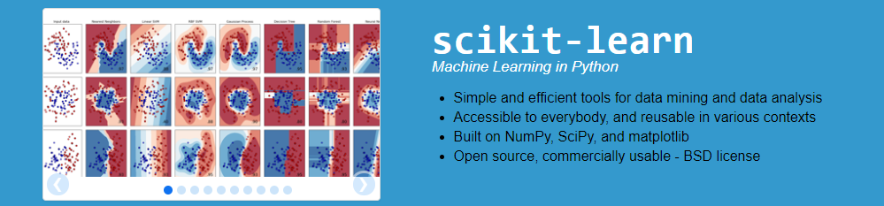

本文首先介绍下sklearn内的**模块组织**和**算法类的顶层设计图**。

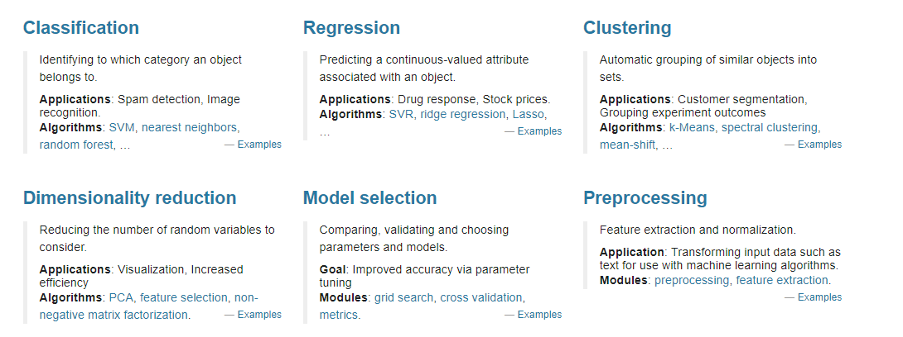

# 2. 三大模块设置

## 2.1 监督学习（supervised learning）

包括分类 classification 和回归 regression

- neighbors：近邻算法
- svm：支持向量机
- kernel-ridge：核岭回归
- discriminant_analysis：判别分析
- linear_model：广义线性模型

- ensemle：集成方法
- tree：决策树
- naive_bayes：朴素贝叶斯
- cross_decomposition：交叉分解
- gaussian_process：高斯过程
- neural_network：神经网络

- calibration：概率校准
- isotonic：保序回归
- feature_selection：特征选择
- multiclass：多类多标签算法

## 2.2 无监督学习（unsupervised learning）

包括聚类 clustering 和 分解dimensionality reduction

- decomposition：矩阵因子分解
- cluster：聚类
- manifold：流形学习
- mixture：高斯混合模型
- neural_network：无监督神经网络

- density：密度估计
- covariance：协方差估计

## 2.3 数据变换 (transforming)

包括预处理 Preprocessing 和模型选择 Model selection 

- feature_extraction：特征抽取
- feature_selection：特征选择
- preprocess：预处理

- random_projection：随机投影
- kernel_approximation：核逼近
- pipline：管道流（这个严格说不算是数据变换模块）

实际上有些算法按照上述模块的划分，我们会发现，它可以处于多个模块之中，比如聚类或者树模型，它们可以在EDA（数据探索）环节进行数据预处理、数据变化、特征选择等等，这就意味着它们既处于无监督学习模块，又属于数据变换和模型选择模块。 

此时我们会问一个问题，那么sklearn是如何来设计这些模块之间的关系的呢？

这就涉及到sklearn的顶层设计。

# 3. 算法类的顶层设计图

## 3.1 设计思路

从sklearn 的 [API](https://scikit-learn.org/stable/modules/classes.html) 我们可以发现，sklearn的顶层涉及7个Mixin类

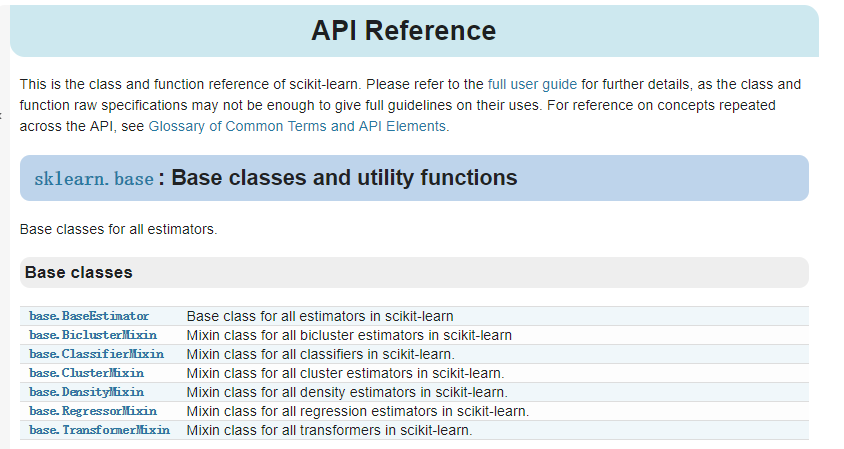

- baseEstimator：所有评估器的父类（实现了设置/返回评估器的参数的方法）
- ClassifierMixin：所有分类器的父类，其子类必须实现一个score函数
- RegressorMixin：所有回归器的父类，其子类必须实现一个score函数
- ClusterMixin：所有聚类的父类，其子类必须实现一个fit_predict函数
- BiClusterMixin：双聚类的父类，（实际只实现了返回数据的维度大小）
- TransformerMixin：所有数据变换的父类，其子类必须实现一个fit_transform函数
- DensityMixin：所有密度估计相关的父类，其子类必须实现一个score函数

**什么是Mixin类？**

举一个简单的例子，小孩一般都会遗传（继承）父亲和母亲的DNA信息，在面向对象中，父亲和母亲就是孩子的父类，但是一般一个类都是单继承形式，也就是一般形式上，我们对小孩说，“你很像你的父亲/母亲，简直是一个模具里刻出来的一样” ，然而小孩或多或少都会继承父母双方的DNA，这时候我们就需要表示出来小孩是继承自父亲和母亲两方，这就是多重继承的形式。但是多重继承又会存在一个问题，因为全世界的父亲和母亲的特质都会有所区别，这就会造成模板（类）太多的问题，这时候就会引入 Mixin类实现多重继承。

比如我们设置一个长辈类，让小孩继承自长辈，然后设置一个Mixin类，其中包含长辈的额外信息（比如：生育功能）。

更详细内容可参考[廖雪峰对多重继承的解释](https://www.liaoxuefeng.com/wiki/1016959663602400/1017502939956896 )，知乎的[回答](https://www.zhihu.com/question/20778853)

## 3.2 SVM举例说明

[以SVM为例我们去查看类的继承关系](https://blog.csdn.net/qsczse943062710/article/details/75642666)

svm既可以作为分类器，也可以作为回归器，所以，它们分别继承实现了ClassifierMixin和RegressorMixin。

**SVM分类器 SVC**

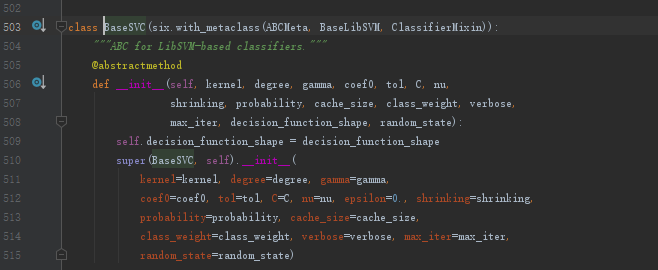

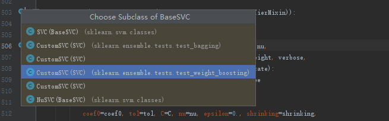

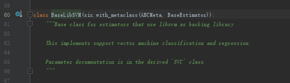

 

**SVM回归器 SVR**

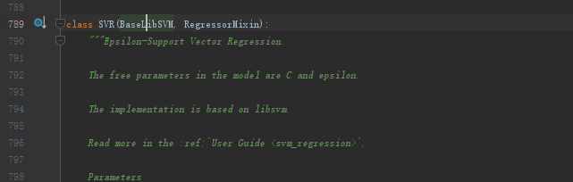

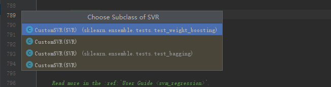

由此我们可以得到 **svm** 总的继承关系

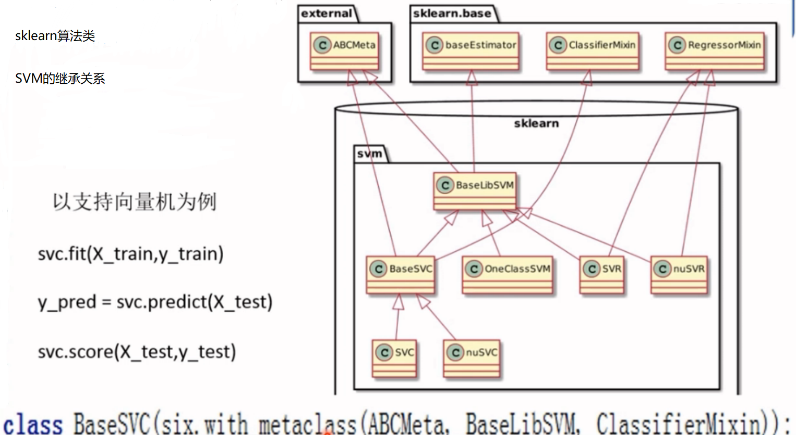

# 4.统一的API接口

​        在sklearn里面，我们可以使用完全一样的接口来实现不同的机器学习算法，通俗的流程可以理解如下：

1. 数据加载和预处理
2. 定义分类器（回归器等等），譬如svc = sklearn.svm.SVC()
3. 用训练集对模型进行训练，只需调用fit方法，svc.fit(X_train, y_train)
4. 用训练好的模型进行预测：y_pred=svc.predict(X_test)
5. 对模型进行性能评估：svc.score(X_test, y_test)

那么统一的API接口的优点除了方便以外，还有什么作用呢？ 这就是我们之前感觉分类乏力的 pipeline大显身手的时候了，它可以将我们使用sklearn的各种评估器串联起来，形成一个数据处理管道！

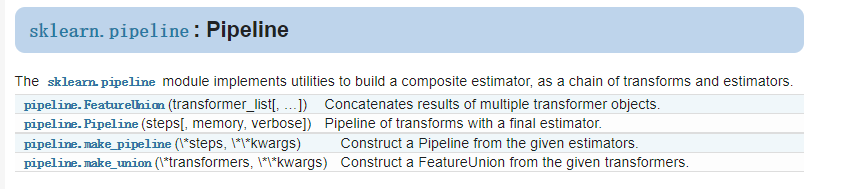

# 5. 其他

至此可以发现，sklearn基本上很完善地实现了数据处理的各个流程！

并且从更新版本上可以发现，sklearn对特征处理的模块在不断地独立出来，比如缺失值处理模块。

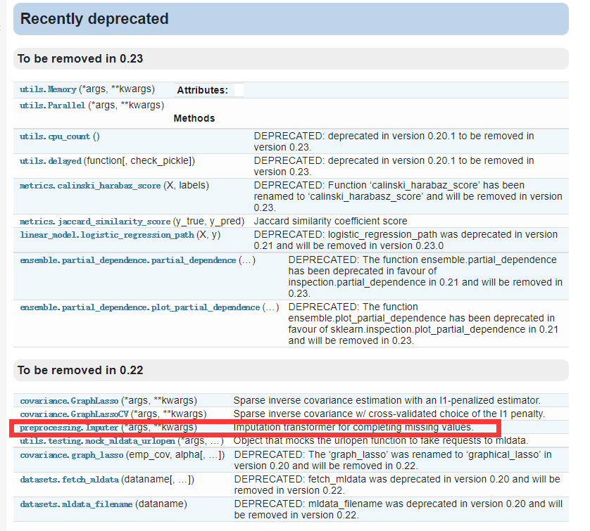

